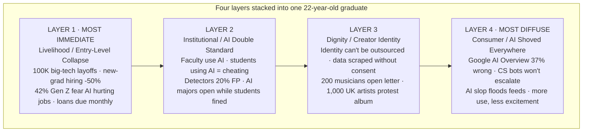

# Plan: Four Layers Behind the AI Backlash (EN)

English version of `anti-ai-four-layers/`. Same layout, math, and color budget. Text translated for the English Substack/Medium version of the article.

## Mermaid sketch

## Type

Illustrative — stack of four labeled layers visualizing how four layers of resentment co-occur in one person.

## Translation notes

- 反感的四层叠加 → Four Layers Behind the AI Backlash
- 生计层 / 制度层 / 尊严层 / 消费层 → Livelihood / Institutional / Dignity / Consumer
- LAYER 1 marked layer-key (article: "most immediate")
- Caption refers to Chapter III's English title: "The Backlash Has Real Roots"

## Layout math

Identical to `anti-ai-four-layers/`. viewBox 680 × 600. Layers at y=96/202/308/414, height 96 each. Divider at x=220. Text widths checked against rect width (580px - 22px padding = 380px max for right column at 14px).

## Color budget

1 accent ramp (coral, default). LAYER 1 = layer-key + eyebrow-accent + divider-accent. LAYER 2–4 neutral.
