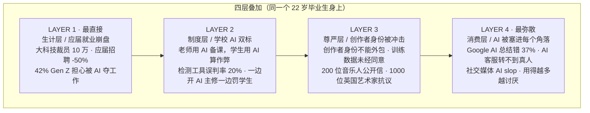

# Plan: 反感的四层叠加

## Mermaid sketch

## Type

Illustrative — stack of four labeled layers visualizing how four layers of resentment co-occur in one person.

## Template reference

Closest match: `huang-ai-five-layers` (5 layers, 96 height, layer-top accent).
This diagram: 4 layers, 96 height, **LAYER 1 (生计层) marked as layer-key** (article calls it "最直接的一层").

## Layout math

- viewBox: 680 × 600
- Title region: y=42 (title), y=64 (subtitle)
- LAYER 1: y=96–192 (height 96), `class="layer-key"`
- LAYER 2: y=202–298
- LAYER 3: y=308–404
- LAYER 4: y=414–510
- Caption-strong: y=540
- Caption: y=572

Inside each layer:
- eyebrow at y_top + 22
- th at y_top + 50 (left), body t1 at y_top + 50 (right)
- ts at y_top + 70 (left), body t2 at y_top + 70 (right)
- divider y_top+14 to y_top+82

## Color budget

1 accent ramp (coral, default). LAYER 1 = layer-key + eyebrow-accent + divider-accent. LAYER 2–4 = neutral.
