# Plan: Anti-Tech Rhetoric Templates (EN)

English version of `anti-tech-rhetoric-templates/`. Same layout, math, color budget. Text translated for the English Substack/Medium version of the article.

## Mechanism

5 anti-tech rhetorical templates, each shown as a horizontal pill chain where the same slot gets a new technology noun every generation. The final AI pill in each row is highlighted in accent color, with a top-right eyebrow label tying the highlighted column together.

## Mermaid sketch

```mermaid
flowchart LR
    subgraph Row1["It will steal our jobs"]
        A1[Looms 1810s] --> A2[Electricity 1880s] --> A3[Automation 1950s] --> A4[Offshoring 1990s] --> A5[AI 2026]
    end
    subgraph Row2["It will make us stupid"]
        B1[Writing · Plato] --> B2[Newspapers 1800s] --> B3[TV 1960s] --> B4[Calculators 1990s] --> B5[ChatGPT 2026]
    end
    subgraph Row3["It will kill creativity"]
        C1[Photography 1830s] --> C2[Cinema 1900s] --> C3[Synths 1980s] --> C4[Photoshop 1990s] --> C5[AI art 2026]
    end
    subgraph Row4["It will isolate us"]
        D1[Telephone 1900s] --> D2[TV 1950s] --> D3[Gaming 1980s] --> D4[Smartphones 2010s] --> D5[AI friends 2026]
    end
    subgraph Row5["Machines will kill us"]
        E1[Frankenstein 1818] --> E2[Metropolis 1927] --> E3[HAL 1968] --> E4[Terminator 1984] --> E5[Hinton 2026]
    end
```

## Translation notes

- 反技术话术的模板复用 → Anti-Tech Rhetoric: The Same Templates, Reused
- 这一轮叫 AI → THIS ROUND IT'S AI
- Row quotes shortened for parallel: "It will steal our jobs / make us stupid / kill creativity / isolate us / kill us"
- Tight pills (max 12 chars at 14px): "Smartphones", "Frankenstein", "Photography", "Electricity", "Calculators" all fit; "AI generation" → "AI art" (6 chars), "AI companions" → "AI friends" (10 chars), "Synthesizers" → "Synths" (6 chars)
- Caption references the English version Chapter 5.3 title "The Script Keeps Getting Reused"

## Layout math

Identical to Chinese version. viewBox 680 × 620. 5 pills per row × 100px wide with 20px gaps. Pills at x=60/180/300/420/540. Row tops at y=96/188/280/372/464. Last pill (column 5) uses `layer-key` (coral accent).

## Color budget

1 accent ramp (coral). Column 5 pills all use `layer-key` (accent fill). Other pills use `layer`. Top eyebrow-accent label hangs over column 5.
