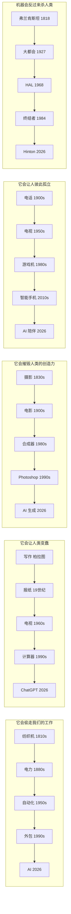

# Plan: 反技术话术的模板复用

## 核心机制

5 条话术模板，每条横向展示"同一个槽位每代换上一个新技术名词"。
末尾的 AI 节点统一用 accent 色高亮，强调"这一轮叫 AI"。

## Mermaid sketch

## 类型与设计

- 类型: illustrative (要的是"看一眼就懂同一套话术每代换名词")
- 不用矩形堆叠（用户明确要求）
- 改用横向 pill chain：每行一条话术 + 5 节点 + 4 箭头 + 年份小注
- 末尾 pill 高亮：accent 色，表示"这一轮替换的是 AI"
- 顶部增加 `→ 这一轮叫 AI` 的 eyebrow-accent 标签悬在第 5 列上方，把整张图穿起来

## Layout math

- viewBox: 680 × 620
- 5 个 pill 每个宽 100，间隔 20
  - Pill 1: x=60–160 (center 110)
  - Pill 2: x=180–280 (center 230)
  - Pill 3: x=300–400 (center 350)
  - Pill 4: x=420–520 (center 470)
  - Pill 5: x=540–640 (center 590)
- 箭头 → 居中放在间隔中点：x = 170, 290, 410, 530
- 每行结构（row top = y_top）:
  - quote: y_top + 14 (th class)
  - pill rect: y_top + 26 to y_top + 54 (height 28, rx=14)
  - pill text: y_top + 45 (居中)
  - 箭头 → text: y_top + 45
  - year label: y_top + 72 (ts class)
- Row spacing: 92 px
  - Row 1 y_top = 96
  - Row 2 y_top = 188
  - Row 3 y_top = 280
  - Row 4 y_top = 372
  - Row 5 y_top = 464
  - Row 5 last element (year) at y=536
- Footer:
  - caption-strong: y=566
  - caption: y=588

## Color budget

1 accent ramp (coral). 第 5 列所有 pill 用 layer-key 类（accent fill）。其他 pill 用 layer。顶部 eyebrow-accent 标签穿过第 5 列上方。
