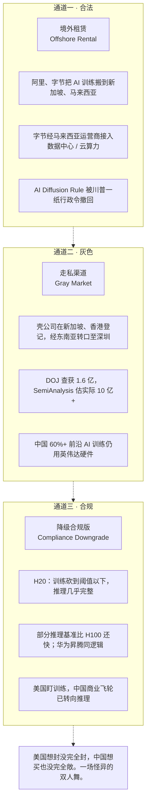

# Diagram Plan: 美国芯片封锁的三条漏风口

**Material**: 黄仁勋文章 第四节《美国为什么封不住：三条都堵不上的通道》
**Type**: structural (three vertical sibling containers, rich interior)
**Slug**: chip-ban-three-channels

## Reader need
"After seeing this diagram, the reader understands why US export controls leak through three distinct, structurally different channels — and that each leak is the US's own design failure."

## Mermaid sketch

## Layout math

- viewBox 680 × 580
- Outer margin x=60, content width 580
- Each container: height 125, stride 141 (16 gap)
  - Container 1: y 96–221
  - Container 2: y 237–362
  - Container 3: y 378–503
- Inside container: divider at x=220 splits left col (label) and right col (body)
  - eyebrow at +22, th at +54, ts at +74
  - body 1/2/3 at +54, +76, +98
- Header: title y=42, subtitle y=64
- Footer: caption-strong y=535, caption y=557

## Color strategy
- All three containers use neutral gray (they are structurally equivalent leaks)
- Accent used only on the right-aligned "leak magnitude" tag in each container (pulls the eye to the scale of each leak)

## Right-tag data points
- Ch 1: "→ 字节 36000 片 Blackwell"
- Ch 2: "→ 估算 10 亿美元 / 年"
- Ch 3: "→ 中国推理算力主力"
