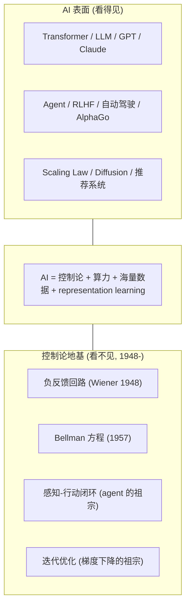

# Plan: 回到 AI - 被吸进地基里的那个内核

## 来源
《什么是控制论？控制论是 AI 的上辈子吗？》第七章整章。

## Type
**Structural - 双层堆叠 + 中间桥接**。视觉隐喻直接对应章节题目"被吸进地基里的那个内核"：上层 AI 表面、下层控制论地基、中间一句话说明两者的连接公式。

## Mermaid 草图

## 布局

- viewBox 680 × 510
- title y=42 "回到 AI: 被吸进地基里的那个内核"
- subtitle y=64 "AI 表面之下藏着 80 年前那本书的反馈骨架"
- 上层容器 (AI today): x=60, y=95, w=560, h=140
- 中间桥接区: y=255-280
  - caption-strong y=255 居中: "AI = 控制论 + 算力 + 海量数据 + representation learning"
  - caption y=275 居中: "(7.3 燃料差距 / 7.4 范式转变)"
- 下层容器 (控制论地基): x=60, y=295, w=560, h=140
- footer: caption-strong y=465 + caption y=487

## 上层容器内容
- eyebrow "AI 表面"
- right tag "→ 看得见"
- th "今天的 AI"
- ts "1990s 到今天看到的全部"
- body 4 行: Transformer 类 / Agent 类 / Scaling 类 / "看起来跟 1948 没关系"

## 下层容器内容
- eyebrow "控制论地基"
- right tag "→ 看不见 / 1948-"
- th "控制论内核"
- ts "感知差距 → 修正 → 再感知"
- body 4 行: 负反馈 / Bellman / 感知-行动闭环 / 迭代优化

## 中间桥接
水平居中两行，把 7.3 + 7.4 的核心论点 (AI = 控制论 + 三件事差距) 压成一句话。

## Footer
- caption-strong: AI 圈基本不提自己的 cybernetics 血缘, 但每一行机器学习代码都在跑 80 年前的循环
- caption: Friston 自由能 (7.6) - 控制论第二春正在生长, model-based 想用贝叶斯重新接回 AI

## Reader need
一眼看清整个第七章的核心结构：AI 表面 (Transformer / GPT / Agent) 之下藏的是控制论 1948 年那套反馈骨架，连接两者的是"算力 + 数据 + representation learning"这三件事差距。
