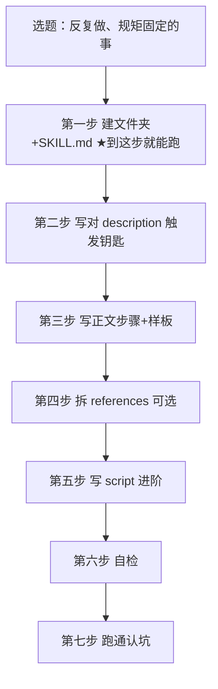

# 手把手做你的第一个 Skill — 七步流程

**来源**：《Skill是什么·写给零基础》第三章（周报 Skill 为例）
**类型**：flowchart（本地"堆叠层行"式，每步一行；模板 us-five-layer-strategy）
**读者收获**：看完知道从零做一个能跑的 Skill 要走哪七步，最小骨架到哪、哪两步可选/进阶。

## Mermaid 结构

## 布局
- 7 行 × 100 高 × 12 间距，viewBox 680×942
- 第一步 = layer-key（accent），因为原文"到这一步一个能用的 Skill 已经做完了"
- 每行：eyebrow(步骤号) + th(动作) + ts(一句话) + 右栏两行做法 + 右上角 accent 小结
- 选题作为副标题，第四/五步标"可选/进阶"
