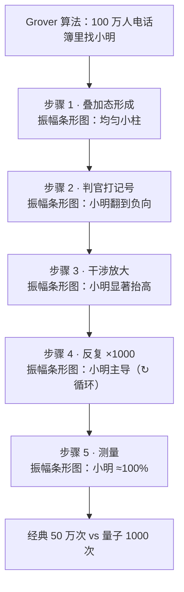

# Grover 算法振幅演化示意图 · 布局方案

## 设计目标
读完图，读者能看到：100 万行电话簿里小明那一根振幅，怎么从 1/100 万被一步步放大到接近 100%。每一步左侧是文字说明，右侧是当前的振幅条形图快照。

## 总体布局
- viewBox 680 × 720
- 标题 y=42，副标题 y=64
- 5 个容器，每个 100 高，间距 12：
  - C1 y=96-196：叠加态形成
  - C2 y=208-308：判官打相位记号
  - C3 y=320-420：干涉放大
  - C4 y=432-532：反复跑 ×1000 次
  - C5 y=544-644：测量
- 尾注 caption-strong y=676、caption y=698

## 容器内部
左栏 60-220：eyebrow（步骤 N）+ th（步骤名）+ 2 行 ts（说明）。
中间 divider x=220。
右栏 238-640：振幅条形图，20 根柱子。

## 条形图坐标
- 柱宽 12，间距 5，每槽 17，起点 x=270，i 号柱中心 x = 276 + i×17
- 小明在 i=10，center x = 446（视觉接近右栏中线 439）
- 每张图基线 y = 容器顶 + 50（C1: y=146, C2: 258, C3: 370, C4: 482, C5: 594）
- 基线画一条 divider 横线，让"负向相位"在 step 2 视觉可见
- 灰色柱（其它 19 行）用 `var(--fg-soft)`；小明那根用 `var(--accent)` (coral)

## 每步柱子高度
| 步骤 | 灰柱高度 | 小明柱 | 注释 |
|------|---------|--------|------|
| C1 叠加态 | +6 全部一致 | +6 灰色（跟其它一样） | 看不出谁是小明 |
| C2 打记号 | +6 | -6（翻到基线下方，coral） | 小明被打了隐形相位记号 |
| C3 干涉放大 | +3（压低） | +18 coral | 小明显著高于其它 |
| C4 反复 ×1000 | +1（几乎贴线） | +26 coral | 右侧加 ↻ ×1000 文字 |
| C5 测量 | +0.5（几乎不可见） | +34 coral | 上方加 "≈100%" 标签 |

## Mermaid 结构草图

## 颜色规则
- 整图只用一个 accent ramp（coral #fb7185）
- 小明那根柱、C5 的"≈100%"文字、尾注的关键数字用 accent
- 其余全部 fg / fg-muted / fg-soft

## 文案
- 标题：Grover 算法：100 万人电话簿里找小明
- 副标题：看小明那一行的振幅怎么从 1/100 万被放大到接近 100%
- C1 左栏：步骤 1 / 叠加态形成 / 100 万行同时叠在 / 一台量子机里
- C2 左栏：步骤 2 / 判官打相位记号 / 只有小明那行 / 被翻到基线下方
- C3 左栏：步骤 3 / 干涉放大 / 绕平均反射 / 小明那根明显抬高
- C4 左栏：步骤 4 / 反复跑 √N 次 / 重复 2+3 步 / 约 1000 次
- C5 左栏：步骤 5 / 测量 / 小明概率 ≈ 100% / 输出小明在哪一行
- 尾注 1：经典做法约 50 万次 vs 量子做法约 1000 次
- 尾注 2：1996 年 Grover 算法
