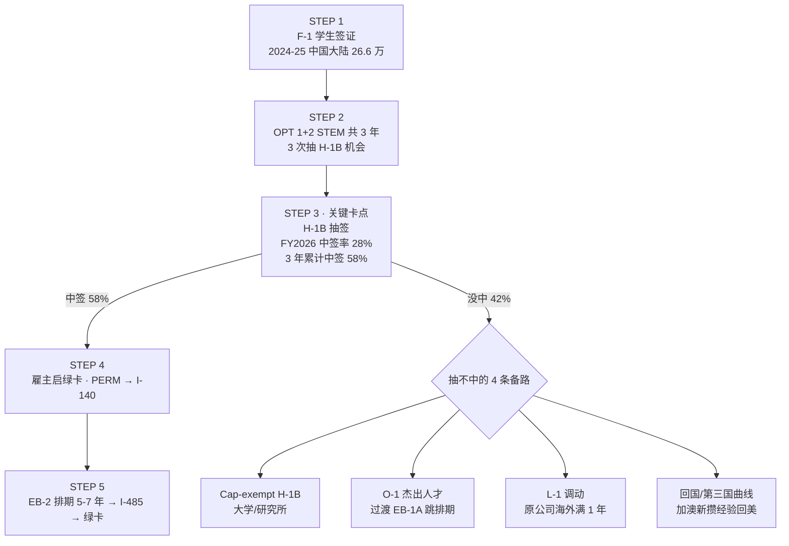

# Plan: 中国留学生 H-1B 路径 + 抽不中的 4 条出路

## Mermaid sketch

## 布局

- 5 个主路径 stacked container(STEP 1-5)
- STEP 3 用 layer-key 高亮(关键卡点)
- 底部独立一条 4-column band 显示备路(横向 4 个卡片 + 上方 eyebrow-accent 标签)

## Layout math

- viewBox: 680 × 800
- title y=42, subtitle y=64
- C1 (h=96): y=96 to 192
- C2 (h=96): y=204 to 300
- C3 LAYER-KEY (h=100): y=312 to 412
- C4 (h=96): y=424 to 520
- C5 (h=96): y=532 to 628
- BAND eyebrow: y=652
- BAND 4 cards (h=60): y=664 to 724
- Footer caption-strong: y=756
- Footer caption: y=778
- H = 800

## 4-column band 坐标

- W=130, gap=20
- Card 1: x=60–190, center 125
- Card 2: x=210–340, center 275
- Card 3: x=360–490, center 425
- Card 4: x=510–640, center 575

## 颜色

1 accent ramp (coral). C3 = layer-key + eyebrow-accent。BAND 头部用 eyebrow-accent。其它中性。
