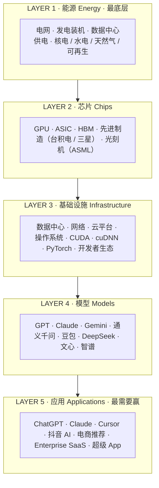

# 黄仁勋 AI 五层蛋糕 — 示意图 plan

## Diagram Plan
**Material**: 黄仁勋在 2026 年达沃斯提出的 AI 五层蛋糕框架（Energy / Chips / Infrastructure / Models / Applications）
**Diagrams**: 1
**Type**: structural（堆叠水平分层，模拟"蛋糕"）
**Named elements**: 5 layers + 每层 4-6 个代表性组件 + 1 个强调 Layer 5（应用层是最大的蛋糕）
**Reader need**: "看完这张图，读者理解 AI 是自下而上的五层堆叠系统，每层有具体组成；应用层是最顶层、最大的一块蛋糕"
**Slug**: huang-ai-five-layers
**Language**: zh
**Color budget**: 2 ramps（gray 基准 + coral 强调 Layer 5）

## Mermaid sketch

## Layout

- viewBox: 680 × 700
- Title block: y=42 / 64
- 5 layers × 96px + 4 × 10px gap = 520px
- Layers range: y=96（L5 top）↓ y=616（L1 bottom）
- Footer quote: y=650 / 672
- Box: x=60 → x=640 (width 580)
- Left label column (layer name + EN): x=82 onward, divider at x=220
- Right content column: x=238 onward
- Top layer (L5): coral tint bg + coral stroke + coral eyebrow
- Other layers: neutral gray fill + gray stroke

## Thesis encoding

Color = meaning:
- L1-L4 gray = "守得住/守不住" 的中性评估
- L5 coral = 黄仁勋原话 "最需要赢的那一层"
- Footer quote 固定原话为 anchor
