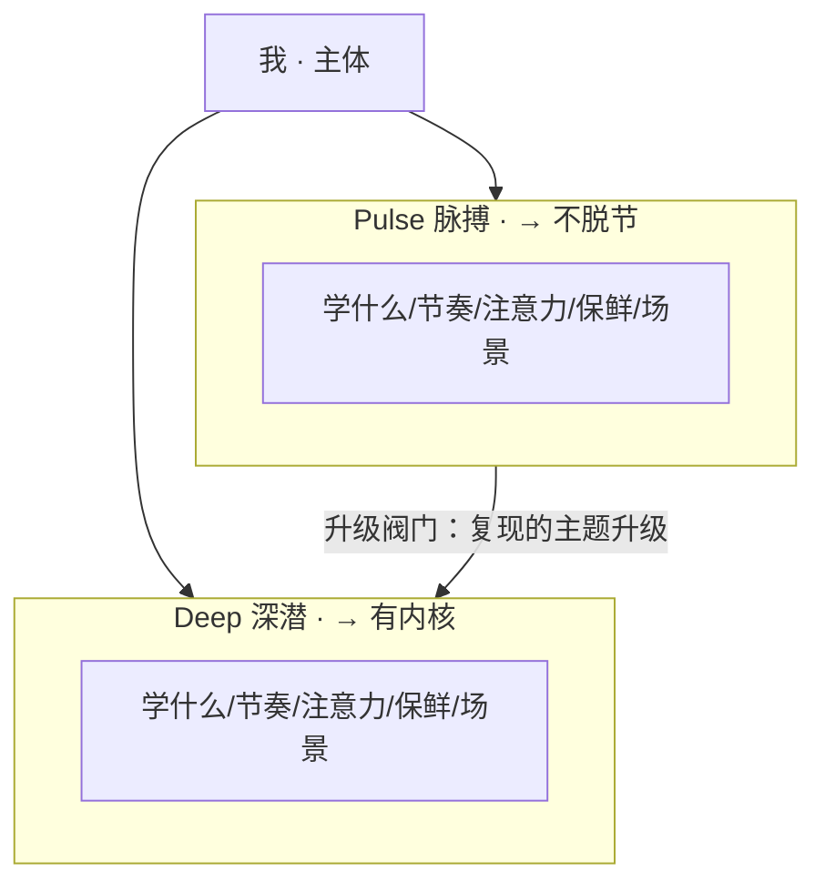

# Plan: 输入端 Pulse vs Deep 对比图

**Material**: 《我打造的个人AI系统之哲学基础》第二章"输入端：把 Learning 拆成两件不同的事"
**Type**: structural subsystem（两个并排 sibling 容器对比 + 一条跨栏的升级阀门箭头）。本地无模板，按 house design-system 现推。
**Reader need**: 看完这张图，读者立刻明白 Learning 被拆成一快一慢两条相反的线，各自要点是什么，以及 Pulse 怎么升级成 Deep。
**Slug**: learning-pulse-deep

## Mermaid 结构

## 布局
- viewBox 0 0 680 450，宽 680，外边距 60。
- 标题 y=42，副标题 y=64。
- "我"药丸 x=280 w=140 h=34（y=82），两条 conn 箭头扇出到两栏顶。
- 左栏 Pulse：x=60 w=250（60–310），y=150 h=224。
- 右栏 Deep：x=390 w=250（390–640），y=150 h=224。
- 中间 80px gap（310–390）放 accent 升级阀门箭头（y=300，Pulse→Deep）。
- 每栏：eyebrow + 右上 accent 标签(→不脱节/→有内核) + th 标题 + ts 副 + divider + 5 行(label x=80/410, value x=140/468，行高 24)。
- 尾注 caption-strong y=406 + caption y=428。
- accent 仅用：两栏右上 punchy 标签 + 升级阀门（单一 coral ramp，符合 house 三支柱用法）。
