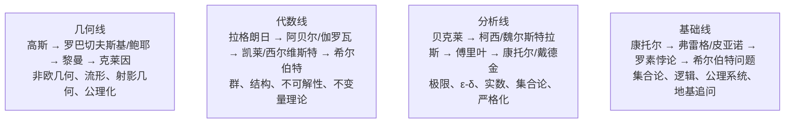

## Diagram Plan

**Material**: `气吞万里如虎：回顾十九世纪的数学英豪们.md` 结语“四条主线”
**Diagrams**: 1
**Type**: structural, stacked sibling containers
**Slug**: `math-19th-century-four-lines`
**Reader need**: "After seeing this diagram, the reader understands the four nineteenth-century mathematical lines and what each line finally formed."

## Layout

- Canvas: `viewBox="0 0 680 655"`
- Title: y=42, subtitle: y=64
- Four containers:
  - Geometry: x=60, y=96, w=580, h=112
  - Algebra: x=60, y=220, w=580, h=112
  - Analysis: x=60, y=344, w=580, h=112
  - Foundations: x=60, y=468, w=580, h=112
- Footer:
  - caption-strong y=614
  - caption y=636

## Labels

- 几何线 / 空间被重写 / `→ 空间`
  - 高斯 → 罗巴切夫斯基 / 鲍耶 → 黎曼 → 克莱因
  - 非欧几何、流形、射影几何、几何公理化
- 代数线 / 公式让位于结构 / `→ 结构`
  - 拉格朗日 → 阿贝尔 / 伽罗瓦 → 凯莱 / 西尔维斯特
  - 群、不可解性、不变量理论、抽象代数
- 分析线 / 直觉退回定义 / `→ 严格化`
  - 贝克莱 → 柯西 / 魏尔斯特拉斯 → 傅里叶
  - 极限、ε-δ、实数、集合论、分析学地基
- 基础线 / 数学审查地基 / `→ 公理`
  - 康托尔 → 弗雷格 / 皮亚诺 → 罗素悖论 → 希尔伯特
  - 集合论、逻辑、公理系统、存在性追问

## Checks

- No rect extends past x=640.
- All text uses project classes.
- No SVG comments.
- Accent used only for right-side tags and footer emphasis.
