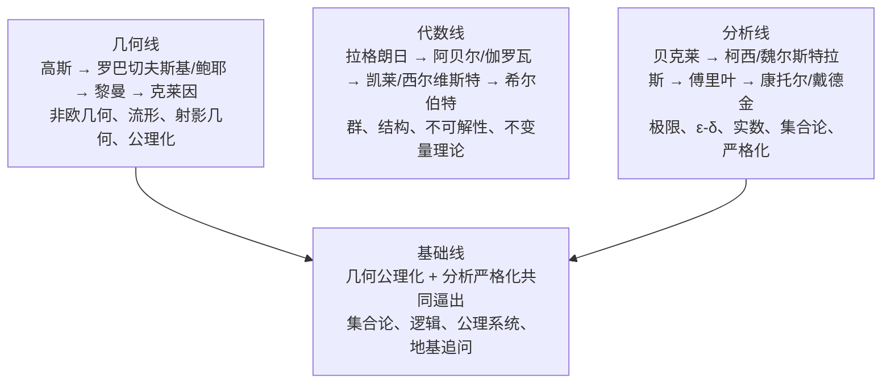

## Diagram Plan

**Material**: `气吞万里如虎：回顾十九世纪的数学英豪们.md` 结语“四条主线”
**Diagrams**: 1
**Type**: structural, stacked sibling containers
**Slug**: `math-19th-century-four-lines`
**Reader need**: "After seeing this diagram, the reader understands the four nineteenth-century mathematical lines, especially that foundations is the pressure point produced by geometry axiomatization and analysis rigorization."

## Layout

- Canvas: `viewBox="0 0 680 645"`
- Title: y=42, subtitle: y=64
- Four containers:
  - Geometry: x=60, y=96, w=580, h=104
  - Algebra: x=60, y=212, w=580, h=104
  - Analysis: x=60, y=328, w=580, h=104
  - Foundations: x=60, y=456, w=580, h=132, highlighted as the pressure point
- Footer:
  - caption y=626

## Labels

- 几何线 / 空间被重写 / `→ 空间`
  - 高斯 → 罗巴切夫斯基 / 鲍耶 → 黎曼 → 克莱因
  - 非欧几何、流形、射影几何、几何公理化
- 代数线 / 公式让位于结构 / `→ 结构`
  - 拉格朗日 → 阿贝尔 / 伽罗瓦 → 凯莱 / 西尔维斯特
  - 群、不可解性、不变量理论、抽象代数
- 分析线 / 直觉退回定义 / `→ 严格化`
  - 贝克莱 → 柯西 / 魏尔斯特拉斯 → 傅里叶
  - 极限、ε-δ、实数、集合论、分析学地基
- 基础线 / 几何 + 分析共同逼出 / `→ 地基危机`
  - 几何公理化追问模型与一致性
  - 分析严格化依赖集合论语言
  - 集合论、逻辑、公理系统、存在性追问

## Checks

- No rect extends past x=640.
- All text uses project classes.
- No SVG comments.
- Accent used for the foundation layer to mark that it is the pressure point produced by the geometry and analysis lines, not an isolated fourth list item.
