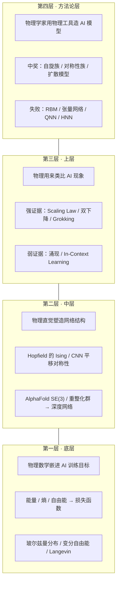

# Plan: 物理在 AI 里的四层位置

## 输入
《当物理遇上 AI：深度学习里的物理元素》上下两篇的总结图。结尾段落明确定义了四层框架。

## Type
**Structural — 模板 B (堆叠层)**。四层堆叠是 huang-ai-five-layers / us-five-layer-strategy 同款。理由：四个并列且分层的概念，每层有独立内容、有清晰的"上下关系"（地基 → 上层建筑）。

## Mermaid 草图

## 布局

- viewBox 680 × 700
- Title y=42: "物理在 AI 里的四层位置"
- Subtitle y=64: "《当物理遇上 AI：深度学习里的物理元素》上下两篇总结"
- 4 个容器，h=120, 间距 14
  - Layer 4 (顶, 方法论层): y=96 bottom=216  **layer-key 高亮**（下篇核心论点）
  - Layer 3 (上层): y=230 bottom=350
  - Layer 2 (中层): y=364 bottom=484
  - Layer 1 (底, 底层): y=498 bottom=618
- Footer:
  - caption-strong y=650: "底层和中层已经成为 AI 的地基，上层和方法论层仍在探索"
  - caption y=672: "方法论层四十年只中过 3 次奖：自旋族 / 对称性族 / 扩散模型"

## 容器内布局（按 design-system §4）

每个容器：
- 左栏 eyebrow x=82 y=y_top+22："第 N 层"
- 左栏 th x=82 y=y_top+54：层名（底层 / 中层 / 上层 / 方法论层）
- 左栏 ts x=82 y=y_top+74：一句话定位
- divider x=220 y=y_top+14→y_top+106
- 右栏 body 3 行：x=238, y=y_top+54/76/98
- 右上角 eyebrow-accent x=618 y=y_top+22：punchy 标签

## 右上角 punchy 标签

- Layer 4: `→ 四十年中奖 3 次`
- Layer 3: `→ 强证据 3 弱证据 2`
- Layer 2: `→ 结构地基`
- Layer 1: `→ 数学地基`

## Reader need
"After seeing this diagram, the reader 一眼看清物理学对 AI 的四层贡献分别是什么，哪两层已经成为隐形地基，哪两层仍在探索。"

## Slug
physics-ai-four-layers
