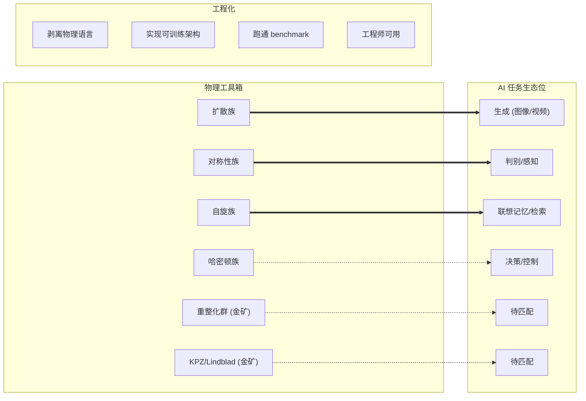

# Plan: 工程化 = 物理工具箱 → 加工 → AI 任务生态位

## 来源
《当物理遇上 AI：深度学习里的物理元素（下）》第十章。

## Type
**Illustrative**。用三段式空间隐喻代替四方块堆叠：左边是原材料（物理工具箱），中央是加工过程（工程化），右边是产品落点（AI 任务生态位）。这能直接传达章节核心论点：演化逻辑，按场合匹配。

## Mermaid 草图

## 布局

- viewBox 680 × 490
- title y=42 "工程化：从买彩票到系统工程"
- subtitle y=64 "用演化思路造 AI 模型，按场合匹配"
- 左容器（物理工具箱） x=60, y=95, w=150, h=325
- 中央管道（工程化） x=240, y=140, w=200, h=240
- 右容器（生态位） x=470, y=95, w=150, h=325
- 6 条水平连接线 y=181/217/253/289/325/361，x=198→482，被中央管道 fill 盖住中段
  - y=181,217,253 实线（已成熟匹配）
  - y=289 半虚线 dasharray=6,3（理论清晰但工程未完成）
  - y=325,361 虚线 dasharray=3,3（金矿待开发）
- pill：宽 126, 高 26, rx=13，fill=var(--bg) + stroke=var(--layer-stroke)
- 金矿 pill 加 stroke-dasharray=4,3
- footer：caption-strong + caption

## 左侧 6 个物理 pill (按 y)
1. 扩散族 y=168
2. 对称性族 y=204
3. 自旋族 y=240
4. 哈密顿族 y=276
5. 重整化群 (虚线) y=312
6. Lindblad / KPZ (虚线) y=348

## 右侧 6 个 AI 任务 pill (按 y, 跟左侧 y 对齐)
1. 生成（图像/视频）y=168
2. 判别 / 感知 y=204
3. 联想记忆 / 检索 y=240
4. 决策 / 控制 y=276
5. 待匹配 (虚线) y=312
6. 待匹配 (虚线) y=348

## 中央管道内容
- eyebrow "中央加工"
- th "工程化"
- ts 4 行：1.剥离物理语言 / 2.实现可训练架构 / 3.跑通 benchmark / 4.工程师可用
- caption-strong "扩散模型 = 标杆"
- caption "Sohl-Dickstein → 何宏嘉"

## Footer
- caption-strong "演化的逻辑：不靠一个统一原则覆盖所有 AI"
- caption "造海量物理启发模型，工程化所有根族，按场合精准匹配"

## Reader need
读者一眼看清第十章的核心提议：从一堆物理候选，经过工程化加工，按场合匹配 AI 任务。已成熟的 3 条线、理论清晰的 1 条线、还有 2 个金矿待开发，是文章下一步路线的具体图像。
