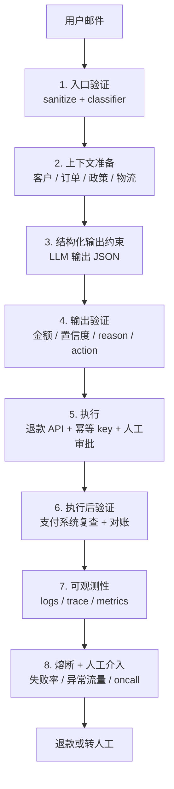

# Diagram Plan: 退款 agent 的 8 层壳

**Material**: 《别再被 AI 新词绕晕了：Prompt、Context、Agent 背后的工程主线》5.2 小节
**Type**: flowchart (8-layer harness pipeline)
**Slug**: refund-agent-harness

## Reader need
"After seeing this diagram, the reader understands that a production refund agent is not just an LLM call; it is an 8-layer harness where only Layer 3 runs the model and the other 7 layers are traditional engineering controls."

## Mermaid sketch

## Layout math

- viewBox: 680 × 1000
- Outer margin x=60, content width 580
- 9 compact containers, each 82 px high, 8 px gap
  - Input: y 96–178
  - Layer 1: y 186–268
  - Layer 2: y 276–358
  - Layer 3: y 366–448
  - Layer 4: y 456–538
  - Layer 5: y 546–628
  - Layer 6: y 636–718
  - Layer 7: y 726–808
  - Layer 8: y 816–898
- Footer: y=938 / 960
- Left column x=82–220; right column x=238–640; divider x=220

## Color strategy

- Layer 3 uses accent because it is the only LLM step.
- Other layers are neutral, emphasizing that the harness is mostly traditional backend / SRE work.
- Right tags categorize each layer: gate, context, LLM, validator, API, reconciliation, observability, breaker.

## Text compression

- No raw code or JSON in SVG.
- Keep each right body line short.
- Footer takeaway: "只有第 3 层是 LLM，其余 7 层都是工程壳。"
