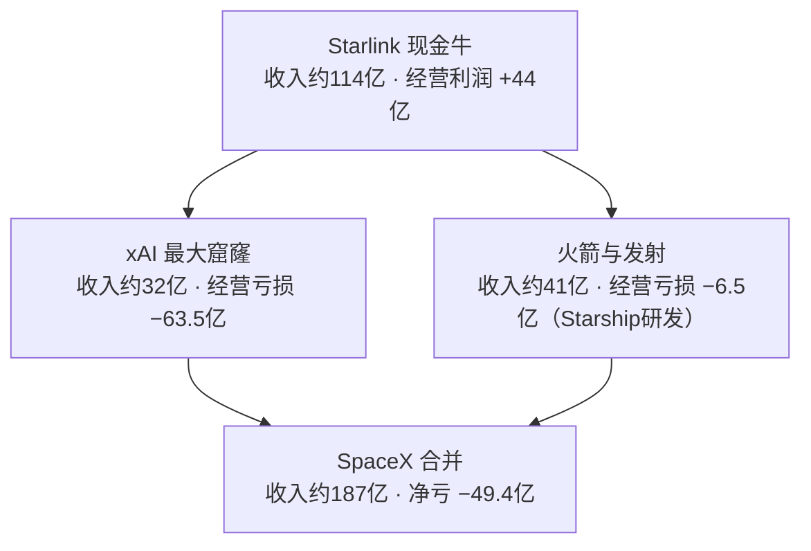

# Diagram Plan

**Material**: 《长篇分析：SpaceX未来的展望》第四章"账本里的真相"——2025 年 SpaceX 分部财务结构
**Diagrams**: 1
**Type**: illustrative（现金流向/喂养直觉图，不是数据罗列，也不是方块堆叠）
**Reader need**: 看完这张图，读者立刻明白：唯一赚钱的 Starlink，把钱喂给了 xAI 和 Starship 两个烧钱口子，合并下来整体净亏。

## Mermaid 结构草图

## 布局
- 顶部居中：Starlink（灰色 .layer，现金牛/源头），含 +44亿利润
- 两条 .arrow 向下分叉到两个窟窿
- 中部左右：xAI（灰底 + coral 亏损数字，最大窟窿 −63.5亿）、火箭与发射（−6.5亿，Starship 研发）
- 两条 .arrow 汇聚向下
- 底部居中：合并净亏（layer-key coral，整图唯一强调框）−49.4亿
- 尾注：一句话主旨 + 口径说明（招股书，单位亿美元）

## 配色
- 只用一套 coral accent = "亏损/烧钱"，灰中性 = 赚钱的 Starlink
- layer-key 只 1 个（合并净亏落点框）
- 亏损数字用 .accent-num（coral），利润 +44亿 用中性 .th，对比清晰

## viewBox
680 × 520
