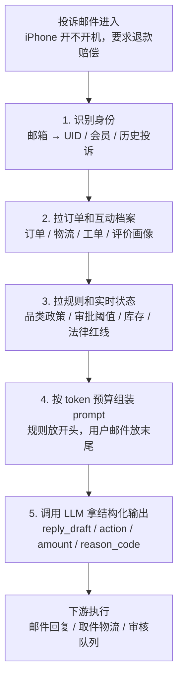

# Diagram Plan: 淘宝客服 agent 的 context 管道

**Material**: 《别再被 AI 新词绕晕了：Prompt、Context、Agent 背后的工程主线》3.3 小节
**Type**: flowchart (5-step pipeline)
**Slug**: taobao-context-pipeline

## Reader need
"After seeing this diagram, the reader understands that the LLM reply is only the last step; the real context engineering work is the four-step backend pipeline that identifies the user, fetches business data, loads rules, and packs the prompt within token budget."

## Mermaid sketch

## Layout math

- viewBox: 680 × 820
- Outer margin x=60, content width 580
- 6 containers, each 92 px high, 10 px gap
  - Step 0: y 96–188
  - Step 1: y 198–290
  - Step 2: y 300–392
  - Step 3: y 402–494
  - Step 4: y 504–596
  - Step 5: y 606–698
- Footer caption at y=738 / 760
- Left column x=82–220, right column x=238–640
- Divider at x=220

## Color strategy

- Neutral containers for steps 0–4.
- Accent container for Step 5, because it is the only LLM call.
- Right tags emphasize step outputs: UID, JSON, rules, prompt, structured output.

## Text compression

- Each right-column line stays below ~28 CJK chars.
- Avoid raw JSON block in the SVG; show field names only.
- Keep the takeaway in footer: "前 4 步是传统后端，LLM 只在第 5 步登场。"
