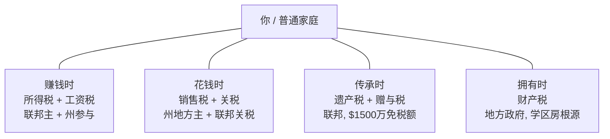

## Diagram Plan

**Material**: 美国税收制度完全指南 第三章 "四大板块"。4 类税（所得税/工资税/消费税/财产+遗产税）按一个普通家庭的生活节奏（赚钱/花钱/拥有/传承）放在中心人物四周。

**Type**: illustrative — 用户明确要求不做"长方形叠在一起"的列表式结构。改用放射状（radial）布局，让读者一眼看到税"从四个方向围住家庭"的视觉感受。

**Reader need**: "看完之后读者明白美国税从赚钱、花钱、拥有、传承四个生活时点同时围住一个家庭，不是单一一种税，而是每个时点都有自己的征税方式。"

## Mermaid sketch

## Layout

- **viewBox**: 680 × 600
- **布局风格**: 不是 design-system 默认的 vertical-stacked-layer 模式。中心放椭圆（layer-key）作为视觉焦点，4 个圆角矩形（layer）放在四角，spokes（细线）从中心连到 4 角。这是对默认模板的一次合规偏离，因为用户明确"不要长方形叠在一起"。
- **4 个 quadrant 矩形**: 180 × 120, rx=14
  - NW 赚钱时: x=60-240, y=110-230
  - NE 花钱时: x=440-620, y=110-230
  - SW 传承时: x=60-240, y=395-515
  - SE 拥有时: x=440-620, y=395-515
- **Center 椭圆**: cx=340, cy=315, rx=78, ry=40, layer-key
- **Spokes**: 从椭圆边缘到每个矩形最近角，4 条细灰线，无 arrow marker
- **每个矩形内**: eyebrow (life moment) + th (税类) + ts (描述) + ts (主征收政府)

## Color & accent budget

- 1 个 layer-key (center 椭圆) ✓
- 0 个 eyebrow-accent
- spokes 用 fg-soft (灰)，不占 accent 配额
- 4 个 quadrant 都用 layer (neutral)，不分颜色（4 类税概念上对等，不需要区分）

## Footer

- caption-strong (y=548): 四类税从赚钱、花钱、拥有、传承四个时点同时围着你
- caption (y=570): "美国税"是多笔不同政府、不同时机的合计。普通中产合并下来的有效税率通常在 25%-40% 之间

## Output

- diagram/us-tax-four-categories/diagram.svg
- diagram/us-tax-four-categories/diagram.png (via scripts/svg-to-png.py)
