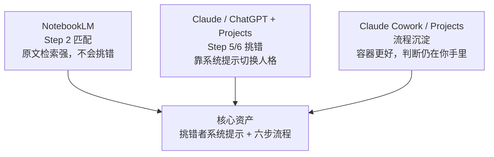

## Diagram Plan

**Material**: `Vibe Reading：AI 时代读书的系统化方法.md` 第六节“工具选型”
**Diagrams**: 1
**Type**: structural, using the three sibling containers template
**Slug**: `vibe-reading-tool-selection`
**Reader need**: "After seeing this diagram, the reader understands each tool's useful boundary, and why the reusable asset is the prompt plus workflow rather than the product."

## Layout

- Canvas: `viewBox="0 0 680 590"`
- Title: y=42, subtitle: y=64
- Three containers:
  - NotebookLM: x=60, y=96, w=580, h=125
  - Claude / ChatGPT + Projects: x=60, y=237, w=580, h=125
  - Claude Cowork / Projects: x=60, y=378, w=580, h=125
- Footer:
  - caption-strong y=535
  - caption y=557

## Labels

- Container 1
  - Eyebrow: `TOOL 1`
  - Title: `NotebookLM`
  - Subtitle: `Step 2 匹配`
  - Tag: `→ 原文检索`
  - Body:
    - `适合问“书里有没有讲 X”，引用回原文。`
    - `它顺着问题找答案，不会逆着理解挑错。`
    - `Audio Overview 好听，但容易变成一键压缩。`
- Container 2
  - Eyebrow: `TOOL 2`
  - Title: `Claude / ChatGPT`
  - Subtitle: `Projects`
  - Tag: `→ 挑错窗口`
  - Body:
    - `把书、笔记、摘要和记录放到同一处。`
    - `关键是系统提示，把助理切成挑错者。`
    - `它能指出漏洞，但仍不是自动阅读系统。`
- Container 3
  - Eyebrow: `TOOL 3`
  - Title: `Claude Cowork`
  - Subtitle: `Project + Skill`
  - Tag: `→ 可复用资产`
  - Body:
    - `适合放 source、requirements、map、notes。`
    - `Skill / Plugin 能把六步法变成固定动作。`
    - `Project 负责装材料，判断仍然在你手里。`

## Checks

- No rect extends past x=640.
- All text uses project classes.
- No SVG comments.
- Accent is used only for the right-side punch tags.
