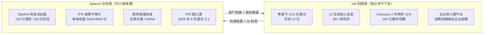

# xai-spacex-merger

**Material**: 《马斯克把 xAI 并入 SpaceX，到底意味着什么？》1.4 节 — xAI 必须塞进 SpaceX 的核心逻辑（双向资产重组）

**Type**: structural subsystem
- 两个并排的 dashed sibling 容器（xAI / SpaceX），各 4 个内部 box
- 两条 cross-system 箭头展示双向交换
- 底部 synthesis 行点出 1.25 万亿合并实体估值 + 两次合并时间线

**Named elements**:

xAI 的困境（coral，4 boxes）：
- 季度亏 14.6 亿美元 / 月烧 10 亿
- 11 位联合创始人全走 / 80 多研究员
- Colossus 1 利用率 11% / 180 亿硬件闲置
- 企业收入跑不出 / 消费战略输给企业战略

SpaceX 的处境（teal，4 boxes）：
- Starlink 现金流凶猛 / 100 亿营收 / 80 亿利润
- IPO 故事不够大 / 单独估值 5000-8000 亿
- 政府渠道现成 / 五角大楼 / NASA 关系深
- IPO 时间窗口紧 / 2026 年 6 月递交 S-1

Cross-arrows:
- Upper（coral）xAI → SpaceX："估值故事 + AI 标签"
- Lower（teal）SpaceX → xAI："资产容器 + 政府渠道"

**Reader need**: 读完这张图，读者理解 xAI 和 SpaceX 各自带着什么进入合并、又从对方拿到什么，从而看清这次合并底层是一次双向资产重组而不是单方面的"AI 业务并入航天公司"。

**Color palette**: coral 表示 xAI 困境（problems / 不利点），teal 表示 SpaceX 资源 / 处境（assets / 优势）。一图两个 accent ramp，符合 ≤2 limit。

**ViewBox**: 680 × 540

## Mermaid sketch

底部 synthesis：
- 合并实体估值 1.25 万亿美元
- 表层是 AI 业务并入航天公司，底层是双向资产重组
- 2026 年 2 月股权合并  ·  5 月 6 日 xAI 法律实体解散

## Layout 数学

- viewBox 680 × 540
- 标题区：y=20-70
- 容器：y=90-420（h=330）
  - Left container x=30, w=240
  - Right container x=410, w=240
  - 中间 gap：x=270-410（140 wide）
- 每个内部 box：w=200，h=56，间距 10
  - Box 1: y=155-211
  - Box 2: y=221-277
  - Box 3: y=287-343
  - Box 4: y=353-409
- Cross arrows：
  - Upper: y=215（coral，左→右，x=270 到 405）
  - Lower: y=349（teal，右→左，x=410 到 275）
- Bottom synthesis：y=445 分隔线 → y=470 / 490 / 510 三行文本
