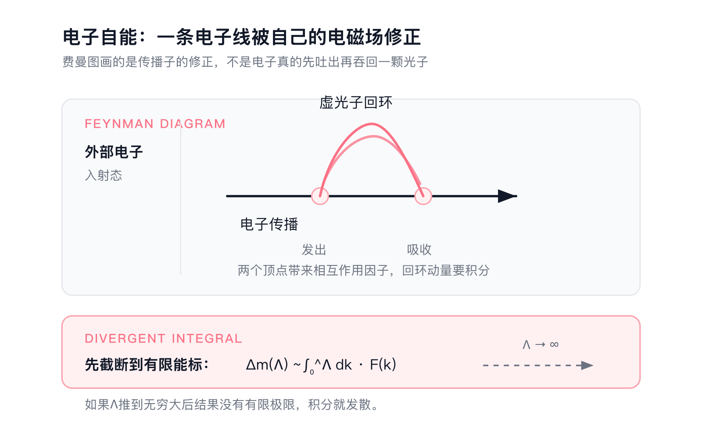

上篇写到1932年，量子力学已经有了自己的语言。

矩阵力学、波动力学、概率诠释、不确定性原理、泡利（Wolfgang Pauli）不相容原理、希尔伯特空间，这些东西放在一起，已经足够解释原子光谱、化学键和元素周期表。对很多读者来说，量子力学到这里似乎已经成型了。剩下的工作，好像只是把方程解得更熟，把模型用得更顺。

可真正的现代物理，恰恰是从这个“已经成型”的地方再次裂开的。

薛定谔方程很好用，但它有一个根本问题：它和狭义相对论不兼容。一个低速电子可以这么算，一个原子里的电子也可以这么算。可只要能量升高，粒子可以被创造、可以被湮灭，一个固定粒子数的波函数就开始撑不住。

这就是中篇要讲的历史。量子力学为了和相对论相容，不得不从“粒子的波函数”走向“场的量子化”。这一步带来了狄拉克（P.A.M. Dirac）方程，带来了反物质，也带来了一个更怪的真空。真空不再是空的，里面有涨落、有极化、有无穷多自由度。

问题也从这里开始。场论一算高阶，就吐出无穷大。物理学家花了二十年才把这个问题压住，靠的是重整化。刚压住电磁相互作用，弱相互作用和强相互作用又把场论推到第二次危机。最后救回来的，是规范场、自发破缺、夸克、渐近自由和威尔逊的重整化群。

这条路线最后长成标准模型。它是人类最精确的理论之一，也是一个明显没写完的理论。它能算出电子磁矩到惊人的精度，能预言W、Z和希格斯，能整理几乎所有已知基本粒子。可它解释不了中微子质量，解释不了暗物质和暗能量，也容不下引力。

所以中篇不是“量子力学后来的应用史”。它讲的是另一件事：当一个理论被迫面对相对论、无穷大和实验机器时，它怎样从量子力学变成量子场论，又怎样在几次失败之后，变成今天粒子物理的底座。

# 一、薛定谔方程不够用了

## 1.1 一开始就藏着裂缝

上篇讲薛定谔方程时，我们主要看的是原子世界。非相对论量子力学在那个尺度上极其成功，氢原子、简谐振子、角动量、能级跃迁，全部能算。可是薛定谔方程从形式上就带着一个尴尬：它对时间是一阶，对空间是二阶。

狭义相对论要求时间和空间以洛伦兹协变的方式放在一起。薛定谔方程没有做到这一点。它适合低速世界，速度接近光速时就开始露怯。

薛定谔本人其实很早就意识到这个问题。他最初试过一个相对论性波动方程，后来被称为克莱因-戈登方程。这个方程满足相对论能量关系

$$E^2=p^2c^2+m^2c^4.$$

可它拿去算氢原子精细结构时，对不上当时的实验结果。更麻烦的是，它对应的概率密度可以取负值。上篇刚建立起来的那套概率诠释，一碰相对论就不稳了。

克莱因-戈登方程本身后来没有被废掉，它适合描述自旋为0的粒子。失败的是把它当成单粒子概率波方程来理解。这个差别很重要，因为量子场论后来会告诉你，方程本身还能留下来，单粒子波函数这套解释框架已经不够。

## 1.2 更深的问题是粒子数会变

狭义相对论还有一个更硬的后果：能量可以变成质量。

只要能量足够高，一个过程里就可以产生粒子和反粒子。一个光子可以在合适条件下产生电子和正电子，一对电子和正电子也可以湮灭成光子。这里的粒子数不守恒，不能靠“多写几个坐标”解决。

非相对论量子力学默认你先指定粒子数。一个电子有一个波函数，两个电子有一个两体波函数，$N$个粒子有一个$N$体波函数。可相对论性世界里，$N$本身会变。你不能先把粒子数钉死，再假装理论还能覆盖所有高能过程。

克莱因佯谬把这个问题暴露得很早。1929年前后，人们发现电子碰到很高的势垒时，按相对论性方程计算，透射概率会出现大于1的怪结果。单粒子图像看，这是灾难。场论图像看，这其实是在提醒你：势垒附近可以产生粒子对，原来那套“一个电子过不过去”的问题问法已经错位。

所以走向场论不是为了把理论写得漂亮。它是被逼出来的。只要相对论和量子力学都要保留，粒子就不能再被当成固定数量的小球。真正稳定的对象只能是场。

## 1.3 视角翻转：场才是主角

量子场论最难的一步，表面看是公式，实际难在换视角。

这个视角有更长的来路。狄拉克1928年的电子方程首先解决的是相对论电子的协变波动方程问题，它仍然可以按“一个电子的波函数”来读。要理解“场才是主角”，得把另一条线接上：经典电磁场先获得物理实在性，随后电磁场本身被量子化。

经典物理里，法拉第（Michael Faraday）和麦克斯韦（James Clerk Maxwell）已经把场变成真实物理对象。电场、磁场有自己的能量和动量，可以在空间中传播。光在麦克斯韦那里就是电磁场的波。这给后来量子化电磁场留下了现成对象。

量子这边，约当（Pascual Jordan）的位置很关键。玻恩（Max Born）、海森堡（Werner Heisenberg）和约当在1926年的“三人论文”里，已经把电磁场的傅里叶模式当成量子振子来处理。约当后来更进一步，推动一个更激进的想法：物质波也可以按场来量子化。这样一来，电子可以被看成电子场的量子激发；那颗小球配一个波函数的图像，开始退到后面。

狄拉克1927年把这条路做得更具体。他量子化的是电磁场，结果是光子可以被产生和湮灭，自发辐射也获得了机制。这个成功很重要，因为光本来就是经典场，量子化以后自然给出“场的量子”。对电子来说，狄拉克1928年的方程还只是协变波动方程；经过空穴理论、反粒子解释和二次量子化，电子场图像才逐渐稳定下来。

到了1929年，海森堡和泡利把这种视角推进到更一般的框架里。场本身成为正则变量，粒子数可变成为理论必须容纳的基本事实。场从背景变成主角，来自相对论、量子化和粒子产生湮灭这几件事共同施加的压力。

在非相对论量子力学里，我们常说电子有波函数。到了量子场论里，更自然的说法是：电子是电子场的一个激发，光子是电磁场的一个激发。粒子不再是最底层的东西。场才是贯穿时空的对象，粒子只是场在某种状态下表现出来的量子。

这个说法听起来抽象，可以用一个粗糙类比抓住方向。水面一直在那里，波纹可以起来，也可以平掉。你可以数某一刻有几个明显波包，但水面本身比波包更根本。

场论里也是这样。电子可以产生、湮灭，光子可以被吸收、发射，粒子数可以改变。理论真正跟踪的是场的状态，某几个永远存在的小球退到了后面。

这一步还解决了一个长期困惑：为什么全同粒子真的全同？如果两个电子只是两颗小球，那它们“完全一样”其实很难解释。场论里，两个电子来自同一个电子场的两个激发，它们没有个体履历可区分。泡利不相容原理、自旋统计关系、产生湮灭算符，都在这套语言里变得自然。

## 1.4 狄拉克1927年先量子化了光

狄拉克在1927年做了一件经常被公众叙事跳过的事：他把电磁场量子化了。

爱因斯坦在1916年研究辐射时引入过A系数和B系数。B系数对应受激吸收和受激发射，A系数对应自发辐射。可在爱因斯坦那里，自发辐射还像一个唯象规则。原子为什么在没有外来光子刺激时也会自己发光？旧理论说不清。

狄拉克把电磁场当成一组量子谐振子来处理。每个模式有产生算符和湮灭算符，光子可以被创建，也可以被消灭。自发辐射从这里获得机制：即使没有外来光子，量子化的电磁场仍然有真空涨落，原子可以和这个场发生耦合。

这里的“量子化光”，核心做法是把经典电磁场先拆成许多模式。那套图像和“一束光里有很多小球排队飞出去”不太一样。每个模式有自己的频率、波矢和偏振，数学上很像一个谐振子。经典电磁波的振幅原本是连续变量，量子化以后，这个变量变成算符。

对一个频率为$\omega$的模式，量子化后的能量只能取一格一格的离散值：

$$
E_n=\left(n+\frac{1}{2}\right)\hbar\omega
$$

这里的$n$就是这个模式里的光子数。狄拉克1927年已经写出了这类改变量子数的操作，只是他用的是当时的$b_r$、$b_r^*$这类记号。今天教材里更常见的是$a_r$和$a_r^\dagger$。两者表达的是同一件事：对第$r$个模式，湮灭算符降低光子数，产生算符提高光子数。

最基本的公式可以这样写：

$$
a_r|n_r\rangle=\sqrt{n_r}|n_r-1\rangle,\qquad
a_r^\dagger|n_r\rangle=\sqrt{n_r+1}|n_r+1\rangle
$$

它们满足玻色子的对易关系：

$$
[a_r,a_s^\dagger]=\delta_{rs},\qquad [a_r,a_s]=[a_r^\dagger,a_s^\dagger]=0
$$

所以“加一个光子”有明确的算符含义，已经超过普通比喻。所谓光子的产生和湮灭，在形式上就是场的某个模式能级往上跳一格或往下跳一格。

这个写法还保留了一个很怪的东西：哪怕$n=0$，这个模式也有$\frac{1}{2}\hbar\omega$的能量。这就是零点能。自发辐射的关键也在这里：原子面对的是已经量子化的电磁场，不是一片绝对空无。真空态没有真实光子，但场算符仍然可以和原子的能级跃迁发生作用。

这一步是量子电动力学的起点。它说明场不只是经典背景，不只是粒子运动的舞台。场本身也要量子化。

从这里往后，粒子物理的基本语言开始变成“场和场的相互作用”。电子场、光子场、夸克场、胶子场、W场、Z场、希格斯场，这些名字听起来像名词堆叠，背后其实是同一场视角的扩张。

## 1.5 二次量子化和反对易

场量子化很快碰到另一个问题：不同粒子要遵守不同统计。

光子这类整数自旋粒子可以挤在同一个量子态里。电子这类半整数自旋粒子不行。上篇讲过泡利不相容原理，它最初像一条从光谱经验里总结出来的规则。到了场论里，这条规则需要被写进更深的代数结构。

约当和维格纳（Eugene Wigner）在1928年指出，费米子场必须用反对易关系。这里的历史要分清：狄拉克1927年已经在辐射场里使用了产生和湮灭光子的算符思想，约当和克莱因（Oskar Klein）同年把这种占有数语言推广到玻色多体系统；到了约当和维格纳1928年，费米子版本才获得正确的反对易结构。

普通数相乘，顺序无所谓。费米子的产生湮灭算符换一下顺序，会多出一个负号。这个负号听起来像形式细节，却正好保证两个电子不能占据同一个状态。

玻色子的基本关系是对易：

$$
[a_i,a_j^\dagger]=\delta_{ij}
$$

费米子的基本关系要换成反对易：

$$
\{c_i,c_j^\dagger\}=\delta_{ij},\qquad
\{c_i,c_j\}=\{c_i^\dagger,c_j^\dagger\}=0
$$

这里的花括号表示$\{A,B\}=AB+BA$。一个直接后果是$(c_i^\dagger)^2=0$。同一个单粒子态上，创造一次可以，第二次就变成零。泡利不相容原理从经验规则变成了算符代数。

玻色子用对易关系，费米子用反对易关系。泡利在1940年给出自旋统计定理的完整证明，把“整数自旋对应玻色子、半整数自旋对应费米子”接到相对论量子场论的基本要求上。

这件事让上篇的许多规则换了身份。它们不再只是原子光谱的整理工具，而是相对论场论的结构结果。

二次量子化这个名字有点误导，好像是在已经量子化的东西上再量子化一次。更准确地说，它把粒子数可变这件事放进形式体系。这套语言经历了几步拼接。狄拉克给出辐射场的产生湮灭语言，约当、克莱因、维格纳等人把它推广到多粒子和费米子问题，福克（Vladimir Fock）在1932年把可变粒子数的态空间写得更系统，后来教材才把它整理成“二次量子化”这一章。

在这套形式里，产生算符创造一个量子，湮灭算符消去一个量子，态空间不再固定在一个粒子数上。对一个单粒子哈密顿量$h_{ij}$，二次量子化以后常写成

$$
\hat H=\sum_{ij}h_{ij}a_i^\dagger a_j
$$

这行公式的意思很直白：先从$j$态拿走一个粒子，再往$i$态放进一个粒子。单粒子跃迁被翻译成了多粒子空间里的算符。

这套空间后来就叫Fock空间。你可以把它想成许多层叠在一起：零粒子态、一粒子态、两粒子态，一直往上。相互作用可以把系统从一层带到另一层。这样，发光、吸收、散射、粒子对产生，都能放进同一套语言。

这也是后来粒子物理能够处理碰撞实验的原因。探测器里看到的从来不会是固定粒子数的静态系统，实际是一串会分裂、会衰变、会重组、会留下不同轨迹的末态。

## 1.6 海森堡和泡利搭框架，然后撞墙

1929到1930年，海森堡和泡利尝试建立一般性的量子场论框架。他们知道，量子力学必须和场结合起来。电磁场量子化只是第一步，真正的问题是怎样系统处理场之间的相互作用。

他们的做法，今天看起来很熟悉：先写出场的拉格朗日量或哈密顿量，再找出场变量和共轭动量，最后把这些量提升为算符。一个标量场可以粗略写成

$$
[\phi(\mathbf{x},t),\pi(\mathbf{y},t)]=i\hbar\delta^3(\mathbf{x}-\mathbf{y})
$$

这里的$\phi$是场，$\pi$是它的共轭动量。这个式子等于把普通量子力学里的$[q,p]=i\hbar$搬到每一个空间点上。理论要处理的对象，从有限个坐标$q_1,q_2,\cdots$变成一个有无穷多自由度的场。

这套框架的野心很大。电磁场、电子场和它们之间的相互作用，可以被放进同一个正则语言里。粒子产生和湮灭也不再需要临时补丁，因为场算符本来就能改变粒子数。后来的量子场论教材仍然保留这条主线：从拉格朗日量出发，做正则量子化，再用微扰论计算相互作用。

可它一上来就碰到电磁场的老麻烦。电磁场有规范自由度，四个势函数$A^\mu$里只有一部分对应独立物理自由度。标量势的共轭动量会消失，约束条件和正则对易关系会打架。这个问题后来发展成约束系统量子化和规范固定的一整套技术；在1929年前后，它已经说明“把每个场变量都照$q,p$那样量子化”不会自动给出干净理论。

更严重的墙，是相互作用一算就发散。电子会和自己的电磁场相互作用。按直觉说，电子带电，它周围有电磁场，这个场的能量也应该反过来影响电子。可真去算电子自能，高频虚光子的贡献一路加上去，积分没有自然停止点。形式上可以把麻烦写成这种味道：

$$
\Delta m \sim \int^{\infty} dk\,F(k)
$$

这里的关键不在$F(k)$的具体形式，关键在积分上限冲到无穷大。理论把电子当成点，把相互作用放在同一个时空点上，于是任意短距离、任意高能量的模式都要参与计算。结果连有限答案都没有。

真空极化也一样。按微扰语言，光子传播时可以耦合到电子-正电子对的涨落，这会改变电磁场的传播和电子的有效电荷。这个现象后来变成真实可测的物理效应，可在早期场论里，它同样伴随发散。低阶近似常常还能给出有用结果，一到辐射修正，理论就开始吐出无穷大。

奥本海默（J. Robert Oppenheimer）1930年前后把问题说得更尖锐：这些无穷大超出了单步计算失误或单个模型小毛病的范围。只要坚持局域场、点粒子和微扰展开，它们就会系统性冒出来。电子自能会发散，真空极化会发散，能级修正也会被拖进去。

这就是第一章最后要留下的气氛：量子场论一开始就给出漂亮语言，也一开始就吐出让人无法接受的无穷大。海森堡和泡利搭出来的是现代量子场论的骨架，可这副骨架还没有告诉人们，怎样从无穷多自由度里取出有限的物理答案。这个问题会压住整个领域将近二十年。

# 二、狄拉克方程、反物质和真空

## 2.1 一个开平方的执念

狄拉克方程是二十世纪物理里最漂亮的方程之一。它要解决的问题很清楚：找到一个既符合量子力学，又符合狭义相对论的电子方程。

相对论的能量关系是$E^2=p^2c^2+m^2c^4$。如果直接量子化，就会得到二阶时间导数，概率诠释很麻烦。狄拉克想要一个对时间一阶的方程，像薛定谔方程那样可以直接描述态的演化。

为了做到这一点，他等于给相对论能量关系“开平方”。代价是方程里必须出现矩阵，波函数也不再是一个简单复数函数，而是四分量对象。最常见的写法是

$$\left(i\hbar \gamma^\mu \partial_\mu - mc\right)\psi=0.$$

这里的$\gamma^\mu$是满足特定反对易关系的矩阵，$\psi$是狄拉克旋量。这个式子比薛定谔方程难看一点，但它同时装下了量子力学和狭义相对论。

狄拉克的做法还有一个很强的审美标准：方程要一阶，形式要协变，概率要能解释。很多理论上的补丁也能凑合算数，但他不满意。他要的是一个结构上干净的方程。

这种审美有时会误导人，有时会救人。狄拉克方程属于后者。它不是从实验表格里拟合出来的曲线。相对论和量子力学的形式约束一路收紧，最后把它挤了出来。

真正让物理学家震动的是，电子自旋从方程里自己出来了。此前自旋更像实验逼出来的额外标签。狄拉克方程里，自旋不需要外加。电子磁矩的$g\approx2$也自然出现。这种“副产品”通常比主目标更能说明一个理论抓住了东西。

## 2.2 负能解带来的麻烦

狄拉克方程很漂亮，也很危险。它有正能解，也有负能解。这个麻烦从相对论能量关系里直接长出来。

把狄拉克方程写成哈密顿量形式，大致是

$$
i\hbar\frac{\partial \psi}{\partial t}=H\psi,\qquad
H=c\,\boldsymbol{\alpha}\cdot\mathbf{p}+\beta mc^2.
$$

这里的$\boldsymbol{\alpha}$和$\beta$都是矩阵。狄拉克要它们满足一组反对易关系，使得这个一阶方程平方以后能回到相对论的能量关系：

$$
H^2=c^2\mathbf{p}^2+m^2c^4.
$$

对一个自由电子，可以代入平面波形式

$$
\psi(x)=u(p)e^{-\frac{i}{\hbar}(Et-\mathbf{p}\cdot\mathbf{x})}.
$$

这样方程会变成一个代数本征值问题。因为$H^2$的本征值是$c^2\mathbf{p}^2+m^2c^4$，所以$H$本身的能量本征值只能是

$$
E=\pm\sqrt{p^2c^2+m^2c^4}.
$$

正号分支很好理解：动量为零时，能量是$mc^2$。负号分支就麻烦了：动量为零时，能量是$-mc^2$；动量越大，能量还会沿着负方向继续变低。这里出现的是一整条能谱分支，不是某个可以忽略的小修正。

这里所谓“负能”，容易被字面误导。它首先是单粒子狄拉克方程的数学结果：同一个相对论色散关系允许正频率解和负频率解。很多人的第一反应当然是把负能分支当成无物理意义的数学赘余，直接扔掉。对一个完全自由的电子，这种做法甚至可以暂时工作：只取正能子空间，波包会留在正能分支里。

麻烦在于，狄拉克追求的是能和电磁场相互作用、并且符合相对论要求的电子理论。一个只描述自由电子的正能近似，挡不住后面的问题。一旦有外场或相互作用，“只保留正能解”就不再是封闭操作；强场下还会出现电子-正电子对产生。负能分支像是在提醒人们：单粒子图像已经不够用了。

如果仍把负能态当成真实电子态，灾难会更直接。电子为什么不一路掉到更低能量？一个普通电子应该发出光子，不断掉进负能海，整个世界都不稳定。狄拉克不是因为喜欢负能才坚持它；他的方程把这条分支放在桌面上，而当时的单粒子语言没有一种干净办法能把它删掉，同时保留相对论协变性、相互作用和概率解释。

今天的量子场论会换一种说法。狄拉克场可以示意写成两类模式：

$$
\psi(x)=\sum_s\int \frac{d^3p}{(2\pi)^3}
\left[b_s(\mathbf{p})u_s(p)e^{-\frac{i}{\hbar}px}
+d_s^\dagger(\mathbf{p})v_s(p)e^{\frac{i}{\hbar}px}\right].
$$

第一项用$b_s$湮灭一个电子，第二项用$d_s^\dagger$产生一个正能反电子。负频率解没有被丢掉，它换了身份，变成反粒子的自由度。这个解释要等场量子化语言成熟以后才真正自然；狄拉克当时面对的，仍然是单粒子方程里那条负能分支。

狄拉克在1930年提出空穴理论。他设想所有负能电子态已经被填满。泡利不相容原理阻止普通电子继续掉下去。如果负能海里少了一个电子，这个“空穴”就会表现得像带正电、质量等于电子的粒子。

狄拉克最初以为空穴可能是质子。这个想法很快出问题，因为质子质量比电子大得多，而且对称性也不合适。外尔（Hermann Weyl）等人从对称性角度指出，真正对应的应该是一种电子的反粒子。

1931年，狄拉克更明确地预言了这种“反电子”。理论第一次给出一个此前没见过的新粒子。这个粒子也不只是修补光谱的小量修正，它是一个全新的物质对象。

## 2.3 安德森在云室里看到正电子

1932年，安德森（Carl Anderson，加州理工物理学家）在宇宙线云室照片里看到了正电子。

云室的工作方式很直观。带电粒子穿过过饱和蒸汽，会留下一串小液滴轨迹。把云室放进磁场里，轨迹会弯曲。通过弯曲方向可以判断电荷正负，通过曲率和能量损失可以估计动量和质量。

安德森在云室中加了一块铅板。粒子穿过铅板后会损失能量，轨迹弯曲会变强。这样就能判断它是从哪边来的。那张著名照片显示，一个质量像电子、带正电的粒子穿过铅板。它不是质子，轨迹不允许这种解释。

这就是正电子。时间线上，安德森看到正电子是在1932年，狄拉克和薛定谔获得诺贝尔物理学奖是在1933年，安德森因为发现正电子获得诺贝尔物理学奖则是1936年。正电子的实验发现发生在狄拉克获奖之前；但到了安德森获奖时，狄拉克方程和反物质预言已经被诺奖承认过。

布莱克特（Patrick Blackett）和奥基亚利尼（Giuseppe Occhialini）随后也在宇宙线过程里确认了正负电子对的产生和湮灭。这个确认很关键，因为正电子从云室里一条奇怪轨迹，变成了可以成对产生、也可以和电子湮灭成光子的物理对象。这样一来，狄拉克负能分支、空穴理论、正电子实验和场论里的粒子产生湮灭，才开始扣到一起。

这里还要提到赵忠尧。1930年，赵忠尧（Chung-Yao Chao）在加州理工研究硬$\gamma$射线穿过铅时，观测到额外的吸收和散射辐射。当时还没有正电子这个清楚概念，他也没有像安德森那样在云室里拍到一条正电子轨迹。后来人们回头看，这些异常结果和高能光子在重核附近产生电子-正电子对、以及正负电子湮灭有关。赵忠尧很早看到了正电子物理的影子，但没有完成“发现正电子”这一步。

这件事改变了理论和实验的关系。过去理论多半解释已知事实，狄拉克方程先把粒子预言出来，实验再把它找出来。后来的粒子物理会反复走这条路：方程先给结构，实验再去机器里找痕迹。

## 2.4 真空从此不再是空的

空穴理论今天已经不是我们使用量子场论的标准语言，但它留下了一个观念：真空有结构。

在经典物理里，真空就是没有东西。到了量子场论里，真空是场的最低能态，通常写成$|0\rangle$。这个态里没有可以被探测器直接数出来的真实粒子，但场算符仍然可以作用在它上面。

最简单的例子还是谐振子。单个模式的能量是

$$
E_n=\left(n+\frac12\right)\hbar\omega.
$$

就算$n=0$，能量也还有$\frac12\hbar\omega$。场论把每个动量模式都看成一个量子振子，真空就成了所有模式都处在基态的状态。问题也从这里开始：模式有无穷多个，真空能量如果直接相加，会得到一个非常大的数，甚至发散。

所以“真空有结构”不是一句玄学口号。它至少包含三层意思。第一，真空有零点涨落；第二，外来粒子会被这些涨落修正；第三，真空本身可以被场的相互作用重新组织。空穴理论用负能海表达这件事，现代量子场论用真空态、场算符和关联函数表达它。

一个常见的写法是看真空中的场关联：

$$
\langle 0|\phi(x)\phi(y)|0\rangle.
$$

如果真空真的是“什么都没有”，这个量应该没有什么可说。可在量子场论里，它描述的是场在两个时空点之间的涨落关联。粒子传播、虚过程、辐射修正，很多计算最后都藏在这类对象里。

这个观念后来贯穿整个现代物理。兰姆位移（Lamb shift）要靠真空涨落（vacuum fluctuations）和辐射修正（radiative corrections）解释，卡西米尔效应（Casimir effect）把真空涨落变成可测力，希格斯场（Higgs field）的真空期望值（vacuum expectation value, VEV）给弱相互作用粒子带来质量。真空不再是空白背景，而是理论里最重要的对象之一。

卡西米尔效应尤其适合说明这一点。两块平行导体板会改变电磁场允许的真空模式，板内外零点能的差变成一个可测压力。理想情况下，单位面积上的力可以写成

$$
\frac{F}{A}=-\frac{\pi^2\hbar c}{240a^4},
$$

其中$a$是两块板的间距。这个公式的意思很直接：真空模式被边界条件改变以后，真的会产生力。

麻烦也随之而来。一个有无穷多自由度的真空，计算时会给出无穷大。电子自能、真空极化、顶点修正，全都逼着物理学家面对同一个问题：如果理论每一步都吐出无穷大，它到底还能不能算物理？

第三章就是这二十年的低气压。

# 三、二十年的无穷大

## 3.1 发散不是小毛病

1930年前后，量子电动力学已经能写出相互作用，却算不出干净结果。最低阶计算常常很好，一到高阶修正，无穷大就冒出来。

最典型的是电子自能。电子带电，会不断发射和吸收虚光子。这个过程应该修正电子质量。可按当时的理论直接积分，高频模式贡献一路加上去，结果发散。

用后来的费曼图语言说，电子线发出一个虚光子，又把它吸回来。这张图不能按“电子真的吐出一颗小光子再吞回去”来读；它表示电子场和电磁场相互作用给传播子带来的修正。积分变量是虚光子的动量，高动量区域对应极短距离。

这类修正更具体地说，是一圈电子自能。用协变记号示意，可以写成

$$
\Sigma(p)\sim e^2\int^\Lambda\frac{d^4k}{(2\pi)^4}\,
\gamma^\mu
\frac{\not{p}-\not{k}+m}{(p-k)^2-m^2}
\gamma_\mu
\frac{1}{k^2}.
$$

这里的$k$就是回环里虚光子的四动量，$\Sigma(p)$是电子传播子的自能修正。后面那个$\frac{1}{k^2}$来自光子传播子，中间那个分式来自中间电子传播子，$\gamma^\mu$和$\gamma_\mu$来自两个电子-光子顶点。$\Lambda$是暂时加上的高动量截断，意思是先只算$|k|<\Lambda$的虚过程。

现在看大$k$时会发生什么。$k$很大时，两个传播子的分母大致给出$k^4$，四维动量积分的体积元大致给出$k^3dk$。分子里还有一项正比于$\not{k}$，按最粗的幂次估计会得到

$$
\int^\Lambda dk\, k^3\frac{k}{k^4}\sim\int^\Lambda dk.
$$

这就是线性发散的味道。实际QED里，因为对称性、规范结构和质量项的关系，质量修正常被整理成对数发散。把角向积分和矩阵结构处理掉以后，可以把它粗略看成

$$
\Delta m(\Lambda)\sim m\,\frac{3\alpha}{4\pi}\int^{\Lambda}\frac{dk}{k}.
$$

如果把前面那串矩阵、传播子和角向积分都压成一个一维径向积分，写成$\Delta m\sim\int dk\,F(k)$，那么$F(k)$就是“动量大小为$k$的虚过程给质量修正贡献多少”。它不是任意函数。对电子质量修正来说，在高动量区它大致像

$$
F(k)\sim \frac{1}{k}.
$$

于是积分变成

$$
\int_1^\Lambda \frac{dk}{k}=\ln\Lambda,\qquad \Lambda\to\infty.
$$

这就是发散积分。它不是某个数很大，而是当截断$\Lambda$被推到无穷大时，结果没有有限极限。$k$越大，波长越短，电子越像一个没有内部结构的点。点粒子加局域相互作用，会让任意短距离的自由度全部参加计算。无穷大从这里出来，粗心代数错误解释不了它。

真空极化也类似。光子传播时，真空中可以短暂出现电子-正电子对，它们会改变电荷的有效作用。这个效应后来变成可计算、可验证的物理。但早期理论里，它同样伴随无穷大。

真空极化的物理图像可以这样看：裸电荷周围会出现短暂的电子-正电子涨落，真空像一种可极化介质。远处看到的电荷，不一定等于方程里最原始的裸电荷。现代语言会说电荷随尺度“跑动”，写成

$$
e=e(\mu).
$$

这里的$\mu$是能标。这个写法属于后来的重整化群语言，1930年代还没有这么成熟。但问题已经在那里：同一个电子，近看和远看给出的有效电荷不一样。

奥本海默（J.Robert Oppenheimer）在1930年明确指出这些问题的严重性。这里的尴尬不在于算错一个数，而在于理论看起来从根上不自洽。你相信场论，就必须接受虚过程。你接受虚过程，积分又爆掉。

这和普通近似失败不同。普通近似失败，换一个更高阶方法就好。QED的问题是高阶本身把灾难带进来。

## 3.2 物理学家真的怀疑场论错了

今天我们回头看重整化，很容易觉得这只是技术细节。当时不是这样。

泡利、海森堡、狄拉克都对场论深感不满。狄拉克尤其坚持，理论不能靠把无穷大相互抵消来维持。他晚年仍然认为重整化是不体面的做法。

他们的不满有充分理由。一个理论如果每算一个更精确的量就冒出无穷大，说明问题不只在算术层面。更深的担心是：局域场论可能把“粒子是一个点”这件事推得太远了。点粒子没有大小，场在它附近可以变化到任意短尺度，积分自然没有刹车。

这条线里，狄拉克和海森堡的不满有共同背景。狄拉克更坚持反对重整化，海森堡则在1943年前后把这种不满推进成更明确的S矩阵纲领。这里的S是scattering，散射。它的基本想法是把一次高能碰撞看成黑箱：远处有一组自由粒子飞进来，远处又有另一组自由粒子飞出去。理论先不承诺中间到底发生了什么局域场过程，只要求给出每一种入态变成每一种出态的振幅。

S矩阵的语言可以写得很简洁：

$$
|\text{out}\rangle=S|\text{in}\rangle.
$$

这里的$|\text{in}\rangle$可以是一组入射粒子的动量、自旋和种类，$|\text{out}\rangle$是探测器远处看到的末态。真正要算的是矩阵元：

$$
S_{fi}=\langle f|S|i\rangle.
$$

这个数就是从初态$i$到末态$f$的散射振幅。忽略相空间因子和归一化细节，它的模平方对应转变概率：

$$
P_{i\to f}\propto |S_{fi}|^2.
$$

实验真正测到的也正是这些东西：某个入射能量下，末态粒子是什么，角分布怎样，截面多大。S矩阵纲领的吸引力就在这里。它绕开了短距离内部图像，把理论压力集中到可观测的散射振幅上。

这并不等于什么公式都可以写。S矩阵必须满足幺正性，概率总和不能凭空多出来：

$$
S^\dagger S=1.
$$

它还要和洛伦兹不变性、因果性、解析性、交叉对称性相容。换句话说，即使暂时放弃局域场的内部图像，散射振幅仍然受到很强约束。对当时的物理学家来说，这是一种严肃撤退：如果局域场在短距离处一直出事，就先把可观测的散射关系保存下来。

这种转向有现实依据。它反映了当时很多一流物理学家的真实判断：量子场论也许只是过渡语言，真正理论应该抛弃局域场。二十世纪三四十年代，场论远没有后来教科书里那么稳。

后来发生的事很有意思。重整化成功以后，S矩阵作为“取代局域场论的纲领”退潮了；但S矩阵作为散射理论的语言没有过时。现代粒子物理每天仍然在算散射振幅、截面和衰变率，只是这些$S_{fi}$通常从重整化后的量子场论里算出来，已经嵌回量子场论内部。

克拉默斯（Hendrik Kramers）在1938年前后提出过一个关键想法：观测到的电子质量本来就包含电磁自能，不该把“裸质量”当成独立可测量对象来死算。这个想法后来会成为重整化的种子。可当时它还没有形成完整机器。

这个想法的形式很朴素：

$$
m_{\rm obs}=m_0+\Delta m.
$$

这里$m_{\rm obs}$是实验测到的质量，$m_0$是裸质量，$\Delta m$是电磁场修正。真正麻烦的地方在于$\Delta m$发散。后来的重整化会反过来使用这件事：既然$m_0$本来不可观测，就让它吸收发散部分，用$m_{\rm obs}$做理论输入。

战争也打断了这条线。很多物理学家转去做雷达、核武器和军工计算。场论的危机没有消失，只是被时代噪音盖住了几年。

## 3.3 弱相互作用和强相互作用也需要场

场论低气压期间，核物理把两个新问题推到物理学家面前。第一条线是β衰变：原子核会放出高速电子，后来还要加上一个反中微子。这条线通向弱相互作用。第二条线是核力：质子都带正电，原子核却能稳定存在，说明核子之间还有一种短程吸引。这条线通向强相互作用的早期模型。两条线的问题不同，却都在扩大场论的地盘：电磁场之外，物理学还需要描述弱作用和强作用的场。

β衰变先作为实验现象出现。1896年，贝克勒尔（Henri Becquerel）发现铀盐会自发发出穿透性辐射。1899年前后，卢瑟福（Ernest Rutherford）把放射性里的不同成分分成$\alpha$射线和$\beta$射线，$\beta$射线很快被确认为高速电子。

真正让理论尴尬的是能谱。按两体衰变的直觉，如果原子核只放出一个电子，电子能量应该接近某个固定值。可是查德威克（James Chadwick）在1914年测到，$\beta$射线的能量是连续分布。连续谱像是在说：电子拿走的能量每次都不一样，剩下那部分能量和角动量去了某个看不见的地方。

泡利在1930年提出一个轻的中性粒子假说，用来保住能量守恒和角动量守恒。这个粒子后来被费米命名为中微子。费米（Enrico Fermi）在1933到1934年把这条实验线索做成β衰变理论，用一个四费米相互作用解释中子衰变成质子、电子和反中微子的过程。这是弱相互作用的第一个有效模型。它很成功，也很危险，因为这种接触相互作用在高能下会失控，后来会被判定为不可重整。

β衰变可以写成

$$
n\to p+e^-+\bar\nu_e.
$$

费米的处理方式很像把四个费米子场放到同一个时空点相互作用。用现代记号粗略写，就是

$$
\mathcal{L}_{F}\sim G_F(\bar p n)(\bar e\nu_e)+\text{h.c.}
$$

这个式子解释低能β衰变很好用，但$G_F$带有负质量维度。能量升高时，散射振幅会越来越大，理论最终违反幺正性。它从一开始就带着“低能有效理论”的味道，只是当时还没有有效场论这套语言。

费米这篇论文还有一段插曲。他先投给Nature，被编辑以“太过思辨”为由拒掉。今天看，这个判断很难不让人想笑。可它也说明当时的理论物理已经走到一个奇怪位置：方程越来越抽象，实验家和编辑未必愿意马上相信。

核力这条线的出发点不同。它讨论的是质子和中子为什么能黏在一起，以及这种吸引为什么只在原子核尺度内有效。汤川秀树（Hideki Yukawa）在1935年提出介子理论，设想核子之间通过交换一种中等质量粒子产生短程吸引。这个粒子后来被称为介子。这个想法后来帮他拿到1949年诺贝尔物理学奖。

汤川的关键判断可以用势能写出来：

$$
V(r)\sim -g^2\frac{e^{-m_\pi c r/\hbar}}{r}.
$$

和库仑势相比，多出来的指数衰减项让作用变成短程。媒介粒子越重，力程越短，尺度大约是

$$
R\sim \frac{\hbar}{m_\pi c}.
$$

这条关系非常有力。它把核力的短程性和一种新粒子的质量联系起来，让“交换粒子”从电磁相互作用推广到核力。

但实验走了一段弯路。1936到1937年发现的μ子一度被误认为汤川预言的介子。问题是μ子和核相互作用太弱，不像核力媒介。真正的π介子到1947年才在宇宙线研究中被确认。

这两条线合在一起，说明场论思想仍然有生命力，也说明场论的困难会越来越大。电磁相互作用已经够麻烦，弱作用和强作用会把问题推到更高能、更强耦合、更难实验的地方。

## 3.4 兰姆位移和电子磁矩把QED逼回来

1947年6月，谢尔特岛会议把QED重新点着了。

这是一个很小的会，二十几位物理学家参加。战争刚结束，美国物理学界想恢复基础研究。会议主题之一就是量子电动力学到底怎么办。

真正把局面推开的，是两个精密实验。兰姆（Willis Lamb）和雷瑟福（Robert Retherford）报告了氢原子能级的细微分裂。按狄拉克方程，氢原子的$2S_{1/2}$和$2P_{1/2}$能级应该简并。实验发现它们差了约1000MHz，这就是后来所谓兰姆位移。

这个差异很小。用能量写，它大约是

$$
\Delta E=h\,\Delta\nu.
$$

频率差只有约1000MHz，放在原子能级尺度里像一条细纹。可它正好落在QED辐射修正应该出现的位置。一个无限尴尬的理论，突然被一个很小的有限数字抓住了衣领。

库什（Polykarp Kusch）报告了电子磁矩的异常。狄拉克方程给出$g=2$，实验却显示电子的$g$略大于2，大约是2.00238。这个偏差很小，但它不是噪音。

磁矩通常写成

$$
\boldsymbol{\mu}=g\frac{e}{2m}\mathbf{S}.
$$

狄拉克方程给出$g=2$已经很漂亮。QED要解释的是那个小小的偏离：

$$
a_e=\frac{g-2}{2}.
$$

施温格1948年算出的最低阶结果是

$$
a_e=\frac{\alpha}{2\pi}.
$$

这类小数后来会成为QED精度的展示窗口。

这两个数把理论家逼回桌前。无穷大不能再当成哲学尴尬搁置，因为实验已经测到它们留下的有限痕迹。理论必须给出有限答案。

贝特（Hans Bethe）在离开会议的火车上做了一个著名计算。他没有直接计算电子自能的绝对值，而是算束缚电子和自由电子自能修正的差。这个差是有限的，并且给出兰姆位移的正确量级。

这个计算今天看并不完整，它是非相对论的，也用了截断。但它给了一个方向：不要问不可观测的裸量是什么，问可观测量之间的差异是什么。

兰姆位移在叙事上还有一层意思。它说明战争期间发展出来的微波技术，回到基础物理以后，能把原子能级量到过去无法想象的精度。理论危机靠抽象争论拖不动，最后是实验精度把它逼到必须解决。

从这个角度看，谢尔特岛会议不能讲成一群理论家突然开窍。它更像战后物理制度的一次重启：雷达留下仪器，曼哈顿计划留下组织能力，年轻理论家带着新的计算习惯回来。QED的翻盘，是理论、仪器和战后科学体制一起推动的。

## 3.5 三条路汇到戴森那里

1947年之后，QED很快出现三套形式。

朝永振一郎（Sin-Itiro Tomonaga）在战时日本相对孤立的环境里，独立发展出协变量子电动力学。施温格（Julian Schwinger）走的是高度形式化路线，计算严密、表达复杂。费曼（Richard Feynman）给出了路径积分和费曼图的计算规则，来路让很多人一开始不放心，但算起来极快。

三条路表面差别很大。朝永把量子态定义在任意类空超曲面上，协变性更清楚；施温格从算符和变分原理出发，控制力很强；费曼把传播振幅写成对所有路径求和。费曼的核心直觉可以压成一句公式：

$$
\langle x_f,t_f|x_i,t_i\rangle=\int \mathcal{D}x\,e^{\frac{i}{\hbar}S[x]}.
$$

这里的$S[x]$指作用量（action）。前面海森堡S矩阵里的$S$指散射矩阵（scattering matrix），两个$S$只是符号相同。这个式子说，粒子从初态到末态的振幅，可以看成所有可能路径贡献的相干叠加。到了场论里，路径积分对象从路径$x(t)$变成场构型$\phi(x)$。

1948年的波科诺会议很能说明这三人的差别。施温格讲得极长，形式漂亮，少数人能跟上。费曼讲图像和规则，许多资深物理学家觉得他在变魔术。费曼本人后来也承认，那次报告并不成功。

真正把这几条路接起来的是戴森（Freeman Dyson）。1949年，戴森证明朝永、施温格和费曼的理论等价，并说明QED的发散可以按系统规则处理。费曼图从此不再只是费曼个人的算术技巧，而成为整个领域的公共工具。

费曼图的传播也值得写进来。它把场论从少数高手的绝技，变成研究生可以学习和使用的手艺。每一条线代表粒子传播，每一个顶点代表相互作用。复杂过程被拆成图，再按规则翻译成积分。

最简单的相互作用顶点来自QED拉格朗日量里的这一项：

$$
\mathcal{L}_{\rm int}=-e\bar\psi\gamma^\mu A_\mu\psi.
$$

它说电子场$\psi$、反电子场$\bar\psi$和电磁场$A_\mu$在同一个顶点耦合。费曼图把这件事画成一条电子线和一条光子线在一点相遇，再配上对应的代数规则。

这不只是画图方便。它改变了粒子物理的劳动方式。一个领域能不能扩大，常常取决于它有没有稳定的计算工具和训练体系。QED在战后迅速成熟，费曼图和戴森的整理起了很大作用。

费曼图还有一个副作用：它让“虚粒子”进入大众想象。严格说，虚粒子并不是探测器里飞过的一颗真实粒子。更准确的讲法是：它属于微扰展开中的内部线。科普里把它讲成真空里短暂冒出的小球，很容易误导。更稳的说法是：场的量子涨落会修正可观测量，费曼图是组织这些修正的计算语言。

## 3.6 重整化到底在干什么

先回到3.1的电子自能。那里的发散，具体落在电子质量修正$\Delta m(\Lambda)$里。$\Lambda$是高动量截断，意思是先只允许动量小于$\Lambda$的虚光子参与计算。截断还在时，积分是有限的；把$\Lambda$推到无穷大，问题才暴露出来。

典型形式可以写成

$$
\Delta m(\Lambda)=A\ln\frac{\Lambda}{m}+B+\cdots.
$$

这里$A\ln(\Lambda/m)$是发散部分，$B$和后面的项是有限部分或高截断下不重要的部分。$\Lambda$越大，理论允许越短距离的虚过程参加计算，$\Delta m(\Lambda)$就越往上跑。这个$A$来自电子自能圈图的高动量部分，先算圈图，才知道发散项长什么样。

重整化的第一步，是承认方程里的裸质量$m_0$本来就不可观测。实验里看到的电子质量，已经包括电子和自身电磁场相互作用后的效果。理论真正要对上的，是传播子极点位置，也就是物理质量$m_{\rm phys}$。

最朴素的关系可以写成

$$
m_{\rm phys}=m_0(\Lambda)+\Delta m(\Lambda).
$$

既然$\Delta m(\Lambda)$里有$A\ln(\Lambda/m)$，裸质量就必须带着同样大小、符号相反的截断依赖：

$$
m_0(\Lambda)=m_{\rm phys}-A\ln\frac{\Lambda}{m}-B_{\rm ref}.
$$

把$m_0(\Lambda)$和$\Delta m(\Lambda)$相加时，$\ln\Lambda$项抵消，剩下按实验质量定标后的有限结果。$B_{\rm ref}$代表有限部分的选择，不同定标方案可以把有限项分配得略有不同；实验质量固定以后，可观测预测必须一致。

这看起来像“无穷大减无穷大”，但实际操作更稳。物理学家先让$\Lambda$保持有限，在有限表达式里抵消同样依赖$\Lambda$的项，最后再取$\Lambda\to\infty$。真正拿来和实验比较的量，从头到尾都是有限的。

计算时更常见的写法，是把裸质量拆成有限质量加一个反项：

$$
m_0=m+\delta m.
$$

这里$m$是重整化后的质量，$\delta m$是专门放进拉格朗日量里的质量反项。圈图给出$\Delta m(\Lambda)$，反项图给出$\delta m(\Lambda)$。定标条件要求二者相加以后，电子传播子的极点落在实验测到的质量上：

$$
\Delta m(\Lambda)+\delta m(\Lambda)=\Delta m_{\rm finite}.
$$

这就是“去掉发散”的数学动作：圈图给出发散形状，反项按同样形状抵消它，实验质量固定剩下的有限部分。重整化没有把某个真实可测的无穷大藏起来，它把不可观测的短距离发散放进不可观测的裸参数里。

重整化是在几步里成形的。克拉默斯（Hendrik Kramers）在1938年前后已经提出，观测到的电子质量应该包含电磁自能。贝特（Hans Bethe）1947年计算兰姆位移时，把这个想法变成有效的计算示范。朝永、施温格和费曼随后分别给出可工作的QED形式，戴森在1949年把它们接起来，并说明质量和电荷重整化足以系统处理QED散射矩阵里的发散。

更技术一点，质量不是唯一需要处理的量。电子场、光子场和电荷也会被重新定义：

$$
\psi_0=Z_2^{1/2}\psi,\qquad
A_0^\mu=Z_3^{1/2}A^\mu,\qquad
m_0=m+\delta m,\qquad
e_0=Z_e e.
$$

下标0表示裸量。$Z_2$负责电子场的归一化，$Z_3$负责光子场的归一化，$\delta m$负责质量反项，$Z_e$负责电荷的重新定义。很多教材还会把顶点修正写成$Z_1$。粗略说，电子线的发散进$Z_2$和$\delta m$，光子线的发散进$Z_3$，电子-光子顶点的发散进$Z_1$或电荷重整化。

这些符号看起来像会计账本，实际含义很朴素：每一种发散都要有固定去处，每一种可观测量都要由实验定标。实际计算时，物理学家会把拉格朗日量拆成两部分：

$$
\mathcal{L}=\mathcal{L}_{\rm ren}+\mathcal{L}_{\rm ct}.
$$

$\mathcal{L}_{\rm ren}$用有限的$m$和$e$计算普通图，$\mathcal{L}_{\rm ct}$提供反项图，专门抵消圈图里的发散部分。每一阶微扰计算都按同一套规则走：先正则化，让积分有限；再加反项，抵消$\Lambda$依赖；最后用实验量固定剩下的有限参数。能按有限个参数反复做完这件事的理论，才叫可重整。

这听起来像赖账。狄拉克不接受，很多人当时也不舒服。他们觉得一个真正干净的理论，不应该先写出无穷大，再靠重新定义参数把它们藏起来。

可物理测量从来不直接接触裸参数。实验测到的是一个电子在远处电磁场里的响应，是谱线的位置，是磁矩，是散射截面。只要所有可观测量之间的关系有限且一致，理论就有资格留下。

这也是重整化最反复折磨人的地方。它逼你承认可观测量才是物理对象，方程里的中间变量可能没有单独物理意义。对习惯经典图像的人来说，这一步很难受。

可是QED的精度太硬。电子反常磁矩的理论计算和实验测量后来能对到小数点后十几位。一个看起来不体面的技术，给出了人类科学里最精密的一类符合。

这里的张力必须保留。重整化在1940年代末让QED可用了，但它还没有完全让人心服。真正让重整化从“消无穷大的技巧”变成“理解物理理论的方式”，要等到第六章的威尔逊。

# 四、场论第二次被放弃，又被救回来

## 4.1 QED成功以后，弱作用和强作用不买账

QED的成功很容易让人产生错觉：既然电磁相互作用能重整化，其他相互作用照着做就行。

弱相互作用很快把这个乐观打碎。费米的四费米理论在低能β衰变里很好用，可高能下散射概率会增长到超过理论允许范围。用场论语言说，它不可重整：它的发散不能靠质量、电荷、场强这几个有限参数反复吸收。算到更高阶时，理论会不断要求加入新的反项，也就等于不断引入新的未知参数。

这个问题可以用量纲看出来。四费米常数$G_F$的量纲大约是能量的$-2$次方，所以高能散射振幅会带上类似

$$
\mathcal{A}\sim G_F E^2
$$

这样的因子。能量$E$越高，振幅越大，截面也会被推高。量子理论要求总概率不能超过1，这叫幺正性。费米理论在低能下很稳，在高能下会撞到这个概率上限。

不可重整的根子也在这里。四费米相互作用把四个费米子场压在同一个时空点上：

$$
\mathcal{L}_F\sim G_F(\bar p n)(\bar e\nu_e).
$$

在四维时空里，费米子场的质量维度是$3/2$，四个费米子场合起来维度是$6$。拉格朗日量总维度必须是$4$，所以$G_F$只能带维度$-2$。这种负质量维度耦合常数会让高能圈图越来越坏。每多算一阶，发散会长出更多带导数、带更高能量幂次的新结构，旧的$m$、$e$、$G_F$几个参数吸不完。

费米理论在低能β衰变里非常好用，麻烦出在高能延拓。把它当成基本理论推到任意高能时，它没有封闭的重整化规则。今天我们会说，它是电弱理论的低能有效理论；在高能处，必须由带$W$玻色子的规范理论接上。

强相互作用更难。核子之间作用很强，耦合常数不小，微扰展开没有小参数。费曼图靠一阶、二阶、三阶逐步修正，前提是后面每一阶越来越小。强相互作用不给你这个前提。

微扰论的默认形状是

$$
\mathcal{A}=a_0+a_1 g+a_2 g^2+\cdots.
$$

如果$g$很小，后面每一项通常越来越不重要。QED里精细结构常数$\alpha\approx1/137$，这给计算留下了空间。强相互作用在低能下没有这么小的参数，级数很难按这个方式收敛。

于是1960年代，场论再次失势。S矩阵纲领、自举理论、雷杰极点、流代数一度占据中心。很多人觉得局域量子场论已经完成了它在QED里的使命，但无法处理强相互作用。

这个判断后来被证明太早了。可在当时，这不是外行误会，当时许多一流物理学家确实沿着这条主流路线走。标准模型的诞生，没有沿着一条直线越走越顺。它更像场论被判过两次死刑之后，又两次活过来。

## 4.2 杨-米尔斯理论早到了一步

1954年，杨振宁（Chen-Ning Yang）和米尔斯（Robert Mills）提出非阿贝尔规范理论。

规范思想本来可以从电磁学讲起。电磁场里，势的选择有某种冗余，不同势可以对应同一个电磁场。量子力学里，波函数整体相位不可观测。如果你进一步要求相位变换可以在每个时空点独立选择，理论为了保持一致，就会被迫引入一个规范场。

最简单的U(1)局域相位变换可以写成

$$\psi(x)\to e^{i\alpha(x)}\psi(x).$$

为了让导数项在这种变换下仍然表现良好，普通导数要换成协变导数。相互作用不是硬塞进去的，它从局域规范对称性的要求里长出来。

电磁学里的协变导数可以写成

$$
D_\mu=\partial_\mu+ieA_\mu.
$$

当相位$\alpha(x)$随位置变化时，$\partial_\mu\psi$会多出一项，$A_\mu$的变换正好把它抵消。这样一个看似数学上的冗余要求，反过来逼出电磁相互作用。

杨-米尔斯理论的关键，是把这个思想推广到非阿贝尔群。非阿贝尔的意思是变换顺序会影响结果。两个旋转先后顺序不同，最后姿态可能不同。规范场本身也会携带“荷”，规范玻色子之间可以互相作用。

非阿贝尔规范场的场强写成

$$
F_{\mu\nu}^a=\partial_\mu A_\nu^a-\partial_\nu A_\mu^a+gf^{abc}A_\mu^bA_\nu^c.
$$

最后那一项是关键。电磁场的U(1)理论没有这一项，光子不直接带电，光子之间没有基本顶点。非阿贝尔理论里，规范玻色子自己也带规范荷，所以它们会互相作用。后来胶子之间的自相互作用，正是强相互作用能渐近自由的根源。

这个结构后来成为强相互作用和弱相互作用的核心。但1954年它有一个致命问题：规范不变性要求规范玻色子无质量。电磁相互作用可以接受，因为光子无质量，作用程很长。弱相互作用是短程的，传递粒子必须很重。

这里的矛盾非常具体。弱作用的作用距离大约在质子尺度以下，意味着媒介粒子质量很大。可你一旦直接给规范玻色子加质量项，规范对称性就坏掉，理论的可重整性也跟着危险。漂亮的对称性和真实的短程弱作用撞在一起。

泡利在讨论中抓住了这个问题。杨振宁后来回忆，泡利追问规范玻色子的质量从哪里来。这个问题当时答不上来。理论漂亮，但物理上没法落地。

## 4.3 破局线索来自超导

解决质量问题的思想线索，来自凝聚态物理。

超导先是实验事实。1911年，昂内斯（Heike Kamerlingh Onnes）在低温汞实验里发现电阻突然降到零。1933年，迈斯纳（Walther Meissner）和奥克森菲尔德（Robert Ochsenfeld）又发现，超导体不只是普通的完美导体，它会把磁场从内部排出去。这就是迈斯纳-奥克森菲尔德效应（Meissner-Ochsenfeld effect）。

到1950年前后，另一个实验线索变得关键：汞的不同同位素有不同的超导转变温度。原子核质量改变了晶格振动频率，转变温度也跟着变，这说明超导机制很可能和晶格振动有关。理论要解释的，已经不只是“为什么没有电阻”，还包括为什么晶格会参与电子的集体状态。

1957年，巴丁（John Bardeen）、库珀（Leon Cooper）和施里弗（John Robert Schrieffer）提出BCS超导理论。超导体里，电子通过晶格振动形成库珀对，大量库珀对进入同一个相干状态。这个状态可以用一个宏观波函数描述，并且带有相位。

超导序参量可以写成

$$
\Psi(\mathbf{x})=|\Psi|e^{i\theta(\mathbf{x})}.
$$

这里已经包含“自发破缺”的核心图像。超导序参量的相位$\theta$可以整体转动，而能量不变；这说明理论里有连续相位对称性。可是一个具体超导体进入超导态以后，宏观波函数必须选定一个具体相位。方程仍然允许所有相位，基态却落在其中一个相位上。

相位$\theta$的缓慢变化，本来应该对应一种集体模式。普通连续对称性破缺里，这类模式会变成低能、甚至无质量的激发。

超导还有一个关键现象：电磁场在超导体内部表现得像获得了有效质量，磁场会被排出去，这就是迈斯纳效应。用后来的语言说，规范对称性和集体相位模式之间发生了特殊组合，原本应该出现的无质量模式不再以普通粒子的方式出现。

迈斯纳效应可以用穿透深度来描述：

$$
B(x)=B_0e^{-x/\lambda_L}.
$$

磁场进入超导体后指数衰减。这在场论语言里像是光子在介质中获得了有效质量。凝聚态物理先给出了直观样板：规范场和集体自由度耦合以后，无质量模式的命运会改变。

南部阳一郎（Yoichiro Nambu）在1960到1961年把自发破缺思想带入粒子物理，用来理解核子质量和手征对称性破缺。戈德斯通定理随后指出，连续对称性自发破缺通常会产生无质量的戈德斯通玻色子。可实验里看不到一堆对应的无质量粒子，这又形成新麻烦。

最常见的自发破缺势能可以写成

$$
V(\phi)=\lambda\left(|\phi|^2-v^2\right)^2.
$$

最低点不在$\phi=0$，而在一圈$|\phi|=v$上。系统必须选其中一个真空，拉格朗日量的对称性还在，具体真空态却不再显示全部对称性。这就是自发破缺。

安德森（Philip Anderson）在1962年从凝聚态角度指出，在有规范场参与时，情况会不同。规范场可以和戈德斯通模式结合，结果是规范场获得质量，自由的无质量戈德斯通粒子不出现。

1964年，布劳特（Robert Brout）和恩格勒（François Englert）、希格斯（Peter Higgs）、古拉尼（Gerald Guralnik）-哈根（Carl Hagen）-基布尔（Tom Kibble）三组人分别给出相对论性版本。今天通常把它称为Brout-Englert-Higgs机制，或简写为希格斯机制。

凝聚态物理在这里提供了一套关键物理图像：自发破缺发生以后，规范场可以吃掉集体模式并获得质量。粒子物理吸收的是这个图像，再把它重写成相对论量子场论。这个思想输入非常深，下篇从超导那边讲回来时，还会再看到同一条线。

## 4.4 电弱统一把场论救回来

1961年，格拉肖（Sheldon Glashow）提出电弱统一的规范结构。1967年，温伯格（Steven Weinberg）把自发破缺机制放进这个结构，写出轻子质量和弱玻色子质量的统一理论。1968年，萨拉姆（Abdus Salam）也给出相关表述。

这一步延续了前面从超导来的启发。超导告诉物理学家，场的基态可以选一个特殊状态，方程的对称性仍然控制理论，实际低能现象却不再显出全部对称性。电弱理论把这个思想搬进相对论规范场论，用希格斯场的真空期望值解释弱玻色子为什么有质量。

这套理论把电磁相互作用和弱相互作用看成同一个电弱相互作用在低能下的不同表现。光子保持无质量，W和Z玻色子获得质量。弱作用短程，不再和规范对称性冲突。自发破缺在这里承担实质工作：它让整套理论能同时保住规范对称性、可重整性和粒子质量。

它的规范群通常写成

$$
SU(2)_L\times U(1)_Y.
$$

自发破缺之后，剩下的低能规范对称性是电磁的$U(1)_{\rm em}$。四个规范场重新组合成光子、$W^+$、$W^-$和$Z^0$。光子保持无质量，$W$和$Z$获得质量，这正好对应电磁长程和弱作用短程。

质量关系可以粗略写成

$$
M_W=\frac12gv,\qquad
M_Z=\frac12\sqrt{g^2+g'^2}\,v.
$$

这里$v$是希格斯场的真空期望值，$g$和$g'$是两个规范耦合。公式背后的意思很清楚：弱玻色子的质量来自真空本身的结构，手工硬塞质量项那条路走不通。

可是温伯格1967年的论文一开始几乎没人引用。原因很现实：理论漂亮不够，关键要看它能不能重整化。自发破缺后的非阿贝尔规范理论如果仍然不可重整，它就只是另一个形式游戏。

1971年，特霍夫特（Gerard 't Hooft）在韦尔特曼（Martinus Veltman）指导下证明自发破缺的非阿贝尔规范理论可以重整化。韦尔特曼的符号计算程序Schoonschip在这项工作里起了作用。1999年，两人因此获得诺贝尔物理学奖。

这一步的重要性在于，它把“漂亮模型”变成“可计算理论”。粒子物理不是只要写出拉格朗日量就结束。你还要能算辐射修正，能处理无穷大，能把实验精度一步步压上去。特霍夫特和韦尔特曼解决的是这个硬门槛。

随后实验很快给出支持。1973年，CERN的Gargamelle气泡室实验看到弱中性流，这是电弱理论的关键预言。1983年，CERN的UA1和UA2实验直接发现W和Z玻色子。2012年，LHC上的ATLAS和CMS实验发现一个约125 GeV的标量粒子，它的性质与希格斯玻色子相符。弱相互作用终于有了自己的规范场论。

弱中性流的意义在于，它没有带电$W^\pm$参与，而是由中性$Z^0$传递。电弱理论要求这种过程存在；如果实验长期找不到，中性流会直接击穿理论。Gargamelle看到它以后，电弱统一从漂亮框架变成有实验抓手的理论。

自发破缺本身不是云室里的一条径迹，实验直接看到的是它推出的后果：光子无质量，$W$和$Z$很重；存在弱中性流；存在一个新的标量激发；这个标量粒子与$W/Z$和费米子的耦合方式大体符合希格斯机制的预期。到了这一步，电弱理论已经从一个受超导启发的漂亮模型，变成通过关键观测检验的场论。

这就是场论第二次复活。第一次复活靠QED和重整化，第二次复活靠规范场、自发破缺、可重整性证明，以及后来一连串实验确认。

# 五、夸克和强相互作用

## 5.1 强子动物园需要一张地图

1950到1960年代，加速器不断制造新粒子。质子、中子、π介子之后，越来越多强子被发现。质量不同、寿命不同、衰变方式不同，名字越积越多，像一座没有地图的动物园。

盖尔曼（Murray Gell-Mann）和奈曼（Yuval Ne'eman）在1961年前后用SU(3)对称性整理这些强子，提出“八重法”。它一开始没有告诉你更小的组成粒子是什么，而是先把混乱谱线按对称性排成多重态。

这里的SU(3)一开始是味道对称性，和后来QCD里的颜色SU(3)不是一回事。它把上、下、奇异三种味道近似放在同一个对称结构里。强子被安排进八重态、十重态这些表示，混乱名单变成几何图案。

一个常用关系是Gell-Mann-Nishijima公式：

$$
Q=I_3+\frac{Y}{2}.
$$

它把电荷$Q$、同位旋第三分量$I_3$和超荷$Y$联系起来。对称性不再只是好看的分类表，而是能把粒子的电荷、奇异数和多重态结构一起约束住。

八重法最漂亮的地方，是它能预言缺失位置。1964年，Ω⁻粒子被发现，质量和性质接近理论预期。这让人们开始相信，强子动物园背后确实有更深结构。

这里和门捷列夫周期表很像。周期表先把元素按规律排好，后来原子结构解释了为什么这样排。八重法先整理强子，夸克模型随后给出更底层的解释。

八重法还有一个细节很适合说明对称性的威力。它不需要你先看见夸克，也能根据群表示把粒子放进固定位置。某个位置空着，理论就会告诉你那里应该有东西。Ω⁻的发现正是这种“空位预言”的胜利。

这种方法后来成了粒子物理的基本习惯。先看对称性，再看表示，再看哪些粒子应该出现。实验机器负责去找。理论和实验之间的关系，从“解释已知粒子”变成“用结构要求未知粒子出现”。

## 5.2 夸克一开始不像真实粒子

1964年，盖尔曼和兹威格（George Zweig）分别提出夸克模型。强子由更基本的成分组成，这些成分带有分数电荷。比如质子可以看成两个上夸克和一个下夸克，中子可以看成一个上夸克和两个下夸克。

用符号写就是

$$
p=uud,\qquad n=udd.
$$

上夸克电荷是$+\frac23e$，下夸克电荷是$-\frac13e$，所以

$$
Q_p=\frac23+\frac23-\frac13=1,\qquad
Q_n=\frac23-\frac13-\frac13=0.
$$

这套记账太漂亮了。很多强子的电荷、奇异数和自旋结构，都能用少数几种夸克组合出来。

问题是，分数电荷粒子没人见过。盖尔曼最初也谨慎地把夸克当成数学记账工具，不急着宣称它们一定是真实存在。兹威格用的是“aces”这个名字，但最后流传下来的是盖尔曼从乔伊斯小说里借来的quark。

夸克模型很快遇到一个统计难题。比如$\Delta^{++}$可以看成三个上夸克组成，三个夸克自旋同向，空间状态也相同。按泡利不相容原理，三个完全相同的费米子不能待在完全相同的量子态里。

解决办法是引入颜色自由度。每个夸克除了味道和自旋，还有一种新的量子数，后来叫颜色。三个上夸克可以颜色不同，整体仍然满足费米子反对称性。

颜色的作用可以用一个很紧的式子表示：

$$
|{\rm color}\rangle=\frac{1}{\sqrt6}\epsilon_{abc}|a b c\rangle.
$$

$\epsilon_{abc}$是完全反对称张量。三个夸克在颜色部分反对称，其他部分就可以按观测需要排列。这样$\Delta^{++}$的三个上夸克不再违反泡利不相容原理。

这件事很有代表性。颜色一开始像是为了救泡利原理而引入的内部标签，后来却变成强相互作用的核心。QCD里的规范群就是$SU(3)$颜色，胶子传递颜色相互作用。

## 5.3 SLAC把质子打出点状结构

夸克是不是“真的”，实验给了关键推动。

1968年前后，斯坦福直线加速器中心（SLAC）的深度非弹性散射实验用高能电子轰击质子。结果显示，电子在质子内部像碰到了点状硬核。散射截面呈现比约肯标度行为，说明质子内部有近似自由的点状成分。

深度非弹性散射的核心变量之一是

$$
x=\frac{Q^2}{2p\cdot q}.
$$

这里$Q^2$表示探针的动量转移尺度，$p$是质子四动量，$q$是虚光子四动量。Bjorken标度的意思是，在足够高的$Q^2$下，结构函数主要依赖$x$，而不强烈依赖$Q^2$本身。这像是在说：电子看到的是质子内部近似点状的组成部分。

费曼把这些内部成分称为部分子（parton）。部分子语言一开始不必等同夸克，它更像高能散射里的有效对象。可是随着数据积累，部分子和夸克图像越来越贴合。

这对强相互作用理论提出了一个奇怪要求。低能下，夸克从来没有被单独拉出来。高能短距离下，它们又像自由粒子。一个理论必须同时解释这两件事。

普通直觉会以为距离越近作用越强。电磁作用里，两个电荷靠近，库仑势更大。强相互作用却需要一种相反性质：距离越近，有效耦合越弱。距离越远，束缚越强。

这就是渐近自由要解决的问题。

## 5.4 渐近自由和强相互作用

从这一节开始，强相互作用真正进入QCD。前面的八重法、夸克模型和部分子模型，更多是在整理强子谱、解释量子数、描述高能散射里看到的点状成分。它们很有效，却还没有给出一个像QED那样的动力学场论：夸克之间到底通过什么场相互作用，耦合常数怎样随距离变化，为什么短距离像自由粒子、长距离又拉不出来。

QCD把颜色提升为规范对称性。它的规范群是$SU(3)_{\rm color}$，夸克带颜色荷，胶子是对应的规范玻色子。这样一来，强相互作用从强子分类表背后的经验规则，推进为一套可计算的非阿贝尔规范场论。

这里的历史顺序要摆正。SLAC深度非弹性散射先给出一个很硬的实验事实：高能短距离下，质子内部的组成部分看起来近似自由。理论家的任务是反过来问，什么样的场论会自然产生这种性质。

1973年，格罗斯（David Gross）和韦尔切克（Frank Wilczek）、波利策（David Politzer）分别计算非阿贝尔规范理论的β函数，发现它可以是负的。这个结果来自场论计算：如果强相互作用由颜色$SU(3)$规范场论描述，那么它的耦合会在高能短距离下自动变弱。三人后来获得2004年诺贝尔物理学奖。

“渐近自由”说的是：当探针能量越来越高、观察距离越来越短时，强相互作用的有效耦合会越来越小。这里的“渐近”指$Q\to\infty$的高能极限，“自由”指相互作用强度趋向于零。反过来，能标降低、距离变大时，耦合会变强，夸克就更难被单独拉出来。

β函数描述耦合常数随能标怎样变化。粗略说，

$$\beta(g)=\mu\frac{dg}{d\mu}.$$

如果$\beta(g)<0$，能标$\mu$升高时，耦合$g$会变小。对强相互作用来说，这正是SLAC实验需要的性质：高能短距离下，夸克像近似自由粒子。

换成更常见的强耦合常数$\alpha_s$，QCD的一圈近似可以写成

$$
\alpha_s(Q^2)\simeq
\frac{12\pi}{(33-2n_f)\ln(Q^2/\Lambda_{\rm QCD}^2)}.
$$

$n_f$是参与的夸克味数。$Q$越大，分母里的对数越大，$\alpha_s$越小。这正好解释SLAC深度非弹性散射为什么会看到近似自由的部分子。到了$Q$接近$\Lambda_{\rm QCD}$的低能区域，公式本身会失效，但它已经提示出另一端的物理图像：低能长距离下强耦合变大，夸克禁闭开始变得不可回避。

非阿贝尔规范理论能做到这一点，关键在胶子。光子不带电，光子之间没有直接电磁相互作用。胶子带颜色，胶子之间会相互作用。这种自相互作用改变了真空的屏蔽方式，让强耦合在高能下变弱。

低能长距离下，耦合变强，微扰论失效，夸克被禁闭在强子内部。我们还没有四维连续QCD里禁闭的严格数学证明，但实验上从未看到自由夸克，格点QCD也给出强支持。

QCD由此成形。强相互作用终于获得自己的动力学语言：一套$SU(3)$非阿贝尔规范场论。

它的拉格朗日量可以压成一行：

$$
\mathcal{L}_{\rm QCD}=-\frac14G_{\mu\nu}^aG^{a\mu\nu}+\sum_f\bar q_f(i\gamma^\mu D_\mu-m_f)q_f.
$$

第一项是胶子场，第二项是夸克场。所有强相互作用的复杂性，包括喷注、禁闭、强子谱、质子质量，很大一部分都从这一行里长出来。

QCD还有一个公众不太熟的后果：质子的质量主要不是三个价夸克的静质量加起来。上夸克和下夸克本身很轻，质子的大部分质量来自胶子场能量、夸克动能和强相互作用的量子涨落。你手里一杯水的质量，往下追，很大一部分其实来自QCD。

这句话把强相互作用从“高能物理的远方故事”拉回日常世界。我们看见桌子、石头、身体和地球，绝大多数质量并不来自希格斯直接给轻夸克的那点质量，主要来自强相互作用把质子和中子组织起来之后的能量。

## 5.5 格点QCD：算不动就切格子

QCD有个很现实的问题：低能强耦合下，费曼图不好用了。

威尔逊提出格点规范理论，把连续时空切成格子，在格点和边上定义场变量。这样可以用数值方法计算强相互作用的非微扰性质。质子质量、强子谱、相变、矩阵元，很多结果都可以通过格点QCD逼近。

连续理论里的路径积分是

$$
Z=\int \mathcal{D}A\,\mathcal{D}q\,\mathcal{D}\bar q\,e^{iS}.
$$

数值计算通常转到欧几里得时空，把振荡的$e^{iS}$变成衰减的$e^{-S_E}$：

$$
Z=\int \mathcal{D}U\,\mathcal{D}q\,\mathcal{D}\bar q\,e^{-S_E}.
$$

这里$U$是格点边上的规范链变量。格点QCD不能把连续场随便离散一下，它要在格点上尽量保留规范不变性。这个要求很硬，也是格点规范理论比普通差分计算更讲究的地方。

这和流体力学里走向CFD有相似形状。方程写得出来，解析解拿不到，就把空间切开，让计算机一步步逼近。不同之处在于，格点QCD面对的是量子场的路径积分，流体力学面对的是连续介质方程。

格点间距$a$扮演紫外截断，盒子大小$L$扮演红外尺度。真正想要的物理结果，要在$a\to0$、$L\to\infty$的极限里稳定下来。计算需要同时控制离散误差、有限体积误差、夸克质量外推和统计误差，按一个按钮不会自动吐出真理。

这条路也再次提醒我们：理论的成熟不等于每个问题都有闭式解。现代物理经常是概念、近似、数值和实验一起工作。没有哪一个单独吃下全部复杂性。

# 六、威尔逊重新解释了重整化

## 6.1 线索来自临界现象

重整化最初在QED里像一套救火技术。威尔逊（Kenneth Wilson）把它变成理解尺度的语言。

他面对的问题来自统计物理。液体到气体的临界点、铁磁体到顺磁体的相变，看起来属于完全不同材料。可实验发现，它们靠近临界点时会出现相同的临界指数。微观材料不同，宏观临界行为却一样。

临界点指相变边界上的特殊点。比如铁磁体加热到居里温度$T_c$附近时，磁化强度会消失，磁化率会变得很大，系统内部一大片自旋会一起涨落。靠近$T_c$时，很多物理量不再平滑变化，而是按幂律变化。临界指数就是这些幂律里的指数。

常见写法是令

$$
t=\frac{T-T_c}{T_c}.
$$

当$t\to0$时，一些量会出现类似这样的标度关系：

$$
C\sim |t|^{-\alpha},\qquad
M\sim (-t)^\beta,\qquad
\chi\sim |t|^{-\gamma},\qquad
\xi\sim |t|^{-\nu}.
$$

这里$C$是比热，$M$是磁化强度，$\chi$是磁化率，$\xi$是相关长度。$\alpha,\beta,\gamma,\nu$这些希腊字母就是临界指数。它们描述的重点不在某个材料的具体温度或具体磁矩，而在靠近临界点时“怎么发散、怎么消失”的速度。

这件事真正奇怪的地方在于，不同材料的微观结构可以完全不同，临界指数却可能一样。水的分子、磁体里的自旋、二元合金里的组分，看起来没有多少共同点；可只要空间维度、对称性和序参量类型相同，临界指数就会落在同一个普适类里。

卡丹诺夫（Leo Kadanoff）提出区块自旋图像：把一小块格点合成一个更大的有效自由度，再看系统参数怎样变化。威尔逊把这个想法发展成重整化群，把“从小尺度到大尺度”的过程变成可计算操作。

这套思想来自凝聚态。中篇在这里借用它，下篇讲多体和涌现时会从源头再讲一次。

## 6.2 重整化从技巧变成世界观

前面讲QED时，重整化看起来确实很像“无穷大减无穷大”。电子自能积分发散，只好先加一个高能截断$\Lambda$，再把裸质量写成依赖$\Lambda$的量，让

$$
m_{\rm phys}=m_0(\Lambda)+\Delta m(\Lambda)
$$

保持有限。这个写法很容易让人觉得物理学家在玩账面魔术：$\Delta m(\Lambda)$发散，$m_0(\Lambda)$也跟着发散，最后凑出一个有限的观测质量。

威尔逊改变的是这件事的读法。他说，不要急着把$\Lambda$只看成一个尴尬的数学补丁。$\Lambda$也可以理解为理论的分辨率：你允许理论看见多短的距离、多高的能量。把$\Lambda$调低一点，相当于把最短距离那一层自由度拿掉。那些被拿掉的高能涨落没有消失，它们的影响会进入低能理论里的质量、电荷、耦合常数。

这就和6.1的临界现象接上了。卡丹诺夫的区块自旋，是把一小块格点合成一个大格点，得到一个分辨率更粗的磁体。量子场论里的重整化，也可以理解成把高动量、短波长的场涨落先处理掉，再写出一个只描述低能长波长现象的新理论。两件事的数学形式不同，物理动作相同：换一个观察尺度，然后看参数怎么变。

所以“重整化群流”说的是理论参数随观察尺度变化，和粒子在空间里移动没有关系。粗略写就是

$$
K_i(\Lambda)\longrightarrow K_i(\Lambda/b).
$$

这里的$K_i$可以是温度偏离临界点的参数，也可以是场论里的质量、耦合常数和各种算符系数。每降低一次分辨率，参数都会重新组合。反复做下去，就能看出哪些参数越来越重要，哪些参数越来越不重要。

临界指数的来源也在这里。靠近临界点时，系统没有一个固定的特征长度，放大一倍、缩小一倍，图像仍然相似。重整化群里，这对应参数流靠近一个固定点。固定点附近只有少数方向会影响长距离行为，大量微观细节会被压下去。不同材料流向同一个固定点，就会有同一组临界指数。

这一步才把QED里那套“调裸参数”的技术重新解释清楚。裸质量$m_0(\Lambda)$依赖$\Lambda$，并不表示自然界真的有一个可观测的无穷大裸质量。它表示你选择了一个分辨率$\Lambda$来写理论；分辨率一变，低能参数也要跟着变，才能保证最后算出来的观测量不变。

费米的弱作用理论就是典型例子。它作为基本理论不行，高能下会出问题。可在低能β衰变里，它非常好用。今天我们知道它是电弱理论低能极限的一种有效描述。

这就是有效场论的逻辑。一个理论要说明自己在哪个能标范围内工作，哪些参数需要从实验输入，哪些高能细节会被压进少数低能常数里。重整化因此从“消掉无穷大”的计算技巧，变成判断理论在不同尺度下怎样改写的工具。

## 6.3 普适类说明微观细节可以被忘掉

6.2讲的是换尺度以后参数会变。6.3要解释的是更反直觉的一步：为什么很多微观细节会在这个过程中消失。

还是看临界现象。水的液气临界点、磁体的居里点、二元合金的相变，微观对象完全不同。水分子在动，磁体里是自旋在排队，合金里是两种原子在占位置。可实验看到的临界指数可以一样。这说明临界点附近真正控制长距离行为的，是维度、对称性和序参量这类粗粒化结构。分子形状、晶格常数和短程相互作用细节退到后面。

威尔逊的语言是：粗粒化时，有些参数会被放大，有些参数会被压小。被放大的叫相关变量。温度离$T_c$有多远就是典型相关变量，因为你必须把温度调到临界点附近，才会看到临界行为。被压小的叫无关变量。它们仍然存在，只是在长距离观察时越来越不影响主要结果。

可以把它想成拍照。近看一块磁体，晶格缺陷、原子间距、短程相互作用细节都在。越放大到长距离、越靠近临界点，系统里最重要的东西变成少数粗粒化变量：空间维度、对称性、序参量有几个分量、相互作用是不是长程。许多微观细节还会影响临界温度$T_c$的具体数值，却不再决定临界指数。

所谓普适类，就是这样来的。两个系统如果在粗粒化后流向同一个固定点，它们就属于同一个普适类。进入同一个普适类以后，临界指数会相同，长距离涨落的形状会相同，微观出身反而退到后面。

微观当然重要。没有微观相互作用，就没有相变。微观结构决定你能不能走到某个临界点，也决定许多非普适的具体数字。威尔逊真正说明的是：一旦进入长波长、低能、靠近临界点的尺度，大量微观细节会变成无关变量。它们影响背景，却不影响临界行为的类别。

这条思想也解释了为什么凝聚态会反哺粒子物理。粒子物理问最高能、最短距离，凝聚态问大量自由度怎样在低能组织起来。两边方向不同，重整化把问题翻译成同一种语言：先确定你在哪个尺度上提问，再判断哪些自由度和参数在这个尺度上还重要。

## 6.4 有效场论成为标准语言

1982年，威尔逊因为临界现象理论获得诺贝尔物理学奖。

他的工作给理论物理留下的，远远超过几组临界指数。更深的遗产是尺度观。一个物理理论要说清自己在哪个尺度工作，参数怎样随尺度流动，哪些项在低能会留下，哪些项会被能标压低。

有效场论就是把这个尺度观制度化。它先选定低能自由度，再写出所有符合对称性的项，然后按能标排序：低维项最重要，高维项被高能尺度$\Lambda$压低。

一个常见形式是

$$
\mathcal{L}_{\rm eff}
=\mathcal{L}_{\rm low}
+\frac{c_5}{\Lambda}\mathcal{O}_5
+\frac{c_6}{\Lambda^2}\mathcal{O}_6+\cdots.
$$

$\mathcal{L}_{\rm low}$描述低能下最重要的自由度，$\mathcal{O}_5,\mathcal{O}_6$这些高维算符记录更高能物理留下的痕迹。低能过程的典型能量如果是$E$，这些修正通常按$E/\Lambda$的幂次被压小。$E$远小于$\Lambda$时，你可以只保留前几项，理论照样非常精确。

这里要分清层级。QED和QCD都是具体的量子场论，前者描述带电粒子和光子的相互作用，后者描述夸克和胶子的强相互作用。杨-米尔斯场论则是更一般的规范场论框架，QCD就是$SU(3)$杨-米尔斯理论加上夸克，电弱理论则使用$SU(2)_L\times U(1)_Y$规范场并配上希格斯机制。有效场论站在另一个层级上：它告诉你怎样在给定能标下使用这些场论，怎样把暂时看不见的高能物理压进低能参数。

在低于电弱尺度时，QED可以看成电弱理论留下来的低能部分。你只看电子、光子和少数轻粒子，$W$、$Z$、希格斯这些重粒子的影响被压进低能参数和高维算符里。在QCD里，短距离高能过程可以直接用夸克、胶子和渐近自由来算；到了低能长距离，夸克胶子被禁闭，合适的低能自由度变成介子、核子和它们的有效相互作用。有效场论的作用，就是在这些尺度之间换语言，而不假装同一套变量在所有距离上都同样好用。

费米的弱作用理论就是这个逻辑的经典例子。它把β衰变写成四个费米子在一个点上相互作用。低能下，这很好用；能量接近$W$玻色子的质量时，这个点相互作用就不够了，必须换成完整的电弱理论。旧理论没有被推翻到一文不值，它被重新理解为低能有效近似。

标准模型也可以放进这个框架。它是在目前实验能标下极其成功的低能理论。我们可以在它后面加上更高维的算符，用来参数化未知高能物理的影响。实验没有看到这些影响时，就等于给$\Lambda$设下下限。这样一来，“没有发现新粒子”也有信息量：它在缩小高能理论可能藏身的空间。

广义相对论也可以这样看。作为经典理论，它在太阳系、双星、中子星和引力波观测里非常成功。作为量子理论，它在高能下会遇到不可重整问题。威尔逊式的有效场论观点允许我们说：在足够低的能量下，引力仍然可以作为有效量子场论来处理，高能细节被压进更高维修正项里。

这给“理论没完工”提供了一种更诚实的说法。没完工的理论仍然可以在明确能标内精确可用。关键是别把有效理论说成终极理论，也别因为它还不是终极理论就否定它的精度。标准模型正是在这个意义上成立：它还没有解释所有事情，但在现有能标下，它好用到令人有点不安。

# 七、标准模型完成了，也没合拢

## 7.1 四十年验证把它钉牢

从1970年代到2010年代，标准模型经历了一串关键验证。这些验证分散在几十年里，一个缺口一个缺口补上去。

1973年，CERN的Gargamelle气泡室实验看到弱中性流，电弱理论第一次拿到关键实验支撑。1974年，J/ψ粒子被发现，所谓“十一月革命”让粲夸克进入主流。1977年，底夸克在费米实验室被发现，第三代夸克的图像开始变得具体。1983年，CERN的UA1和UA2实验直接发现W和Z玻色子，弱相互作用的规范玻色子终于从公式走进探测器。

后面的缺口补得更慢。1995年，顶夸克在费米实验室由CDF和DZero宣布发现。2000年，DONUT实验给出τ中微子的首次直接证据。2012年，ATLAS和CMS在LHC发现约125GeV的新玻色子，性质与希格斯玻色子相符。到这里，标准模型粒子表上的最后一块大拼图才算落下。

把这条线和早期量子理论相比，实验节奏的变化很明显。1920年代量子力学刚成形时，许多关键实验还在桌面实验、光谱、散射和原子物理范围内，理论和实验之间的回合很快。1930年代以后，云室、宇宙线和早期核物理实验继续给出新粒子线索。再往后，粒子加速器变成主角，实验室开始批量制造和辨认强子，理论再用对称性、夸克模型和规范场论把这些粒子收拢。

标准模型后半段的验证周期明显拉长。1970年代还有一串密集突破，到了1980年代，最关键的是W和Z的直接发现。再往后，顶夸克等到1995年，τ中微子等到2000年，希格斯等到2012年。越往后，缺的粒子越重、信号越稀有、背景越复杂，实验也越依赖大型加速器、复杂探测器、长期数据积累和统计分析。

这里的等待来自真实的技术门槛。W和Z需要把CERN的SPS改造成质子-反质子对撞机。顶夸克需要Tevatron的高能碰撞和复杂事例重建。τ中微子极难直接看见，DONUT要从大量候选事件里找极少数相互作用信号。希格斯更像是在海量背景里找一个约125GeV附近的小峰，LHC、ATLAS和CMS这种规模的机器和协作才把它做出来。

2012年以后，问题变得更明显。LHC还在运行，精密测量也在继续推进，但标准模型以外的新粒子没有像很多人期待的那样很快出现。所谓实验卡壳，主要指发现新结构的边际成本越来越高：要么需要更高能量，要么需要更高亮度和更长时间积累数据，要么需要在更复杂的背景里挖更小的偏差。

所以说标准模型被“四十年验证钉牢”，这句话有两层意思。第一层是强，几十年关键实验和精密测量都没有把它打穿。第二层是贵，越到后面，验证它和寻找它以外的新东西越需要巨大的工程系统。希格斯尤其适合作为收口：1964年的机制需要一个场，场的量子激发就是希格斯玻色子。2012年发现它时，距离理论提出已经接近半个世纪。

我自己学粒子物理时，最强的体感并非“标准模型很漂亮”这么简单。它漂亮得有点让人不舒服。它每一块都能算，实验也一直点头，可你看着那一排质量和混合角，又知道它没有真正解释为什么是这些数。它像一台极其精密的机器，外壳严丝合缝，背面却露着一排手动旋钮。

## 7.2 中微子质量是明确越界

标准模型第一个最干净的裂口，是中微子振荡。

1998年，超级神冈实验观测到大气$\nu_\mu$的方向相关亏损。来自头顶的大气中微子只飞几十公里，来自地球另一侧的大气中微子要穿过地球，飞行距离可以接近一万公里。实验看到，长距离飞来的$\nu_\mu$少了很多。这个方向差异来自中微子本身的传播：它们在飞行中改变了味道。

太阳中微子给了另一条证据。太阳核反应主要产生电子中微子，可地球上长期测到的电子中微子数量偏少。加拿大的SNO实验后来证明，总中微子数和太阳模型能对上，少掉的电子中微子以别的味道到达了探测器。2015年诺贝尔物理学奖授予梶田隆章（Takaaki Kajita）和麦克唐纳（Arthur McDonald），表彰他们在中微子振荡方面的发现。

今天的解释，是中微子的“味道态”和“质量态”不是同一组基底。弱相互作用产生和探测的是味道态，$\nu_e,\nu_\mu,\nu_\tau$。真正自由传播的是质量态，$\nu_1,\nu_2,\nu_3$。两组态之间由PMNS矩阵联系：

$$
|\nu_\alpha\rangle=\sum_i U_{\alpha i}^\ast|\nu_i\rangle,\qquad \alpha=e,\mu,\tau.
$$

一个$\nu_\mu$被产生出来时，其实是几个质量态的叠加。它们质量不同，传播时积累相位的速度也不同。飞行一段距离以后，这些相位重新组合，探测时就可能表现成$\nu_e$、$\nu_\mu$或$\nu_\tau$。两味近似下，振荡概率常写成

$$
P(\nu_\alpha\to\nu_\beta)\simeq
\sin^2(2\theta)\,
\sin^2\left(1.27\,\frac{\Delta m^2 L}{E}\right).
$$

这里$L$是飞行距离，$E$是中微子能量，$\Delta m^2$是两个质量态的质量平方差。这个式子把关键点说得很清楚：振荡依赖$L/E$，也依赖质量差。若所有中微子质量都相同，尤其都为零，$\Delta m^2=0$，振荡项就没有了。

这就越过了原始标准模型。原始标准模型里没有右手中微子，也没有给中微子质量的机制，中微子被当成严格无质量粒子。振荡实验要求至少两个中微子质量态之间有非零质量平方差，所以原始标准模型不完整。

量子场论和标准模型的主体结构仍然保住了。问题落在最小版本的中微子部门：它需要扩展。可以加入右手中微子，让中微子像带电轻子和夸克那样获得Dirac质量；也可以加入Majorana质量或更高维的Weinberg算符，再通过跷跷板机制解释中微子为什么这么轻。这些方案都在原始标准模型之外，但都沿用量子场论和有效场论的语言。

中微子质量还有一个特别之处：它非常小，却可能指向很高能标的物理。它像一条细裂缝，不大，但明确穿过墙。

振荡实验已经测出了质量平方差和混合角，却还没有告诉我们每个中微子的绝对质量是多少，也没有最终回答中微子到底是Dirac粒子还是Majorana粒子。中微子也提醒我们，实验发现不一定来自能量最高的机器。超级神冈和SNO没有把粒子撞到更碎，它们用巨大地下探测器等极少数事件。标准模型的边界，有时出现在对撞机里，有时出现在地下水箱里，有时出现在宇宙学数据里。

## 7.3 暗物质、暗能量和反物质问题

标准模型还有几处更大的缺口。

暗物质不在标准模型里。星系旋转曲线、引力透镜、宇宙微波背景和大尺度结构都指向一种额外引力源。它不发光，和普通物质相互作用很弱。标准模型里的中微子太轻、太热，不能承担冷暗物质的主要角色。

暗能量更远。宇宙加速膨胀说明真空能或某种等效成分在宇宙尺度上起作用。标准模型没有给出令人满意的解释。量子场论对真空能的朴素估计和观测值差得离谱，这是现代物理最难看的问题之一。

物质-反物质不对称也没解决。标准模型有CP破坏，弱相互作用里确实存在粒子和反粒子行为差异。可这个量不足以解释今天宇宙为什么几乎全是物质。

这些问题和“又发现一个新粒子”不一样。它们说明标准模型可能只是更大结构的低能投影。它把已知粒子相互作用整理得非常好，却没有解释宇宙学层面的几个大事实。

暗物质尤其像一块横在粒子物理和天体物理之间的石头。星系和星系团告诉你那里有额外质量，宇宙学告诉你它在早期宇宙就参与结构形成，可地下直接探测和LHC搜索至今没有给出确证。它很可能是粒子，也可能逼我们修改某些引力或宇宙学假设。

暗能量更麻烦，因为它牵涉真空本身。量子场论告诉你真空有能量，宇宙学告诉你真空能如果按最朴素方式估计会大到离谱。这个落差远远超过一两倍，已经大到让人怀疑问题问法都不对。

## 7.4 结构本身也让人不满意

即使只看标准模型内部，它也不像一个最终理论。

它有一堆自由参数，质量、混合角、耦合常数都要从实验输入。为什么电子这么轻，顶夸克这么重？为什么三代费米子复制三遍？为什么CKM矩阵和PMNS矩阵长成那样？理论本身没有给出深层答案。

层次问题也一直压在希格斯上。希格斯质量对高能修正极其敏感，按自然性直觉，它应该被推到很高能标。实验看到的希格斯质量约125GeV，远低于普朗克能标。为什么它这么轻？超对称曾经被很多人看好，部分原因就在这里。

强CP问题则问另一件事：QCD原则上允许一个会导致强相互作用CP破坏的$\theta$项，可实验对中子电偶极矩的限制说明这个项极小。为什么它这么小？轴子就是围绕这个问题提出的候选解。

最硬的缺口是引力。标准模型不包括引力。把广义相对论按普通微扰量子场论处理，会遇到不可重整问题。从威尔逊视角看，广义相对论可以作为低能有效理论成立，但它上面接什么，我们还不知道。

## 7.5 数学根基上的一百万美元

标准模型的核心数学语言是杨-米尔斯规范理论。物理学家每天用它，实验也反复支持它。可四维时空里的量子杨-米尔斯理论，在严格数学意义上仍然没有被完整构造出来。

克雷数学研究所把“杨-米尔斯存在性与质量间隙”列为七个千禧年难题之一，奖金一百万美元。问题大意是：对任意紧致简单规范群，证明四维量子杨-米尔斯理论存在，并且有正的质量间隙。

质量间隙说的是，真空态之上第一个激发态和真空之间隔着正能量。这对强相互作用很关键，因为胶子在经典杨-米尔斯理论里无质量，实际强相互作用却表现出短程和禁闭。

格点计算给出大量数值证据，实验也支持QCD图像。但数值证据不是数学证明。这一点和纳维-斯托克斯方程很像：方程天天用，工程上很成功，数学上仍然挂着一个根本问题。

物理上的理解和数学上的存在性证明，是两种不同标准。标准模型在物理上极其成功，但它的数学地基仍有一块没有浇透。

## 7.6 越过标准模型为什么这么难

过去几十年，越过标准模型的尝试多到很难收束。

中微子质量有一大串模型。最保守的做法，是加入右手中微子，让中微子像电子那样获得Dirac质量。更激进的做法，是把中微子看成Majorana粒子，也就是它自己的反粒子，再用Weinberg算符或跷跷板机制解释质量为什么小得离谱。暗物质也一样，WIMP、轴子、惰性中微子、暗光子、隐藏部门，各自都有相应的场论写法和实验窗口。

结构性问题也催生了许多更大的方案。超对称（Supersymmetry）想解决希格斯层次问题，也让规范耦合在高能下更漂亮地汇合。大统一理论（Grand Unified Theory, GUT）想把强相互作用和电弱相互作用放进同一个更大的规范群。弦理论（String Theory）试图把引力也量子化，并把粒子看成弦的不同振动模式。圈量子引力（Loop Quantum Gravity）走另一条路，直接量子化时空几何。

这些方向都有深数学和大量论文。困难在于，至今没有哪条路给出被实验证实的独特预言。LHC没有找到超对称粒子，这本身就是重要负结果。质子衰变也没有被看到，许多简单大统一模型被排除或压缩。暗物质直接探测实验把WIMP的参数空间压得越来越窄，但仍然没有看到明确散射信号。无中微子双β衰变如果被发现，会强烈支持Majorana中微子；可到现在，它也还没有出现。

这和前面几章的历史性质不同。狄拉克方程有正电子，电弱理论有中性流和W/Z，QCD有深度非弹性散射和喷注，希格斯机制有希格斯玻色子。越过标准模型的许多理论，暂时缺少这种可以把争论钉死的实验抓手。理论空间越长越大，实验回执却越来越慢。

实验要跟上，大概有几条路。第一条是能量前沿，继续造更高能的对撞机。LHC现在的质子-质子碰撞能量是13.6TeV，CERN讨论中的FCC设想用约百公里量级隧道，把质子-质子对撞推到100TeV量级。这当然会扩大直接发现新粒子的范围，但它仍然只是在TeV到百TeV之间推进一截。

第二条是精密前沿，不直接造出新粒子，而是在已知过程里找微小偏差。希格斯工厂可以把希格斯耦合测得更准，味物理实验可以继续盯住稀有衰变，缪子磁矩、电子电偶极矩、中子电偶极矩这类量也能给高能新物理设下间接限制。有效场论在这里很有用：如果高能新物理暂时造不出来，它可能会以$\mathcal{O}(E^2/\Lambda^2)$这类小修正留在低能观测里。

第三条是强度前沿和地下实验。DUNE这类长基线中微子实验会继续测中微子的质量顺序、CP破坏和三味振荡是否自洽。无中微子双β衰变实验会追问中微子到底是不是Majorana粒子。液氙暗物质实验、轴子实验、间接探测和宇宙学观测，会从不同方向搜暗物质。它们不靠更高碰撞能量取胜，靠的是更大靶质量、更低本底、更长曝光和更精密的数据。

第四条是宇宙学和天体物理。暗物质、暗能量、早期宇宙、引力波背景、宇宙微波背景和大尺度结构，都可能留下粒子物理的痕迹。很多高能过程在人类实验室里造不出来，但早期宇宙曾经天然到达过极高温度。问题在于，宇宙学证据通常更间接，模型依赖也更强，解释空间容易同时容纳很多方案。

真正卡住人的，是能标。百TeV对撞机听起来已经巨大，可它和大统一能标$10^{15}$到$10^{16}$GeV、普朗克能标$10^{19}$GeV相比，差了十几到十六个数量级。如果新物理真的只在这些能标附近才直接显形，人类不可能靠传统加速器一路撞上去。按现有磁铁和圆形加速器思路估算，这早就超出“造一个更大的LHC”的范围，机器尺度会离开地球工程的范围，甚至远超太阳系尺度。

所以标准模型之后的停滞，不能只归因于理论家想象力不够。可能的能标太高，可能的信号太弱，可能的新物理藏在宇宙学或低能精密测量里。理论路线分叉很多，实验入口却变窄了。

这也是为什么这段历史要写得克制。把超对称、弦论、大统一一股脑写成失败，太粗暴。把它们写成马上要改写世界，也没有证据。更稳的判断是：它们保留了重要问题，但还没有拿到标准模型早年那种硬实验回执。

基础理论由此进入了更长的等待期。若新物理在TeV到百TeV附近，未来对撞机、希格斯工厂和精密实验还有机会追上。若突破口在中微子、暗物质或宇宙学，地下实验和天文观测可能先开口。若真正答案藏在大统一或量子引力能标，直接实验在可预见时期很难跟上，只能靠低能痕迹、宇宙遗迹和数学一致性慢慢逼近。

## 7.7 中篇的小结

回头看这条路，狄拉克1929年那句话只说对了一部分。

基础定律并没有在1929年就全部写完。相对论量子力学逼出了场量子化，场量子化逼出了反物质和真空结构，无穷大逼出了重整化，弱作用和强作用逼出了非阿贝尔规范场、自发破缺、夸克和渐近自由。所谓“剩下只是方程太难解”，低估了理论本身还要继续长出来的部分。

标准模型把这条路推到一个高点。它把电磁相互作用、弱相互作用和强相互作用放进统一的量子场论语言里，解释了粒子表上几乎所有已知成分，也经受住了几十年的实验检验。可是它没有真正合拢：中微子质量、暗物质、暗能量、物质-反物质不对称、自由参数、层次问题、强CP问题和引力，都还在外面。

这也是中篇最重要的结论：场论没有因为无穷大而死掉，反而靠重整化、规范对称性和有效场论变成现代物理的底层语言。它强到可以解释正电子、兰姆位移、反常磁矩、弱中性流、W/Z、喷注和希格斯；它也老实承认，自己很可能只是某个更高层理论在当前能标下的有效近似。

可狄拉克也没有完全错。等标准模型建成之后，另一个问题又回来了：方程写下来了，现实世界仍然难算。一个质子质量主要来自胶子和夸克的强相互作用，一个超导体来自海量电子的集体相干，一块半导体芯片来自电子在晶格里的能带结构。往小里走，我们撞上无穷大和标准模型之外的空白；往大里走，我们会撞上多体、尺度和涌现。

所以下篇要反过来，往大里走。粒子一个个加回来，量子力学会变成化学、材料、超导、激光、量子信息和量子计算。那里的难题不再主要是“基本粒子是什么”，而是大量粒子放在一起以后，为什么会长出全新的规律。

这三篇合在一起，才是量子力学真正的研究史。上篇讲语言怎样建立，中篇讲语言怎样被相对论和无穷大逼到场论，下篇讲同一套语言怎样进入物质世界。量子力学的难，不只来自“世界很小”。它真正难的地方在于，越往后走，越会发现小和大、基本和有效、方程和现实，根本分不开。

## 作者其它文章（选）

- [量子力学研究史（上）：从黑体辐射到希尔伯特空间](https://x.com/snowboat84/status/2083063168981737698)
- [纳维-斯托克斯方程：一个方程背后的多重难题](https://x.com/snowboat84/status/2082618473776329127)
- [算法交易是怎么吃掉华尔街的](https://x.com/snowboat84/status/2082257654353895482)
- [顶尖VC2026年以来动向观察](https://x.com/snowboat84/status/2081903835833147732)
- [美国数学教育和研究现状](https://x.com/snowboat84/status/2080872418999156980)
- [AI安全综述：我们到底在怕什么？](https://x.com/snowboat84/status/2080455644180832672)
- [强化学习沉浮史](https://x.com/snowboat84/status/2080159169806799316)
- [雅可比猜想：从Vitushkin的二维例子推出Fable的三维反例](https://x.com/snowboat84/status/2079683084979769478)
- [AI商业模式的危机](https://x.com/snowboat84/status/2079355630452957309)
- [AIforScience详细介绍（下）：机会与入场](https://x.com/snowboat84/status/2078282144619593819)
- [一篇文章讲清楚美国的移民系统](https://x.com/snowboat84/status/2057980486501433383)
- [一文讲清楚美国医疗系统](https://x.com/snowboat84/status/2055081426748076032)
- [细说美国的华人老钱家族](https://x.com/snowboat84/status/2062326581776011623)
- [美国的犹太人和华人分别抢到了什么资源？详细分析](https://x.com/snowboat84/status/2063049247805837815)
- [一篇文章看懂美国教育全生态](https://x.com/snowboat84/status/2054359249917210633)
- [AI圈大V名单（名单不断扩充中）](https://x.com/snowboat84/status/2069206740546343372)
- [什么是控制论？控制论是AI的上辈子吗？](https://x.com/snowboat84/status/2064496706042069340)
- [祖父积分学概论](https://x.com/snowboat84/status/2056533111983493136)
- [教宗良十四世论人工智能（精华版）](https://x.com/snowboat84/status/2059434342745866391)
- [什么是希尔伯特的第六问题？这个问题重要吗？](https://x.com/snowboat84/status/2077249534049259588)

---

## 本文参考文献

- [Quantum Field Theory: The History of Quantum Field Theory](https://plato.stanford.edu/archives/fall2023/entries/quantum-field-theory/qft-history.html) - Stanford Encyclopedia of Philosophy
- [Paul A.M.Dirac Biographical](https://www.nobelprize.org/prizes/physics/1933/dirac/biographical/) - NobelPrize.org
- [The Quantum Theory of the Emission and Absorption of Radiation](https://doi.org/10.1098/rspa.1927.0039) - P.A.M.Dirac，Proceedings of the Royal Society A，1927
- [Zum Mehrkörperproblem der Quantentheorie](https://doi.org/10.1007/BF01329553) - Pascual Jordan与Oskar Klein，Zeitschrift für Physik，1927
- [Über das Paulische Äquivalenzverbot](https://doi.org/10.1007/BF01331938) - Pascual Jordan与Eugene Wigner，Zeitschrift für Physik，1928
- [Konfigurationsraum und zweite Quantelung](https://doi.org/10.1007/BF01344458) - Vladimir Fock，Zeitschrift für Physik，1932
- [Zur Quantendynamik der Wellenfelder](https://doi.org/10.1007/BF01340129) - Werner Heisenberg与Wolfgang Pauli，Zeitschrift für Physik，1929
- [Zur Quantentheorie der Wellenfelder. II](https://doi.org/10.1007/BF01341423) - Werner Heisenberg与Wolfgang Pauli，Zeitschrift für Physik，1930
- [Note on the Theory of the Interaction of Field and Matter](https://doi.org/10.1103/PhysRev.35.461) - J. Robert Oppenheimer，Physical Review，1930
- [Die beobachtbaren Größen in der Theorie der Elementarteilchen](https://doi.org/10.1007/BF01329800) - Werner Heisenberg，Zeitschrift für Physik，1943
- [The S Matrix in Quantum Electrodynamics](https://doi.org/10.1103/PhysRev.75.1736) - Freeman Dyson，Physical Review，1949
- [The Electromagnetic Shift of Energy Levels](https://doi.org/10.1103/PhysRev.72.339) - Hans Bethe，Physical Review，1947
- [Heike Kamerlingh Onnes Facts](https://www.nobelprize.org/prizes/physics/1913/onnes/facts/) - NobelPrize.org
- [Ein neuer Effekt bei Eintritt der Supraleitfähigkeit](https://doi.org/10.1007/BF01504252) - Walther Meissner与Robert Ochsenfeld，Naturwissenschaften，1933
- [Isotope Effect in the Superconductivity of Mercury](https://doi.org/10.1103/PhysRev.78.477) - Emanuel Maxwell，Physical Review，1950
- [Microscopic Theory of Superconductivity](https://doi.org/10.1103/PhysRev.106.162) - John Bardeen、Leon Cooper与John Robert Schrieffer，Physical Review，1957
- [Theory of Superconductivity](https://doi.org/10.1103/PhysRev.108.1175) - John Bardeen、Leon Cooper与John Robert Schrieffer，Physical Review，1957
- [The Radio-Activity of Matter](https://doi.org/10.1038/063396d0) - Henri Becquerel，Nature，1901
- [Ernest Rutherford Nobel Lecture](https://www.nobelprize.org/prizes/chemistry/1908/rutherford/lecture/) - NobelPrize.org
- [Intensitätsverteilung im magnetischen Spectrum der β-Strahlen von radium B + C](https://cds.cern.ch/record/262756) - James Chadwick，CERN Document Server，1914
- [The Puzzle of Neutrinos, Seventy Years On](https://home.cern/the-puzzle-of-neutrinos-seventy-years-on/) - CERN，2026
- [Versuch einer Theorie der β-Strahlen](https://doi.org/10.1007/BF01351864) - Enrico Fermi，Zeitschrift für Physik，1934
- [January1928:The Dirac equation unifies quantum mechanics and special relativity](https://www.aps.org/apsnews/2024/11/mathematical-intuition-dirac-quantum-mechanics) - American Physical Society
- [August1932:Discovery of the Positron](https://www.aps.org/apsnews/2004/08/discovery-positron-1932) - American Physical Society
- [Scattering of Hard Gamma-Rays](https://doi.org/10.1103/PhysRev.36.1519) - Chung-Yao Chao，Physical Review，1930
- [赵忠尧与电子对产生和电子对湮灭](https://www.nature.shu.edu.cn/CN/Y1990/V13/I5/275) - 李炳安、杨振宁、张美曼，《自然杂志》，1990
- [Carl D.Anderson Facts](https://www.nobelprize.org/prizes/physics/1936/anderson/facts/) - NobelPrize.org
- [The Nobel Prize in Physics 1949](https://www.nobelprize.org/prizes/physics/1949/summary/) - NobelPrize.org
- [June2-4,1947:The Shelter Island Conference](https://www.aps.org/apsnews/2000/06/1947-shelter-island-conference) - American Physical Society
- [Hans Bethe and Quantum Electrodynamics](https://physicstoday.aip.org/features/hans-bethe-and-quantum-electrodynamics) - Physics Today
- [The Nobel Prize in Physics 1969 Presentation Speech](https://www.nobelprize.org/prizes/physics/1969/ceremony-speech/) - NobelPrize.org
- [The Nobel Prize in Physics 1979](https://www.nobelprize.org/prizes/physics/1979/summary/) - NobelPrize.org
- [The Nobel Prize in Physics1999](https://www.nobelprize.org/prizes/physics/1999/9420-the-nobel-prize-in-physics-1999-1999-3/) - NobelPrize.org
- [Press release:The1999Nobel Prize in Physics](https://www.nobelprize.org/prizes/physics/1999/press-release/) - NobelPrize.org
- [The Nobel Prize in Physics 2013 Press Release](https://www.nobelprize.org/prizes/physics/2013/press-release/) - NobelPrize.org
- [Gargamelle](https://home.cern/science/experiments/gargamelle/) - CERN
- [The Z boson](https://home.cern/science/physics/z-boson/) - CERN
- [The Nobel Prize in Physics 1990 Press Release](https://www.nobelprize.org/prizes/physics/1990/press-release/1000/) - NobelPrize.org
- [The Nobel Prize in Physics2004](https://www.nobelprize.org/prizes/physics/2004/9472-the-nobel-prize-in-physics-2004-2004-8/) - NobelPrize.org
- [The Nobel Prize in Physics2004 Popular information](https://www.nobelprize.org/prizes/physics/2004/popular-information/) - NobelPrize.org
- [Asymptotic freedom wins Nobel](https://cern-courier.web.cern.ch/a/asymptotic-freedom-wins-nobel/) - CERN Courier
- [Press release:The1982Nobel Prize in Physics](https://www.nobelprize.org/prizes/physics/1982/press-release/) - NobelPrize.org
- [November1974:Discovery of the Charmed Quark](https://www.aps.org/apsnews/2017/11/november-1974-discovery-charmed-quark) - American Physical Society
- [Discovery of the top quark](https://www.fnal.gov/pub/inquiring/timeline/23.html) - Fermilab
- [Physicists Find First Direct Evidence for Tau Neutrino at Fermilab](https://news.fnal.gov/2000/07/physicists-find-first-direct-evidence-tau-neutrino-fermilab/) - Fermilab
- [The Higgs boson](https://atlas-public.web.cern.ch/Discover/Physics/Higgs) - ATLAS/CERN
- [How did we discover the Higgs boson?](https://home.cern/science/physics/higgs-boson/how/) - CERN
- [The Nobel Prize in Physics2015 Popular information](https://www.nobelprize.org/prizes/physics/2015/popular-information/) - NobelPrize.org
- [Future Circular Collider Feasibility Study](https://fcc.cern/overview) - CERN
- [Particle Physics: Neutrinos](https://www.fnal.gov/pub/science/particle-physics/experiments/neutrinos.html) - Fermilab
- [Neutrinoless Double Beta Decay](https://www.anl.gov/hep/neutrinoless-double-beta-decay) - Argonne National Laboratory
- [The LZ Dark Matter Experiment](https://lz.lbl.gov/) - Lawrence Berkeley National Laboratory
- [Yang-Mills & the Mass Gap](https://www.claymath.org/millennium/yang-mills-the-maths-gap/) - Clay Mathematics Institute

---

## 附录：原始草稿

>
>
> > **目标篇幅**：19,000–21,000 字 ｜ **结构**：7 章，每章 4–6 节 **本篇主干**：上篇建成的那套语言，一碰上狭义相对论就不够用了。补救的过程持续了八十五年，中间经历两次几乎被判死刑的危机，最后长成了标准模型——人类最精确的理论，也是一个明显没完工的理论。 **本篇副线**：什么叫"理解一个理论"这件事本身在变。从"消掉无穷大是骗术"到威尔逊的有效场论——重整化从一种令人羞耻的技巧，变成了对"物理理论是什么"的重新定义。 **公式配额（三个，封顶）**：狄拉克方程 ｜ 规范变换（写成一句话即可，不展开）｜ β 函数的符号（只讲符号的意义，不写形式） **与上下篇的接口**：接上篇 8.2（狄拉克 1927 场量子化）；第四、六章的思想源头在下篇（凝聚态），必须明确标注并在下篇还账；第七章末尾的千禧难题对照，接作者上一篇流体力学文章。
>
> **v2 改动**：副标题由"往小里走——场、无穷大与标准模型"改为"场、无穷大与标准模型"。九章压成七章：原第一、二章合并为新第一章（走向场论）；原第四、五章合并为新第三章（无穷大与重整化，问题与解决方案是同一条弧线）；原第六至第九章顺延为新第四至第七章。威尔逊一章保持独立，不并入标准模型章。
>
> **待定**：标题体例。上篇为"从黑体辐射到希尔伯特空间"（从……到……），中篇现为名词并列。若统一，建议下篇改为"多体、涌现与量子信息"，中下配套。
>
> **与上篇的重叠提醒**：狄拉克方程与反物质在上篇 8.2 已出现。上篇从"理论第一次先于实验预言新粒子"的方法论角度写；中篇第二章从"相对论性场论的第一块砖"角度重写。视角不同，叙事不得重复。
>
> ---
>
> ## 第一章　走向场论
>
> ### 1.1 薛定谔方程的原罪
>
> - 它在时间上一阶、空间上二阶，天然不满足洛伦兹协变
> - 薛定谔本人最早试过相对论性版本（后来叫克莱因-戈登方程），算出的氢原子精细结构与实验对不上，他放弃了，退回非相对论版本发表
> - 克莱因-戈登方程的"概率密度"可以为负——**上篇第六章那套诠释，一到相对论就失效**
> - 也就是说：量子力学从第一天起就和相对论不兼容，只是被藏起来了
>
> ### 1.2 更深的问题：粒子数不守恒
>
> - E=mc² 意味着能量足够高就能凭空产生粒子对
> - 一个描述固定粒子数的波函数，在原理上就站不住
> - 克莱因佯谬（1929）：陡峭势垒下出现大于一的透射，本质是电子对产生的信号——最早的警报
> - **这一节要说清：走向场论不是为了更漂亮，是被逼的**
>
> ### 1.3 视角翻转：不是粒子有波函数，而是场本身是量子的
>
> - 电子不再是"有波动性的粒子"，而是电子场的激发
> - 粒子数不守恒变得自然：激发可以产生、可以消失
> - 日常锚：像水面上的波纹，波纹可以起来也可以平掉，但水面一直在
>
> ### 1.4 狄拉克 1927：电磁场的量子化
>
> - 把电磁场当作一堆振子量子化，得到光子的产生湮灭算符
> - **自发辐射第一次有了机制**：直接推出爱因斯坦 1916 只能唯象假设的 A 系数（上篇第二章还账）
> - 量子场论的正式起点
>
> ### 1.5 二次量子化、反对易与自旋统计
>
> - 约当-维格纳 1928：费米子必须用反对易关系
> - **泡利不相容不再是外加原则，而是场论结构的推论**（上篇第七章还账）
> - 约当-泡利 1928：洛伦兹协变的场对易子
> - 整数自旋必为玻色子、半整数必为费米子；泡利 1940 给出完整证明——场论对上篇那"两族粒子"的深层解释
>
> ### 1.6 海森堡-泡利 1929–30：框架，与第一次撞墙
>
> - 第一个一般性的量子场论框架
> - 也是第一次撞上发散：电子自能无穷大
>
> > **钩子**：新框架刚搭好，就开始吐出无穷大。而在此之前，它先给了物理学一件史无前例的礼物。
>
> ---
>
> ## 第二章　狄拉克方程、反物质与真空（约 2200 字）
>
> > 上篇 8.2 已从方法论角度提过。本章视角不同：它是相对论性场论的第一块砖，也是"真空是一个物理对象"这个观念的来源。
>
> ### 2.1 1928：一个开平方的执念
>
> - 狄拉克坚持要一个时间一阶的相对论性方程
> - 为此不得不引入四分量、矩阵系数
> - 自旋和电子磁矩 g≈2 自动涌现——**没有任何一处是硬塞进去的**，这是全篇最漂亮的时刻之一
> - 公式一：狄拉克方程
>
> ### 2.2 负能解与空穴
>
> - 负能态的灾难：电子应该在极短时间内掉进无底洞
> - 1930 空穴理论：真空是填满的负能海，空穴表现为正电荷
> - 狄拉克最初以为空穴是质子；外尔用对称性论证否掉，1931 他才承认这是一种新粒子
>
> ### 2.3 1932 安德森
>
> - 云室里的正电子；布莱克特-奥基亚利尼的确认
> - 从预言到发现只隔了一年多——加速了整个物理学界对"理论可以先行"的接受
>
> ### 2.4 真空不再是空的
>
> - 从此真空是一个有结构的物理对象：涨落、极化、能量
> - **这个观念转变是整个现代物理的地基**，后面每一章都要用它
> - 也正是它带来了下一章的灾难：一个有无穷多自由度的真空，算起来就会给出无穷大
>
> > **钩子**：这个漂亮的方程，一旦算到高阶，就开始吐出无穷大。接下来是二十年。
>
> ---
>
> ## 第三章　二十年的无穷大与重整化：1930–1949（约 4000 字）
>
> > 本篇最长的一章，因为它是一条完整的弧线：从奥本海默 1930 指出问题，到戴森 1949 收口，中间隔着二十年低气压和一场战争。分成两章会把这条弧线砍断。
>
> ### 3.1 发散的清单
>
> - 电子自能发散；真空极化发散
> - 奥本海默 1930 明确指出问题的严重性
> - **张力所在**：微扰展开的最低阶好得不得了，下一阶就爆掉
>
> ### 3.2 绝望的深度
>
> - 泡利、海森堡、狄拉克本人都认为场论从根上就是错的
> - 狄拉克后来终生拒绝重整化，说那是把无穷大扫到地毯下面
> - 海森堡转向 S 矩阵纲领：干脆放弃描述过程细节，只要输入输出
> - 克拉默斯的伏笔（1938）：观测到的电子质量本来就包含自能，不该指望理论单独算出"裸质量"——后来一切的种子，当时无人跟进
> - **这一节要写足低气压**，否则 1947 年的翻盘没有分量
>
> ### 3.3 平行推进的旁支
>
> - 费米 1934 β 衰变理论（投给 Nature 被拒，理由是太过思辨）——弱相互作用的第一个模型，后面会发现它不可重整
> - 汤川 1935：交换介子解释核力，预言质量居中的新粒子
> - 1937 μ 子被误认成汤川粒子；1947 π 介子才真正找到——十年的乌龙
> - 战争打断一切，多数人去做雷达和原子弹
>
> ### 3.4 1947 谢尔特岛：两个微小的偏差
>
> - 二十几个人的小会
> - 兰姆-雷瑟福：氢原子两个本该简并的能级差了约 1000 MHz——狄拉克方程说这里应该是零
> - 库什：电子磁矩不是 2，是 2.00238
> - **把停滞二十年的领域重新启动的，不是新思想，是两个小到几乎测不出来的数字**
> - 贝特在回程火车上用非相对论方法做减法，算出兰姆位移的正确量级。关键思想：不算自能本身，算它与自由电子情形的差
>
> ### 3.5 三条路与戴森的统一
>
> - 朝永振一郎：战时的日本，与外界完全隔绝，独立做出协变形式的理论
> - 施温格：极致的形式化，优雅但难懂；1948 波科诺会议上讲了一整天
> - 费曼：图和规则，来路不明但算得飞快；同一个会上讲砸了
> - 戴森 1949：证明三者等价，并证明 QED 在所有阶都可重整
> - **费曼图的传播史**：它把场论从少数人的绝技变成了研究生能上手的手艺，戴森在康奈尔、普林斯顿的教学是关键
>
> ### 3.6 重整化是什么，以及当年的不安
>
> - 大白话：理论里的"裸参数"本来就不可观测；把无穷大吸收进它们，再用实验值定标
> - QED 的精度：电子反常磁矩理论与实验对到小数点后十二位，**人类全部知识里最精确的一次符合**
> - 但当时的普遍感受是：这有效，但不体面
> - **这份不安要老实写出来**，因为第六章的威尔逊会把它彻底翻案
> - 顺带一笔：算得越准，越没人关心它在说什么——上篇留下的测量问题一个字都没解决（这条线交给下篇）
>
> > **钩子**：所有人都以为找到了通用方法。然后发现它只对四种相互作用里的一种管用。
>
> ---
>
> ## 第四章　第二次危机与自发破缺（约 2800 字）
>
> ### 4.1 场论第二次被判死刑
>
> - 费米型弱作用理论不可重整，高能下概率超过一
> - 强相互作用耦合常数约等于 1，微扰论从根上用不了
> - 1960 年代场论一度被广泛放弃：S 矩阵纲领、自举理论、雷杰极点当道
> - 盖尔曼流代数：绕开场论、只用对称性代数关系的权宜之计
>
> ### 4.2 规范场：一个早了二十年的想法
>
> - 外尔的规范思想；1954 杨振宁-米尔斯非阿贝尔规范理论
> - 公式二：规范变换（一句话说清"局域相位自由"这个要求如何强行生出相互作用）
> - 致命问题：规范不变性要求规范玻色子无质量，可弱作用明明是短程的
> - 泡利在讨论班上当场把杨振宁问住的那一幕
> - 理论被搁置十几年
>
> ### 4.3 破局来自另一门学科
>
> - **BCS 超导（1957）里，规范对称性是自发破缺的，光子在超导体内获得有效质量**
> - 南部阳一郎 1960–61：把这套机制搬进粒子物理，解释核子质量与手征对称性破缺
> - 戈德斯通定理与它带来的新麻烦（无质量的戈德斯通玻色子，实验里没有）
> - 安德森 1962：在凝聚态里，规范场与戈德斯通模式结合，两个问题互相解决
> - 1964 布劳特-恩格勒、希格斯、古拉尼-哈根-基布尔三组人独立给出相对论性版本
> - **必须写清：粒子物理最核心的质量生成机制，源头在凝聚态。下篇会从另一头再讲一遍**
>
> ### 4.4 电弱统一与复活
>
> - 1967 温伯格、1968 萨拉姆（格拉肖 1961 的结构）
> - 温伯格那篇论文头几年几乎无人引用
> - 1971 特霍夫特-韦尔特曼证明自发破缺的规范理论可重整——**场论复活的确切时刻**，引用曲线随即暴涨
> - 1973 CERN 发现中性流
>
> ---
>
> ## 第五章　夸克与渐近自由（约 2600 字）
>
> ### 5.1 强子动物园与八重法
>
> - 1950–60 年代加速器不断吐出新粒子，上百种，毫无秩序
> - 1961 盖尔曼-奈曼八重法；1964 预言 Ω⁻ 并被找到
>
> ### 5.2 夸克：一开始连提出者都不信
>
> - 1964 盖尔曼与兹威格；分数电荷
> - 盖尔曼最初把夸克说成数学上的记账工具，不一定是真实粒子
> - **Δ⁺⁺ 的统计难题**：三个同向自旋 u 夸克构成对称波函数，违反泡利不相容（上篇第七章还账）
> - 解决办法：引入颜色自由度。**一个纯粹为了拯救全同粒子原理而发明的量子数，后来成了强相互作用的核心**
>
> ### 5.3 SLAC 1968
>
> - 深度非弹性散射；比约肯标度无关性；费曼的部分子
> - 质子内部有点状成分——夸克可能是真的
>
> ### 5.4 1973 渐近自由与禁闭
>
> - 格罗斯-韦尔切克、波利策：非阿贝尔规范理论的耦合随能量升高而减小
> - 公式三：β 函数的符号（只讲符号的含义）
> - **这一点反直觉，必须讲透**：所有已知理论都是靠得越近作用越强，只有这一类相反
> - 一举解释两件事：为什么高能下夸克像自由的（SLAC 看到的），为什么低能下夸克永远拽不出来（禁闭）
> - QCD 成形；禁闭至今没有严格证明
> - 格点 QCD：解不出就上算力，把时空切成格子硬算——**和流体力学走到 CFD 是同一个动作**
>
> ---
>
> ## 第六章　威尔逊：重整化到底意味着什么（约 2200 字）
>
> > 本篇的思想高点。前五章讲人们怎么做，这一章讲人们终于明白自己在做什么。
>
> ### 6.1 来自临界现象的视角
>
> - 卡丹诺夫的区块自旋：把格点一块块粗粒化，看参数怎么流动
> - 威尔逊 1971–74：重整化群作为一种在尺度之间移动的操作
> - **标注：源头又是凝聚态，下篇还账**
>
> ### 6.2 翻案
>
> - 重整化不是掩盖无穷大的技巧
> - 真正的意思是：**每个理论都只是某个能标之下的有效理论**。高能细节被吸收进低能的几个参数里，这不是缺陷，是理论应有的样子
> - 不可重整不再等于"错"，只等于"这个描述在更高能标失效"——费米的弱作用理论从"错误理论"变成"有效理论"
> - 正面回应第三章那份不安：狄拉克到死认为重整化是骗术，而威尔逊之后，这个判断被整个领域推翻
>
> ### 6.3 普适类
>
> - 完全不同的系统（液气临界点、铁磁相变）有完全相同的临界指数
> - **微观细节大部分不重要**——这个结论的哲学分量极大，下篇会把它推到极致
>
> ### 6.4 两门学科合流
>
> - 粒子物理和统计物理用的是同一套数学
> - 1982 威尔逊诺奖
> - 有效场论成为今天理论物理的标准语言
>
> ---
>
> ## 第七章　标准模型：完成与未合拢（约 2400 字）
>
> ### 7.1 十年验证
>
> - 1974 十一月革命（J/ψ）与粲夸克；1977 底夸克；1983 W/Z 玻色子；1995 顶夸克；2000 τ 中微子；2012 希格斯
> - **四十年里没有一次实验和标准模型明确矛盾**
>
> ### 7.2 已知的裂口
>
> - 中微子振荡（1998 超级神冈）：标准模型里中微子本该无质量——第一个确凿的越界证据
> - 暗物质、暗能量：占宇宙绝大部分，标准模型里没有对应物
> - 物质-反物质不对称：CP 破坏的量差了好几个数量级
>
> ### 7.3 结构性的不满
>
> - 十九个自由参数，全部靠实验输入
> - 层次问题：希格斯质量为什么这么轻
> - 强 CP 问题
> - 引力：微扰量子引力不可重整。从威尔逊的视角看，广义相对论只是一个有效理论，而我们不知道它上面是什么
>
> ### 7.4 数学根基上的窟窿
>
> - **四维时空里的杨-米尔斯理论至今没有被严格构造出来**
> - "杨-米尔斯存在性与质量间隙"是七个千禧年难题之一，一百万美元，无人认领
> - **明确对照**：作者上一篇写的纳维-斯托克斯存在性与光滑性是另一个。人类每天用几百万次的两组方程，数学根基处各挂着一百万美元的悬赏
> - 格点计算能给出质量间隙的数值证据，却给不出证明——又是一次"算得出但证不了"
>
> ### 7.5 越过标准模型的尝试（一节收干净，不展开）
>
> - 超对称、大统一、弦论、圈量子引力
> - 共同困境：至今没有可判定的实验判据。**这是它们和前面所有内容性质上的根本不同**，也是本篇到此为止的理由
> - LHC 至今没找到超对称粒子，这本身是一个重要的负结果
>
> ### 7.6 小结与转场
>
> - 往小里走这条路，走到了人类最精确的理论，也走到了一堵墙
> - 而在同一段时间里，另一批人往相反方向走：不是把物质拆得更小，而是把粒子一个个加起来
> - 那条路撞上的是完全不同的一堵墙，而且它反过来给了本篇第四、六两章最核心的思想
>
> > **转场句**：狄拉克 1929 年说定律已经全都知道了，剩下的只是方程太难解。中篇讲的是他说错的那一半，下篇讲的是他说对的那一半——以及那一半有多难。
>
> ---
>
> ## 全篇一句话主干
>
> 薛定谔方程与相对论不兼容 → 场量子化解决了粒子数不守恒 → 狄拉克方程带来自旋与反物质，也带来一个有结构的真空 → 发散让场论被判死刑二十年，直到兰姆位移逼出重整化，QED 精确到十二位 → 可它对弱作用和强作用都失效，场论第二次被放弃 → 从超导借来的自发破缺救活了电弱统一，渐近自由救活了强作用 → 威尔逊重新解释了重整化的含义，让"有效理论"成为标准语言 → 标准模型完成，四十年无一败绩，却留下十九个参数、一个引力和一个千禧难题。
>
> ---
>
> ## 章节配额一览
>
> |章|标题|字数|
> |---|---|---|
> |一|走向场论：1927–1930|3,200|
> |二|狄拉克方程、反物质与真空|2,200|
> |三|二十年的无穷大与重整化：1930–1949|4,000|
> |四|第二次危机与自发破缺|2,800|
> |五|夸克与渐近自由|2,600|
> |六|威尔逊：重整化到底意味着什么|2,200|
> |七|标准模型：完成与未合拢|2,400|
> ||**合计**|**19,400**|
>
> ---
>
> ## 参考文献方向
>
> - Silvan S. Schweber,《QED and the Men Who Made It》——第三章骨干
> - Steven Weinberg,《The Quantum Theory of Fields》Vol.1 的历史导言
> - Laurie Brown & Lillian Hoddeson (eds.),《The Birth of Particle Physics》《Pions to Quarks》
> - David Kaiser,《Drawing Theories Apart》——费曼图传播史
> - Andrew Pickering,《Constructing Quarks》
> - 't Hooft (ed.),《50 Years of Yang-Mills Theory》
> - Kenneth Wilson, "The renormalization group and critical phenomena", Nobel Lecture 1982
> - Clay Mathematics Institute, Yang–Mills Existence and Mass Gap 官方问题陈述
> - 原始论文：Dirac 1927/1928、Yukawa 1935、Yang-Mills 1954、Nambu 1960、Higgs 1964、Weinberg 1967、't Hooft-Veltman 1972、Gross-Wilczek 1973、Politzer 1973、Wilson 1971
