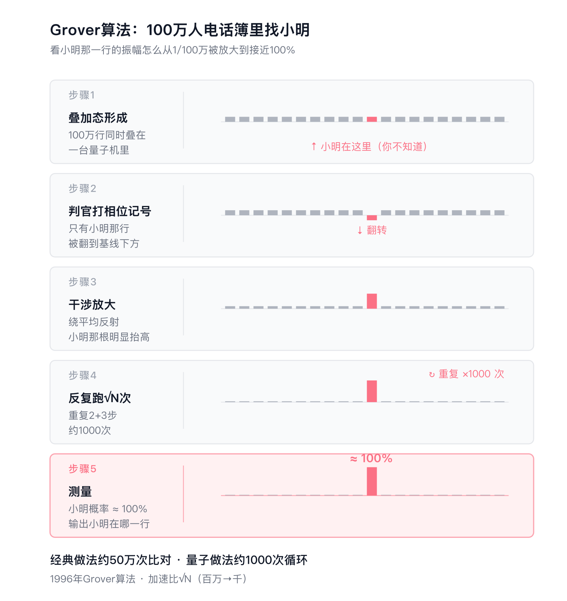
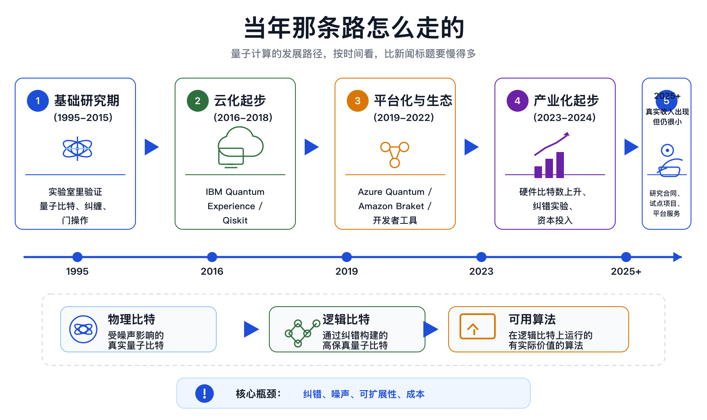

## 引子

你是不是每隔一段时间就会在新闻里看到"量子计算重大突破"？Google又怎样了，IBM又怎样了，中国"祖冲之"号又破纪录了。每一次都说"距离实用只差一步""将改变世界""颠覆AI、医药、金融"。

但你环顾四周，身边有任何一个人、任何一家公司，真的在用量子计算做事吗？

这个反差就是这篇文章要回答的问题。量子计算到底是真的快要改变世界，还是一个被讲了40年、还要继续讲下去的故事。

科学史上有这么一类技术。核聚变发电讲了70年还没商用，室温常压超导追了快70年也没真造出来，磁流体发电（MHD）从1950年代被美苏当下一代发电方案推到现在也没成。每隔几年都会出现"重大突破"的新闻，但真正进入工业和生活的那一天永远在下一个10年。

量子计算属不属于这一类。要回答这个问题，得先搞清楚它到底是什么、已经做到了什么、离实用还差多远，以及这一点最少被讨论但可能最关键，就算技术上成了，今天的世界还有没有能力把它变成产业。

我自己读物理出身，博士那几年量子力学是天天打交道的东西，毕业后曾经在IBM的量子计算部门待过，现在也认识几位在Google量子计算工作的朋友。这篇文章是我作为已经离开这个赛道、但还看得懂内行话的人，结合物理直觉和产业逻辑，对这件事的一个尽量诚实的评估。

# 一、量子计算到底是什么

要搞清楚量子计算的前途，得先搞清楚它跟普通计算机有什么不同。这一节用大白话讲，但有几个核心概念必须讲准。

## 1.1 一个不太一样的开关

普通计算机里所有信息都是0和1。每一位信息（一个"比特"）就是一个开关，要么开（1），要么关（0）。你手机里、电脑里、服务器里有几百亿这样的开关在工作。

量子计算机的基本单位叫**量子比特**（qubit）。它跟普通开关唯一的区别是：在你不去测量它的时候，它处在一种"既是0也是1"的混合状态，叫**叠加态**。一旦你测量，它立刻坍缩成确定的0或确定的1，叠加状态消失。

最常用的比喻是硬币。一枚落到桌上的硬币要么正面要么反面，对应经典比特。一枚还在空中旋转的硬币，正反两面都有一部分概率，对应量子比特。但只要你伸手按住看一眼（"测量"），它立刻定格成正或反，旋转的状态就没了。

把n个量子比特放在一起，它们的整体状态可以同时叠加在2的n次方个可能值上。50个量子比特对应约10的15次方个状态，300个量子比特对应的状态数超过宇宙中所有原子的数量。

## 1.2 量子计算到底是怎么算的

光有叠加态没用。因为你最后还是只能测一次拿一个结果，而且这个结果按概率随机给，跟掷骰子区别不大。

量子计算的窍门是利用一个物理现象：**波的干涉**。

你在湖面同时扔两块石头，水波会相遇。有的地方波峰碰波峰，水面跳得更高（加强）。有的地方波峰碰波谷，互相抵消变平（消除）。声波也一样，降噪耳机的原理就是耳机发出一个跟外界噪音相反的声波，两个声波相加，正好抵消成0，你就听不到噪音了。

量子状态本质上也是一种波。一台量子计算机跑一个算法，本质上是导演一场波的"加强加抵消"操作：让正确答案对应的波互相加强，让错误答案对应的波互相抵消。等你最后测量的时候，正确答案就以接近100% 的概率被叫出来。

举个具体的例子。假设你有一本100万人的电话簿，没任何顺序，每一行是"姓名+号码"。你要找"小明"这个名字对应的号码。注意：你不知道小明的号码，但你知道一条规则：拿到一行就能判断"这行的名字是不是小明"。这条判断规则是你能写出来的代码（或者说一个"判官"）。

经典计算机的做法：从头翻到尾，一行行喂给判官问"是不是小明"，平均要翻50万次才能命中。

量子计算机的做法：

1. 用大约20个量子比特造一个叠加态（2的20次方约等于100万），让100万行电话簿同时"摆"在这台机器里。
2. 把那个判官接到量子比特上，让它一次性扫过这100万行。因为这100万行是叠加在一起的，判官实际上是同时检查所有人。但它不告诉你答案，只悄悄做一件事：判断结果是"是小明"的那一行，对应的波的相位被翻一下，其它行不动。结果是：电话簿里只有小明那一行被打了个隐形的记号，但你目前还看不出来是哪一行。
3. 再跑一个固定操作（跟具体的小明无关，纯数学），让所有被打过记号的波跟没被打记号的波互相干涉。被打过记号的小明那一行的波幅度被放大一点，其它没被打的被压低一点。
4. 把第2、3两步合在一起反复跑约1000次（即 √100万）。每跑一轮，小明那一行的"分量"就大一点，其它的就小一点。
5. 1000次之后，小明那一行的概率被放到接近100%。测量一次，机器输出的几乎肯定就是小明那一行的位置，你顺着位置去查电话簿，就拿到了号码。

下面这张图把5步流程对应的振幅条形图画出来了，小明那根橘色柱子从被淹没在99万根灰柱子里，到翻转到基线下方被打记号，再被一步步抬高，最后接近100% 主导整个分布。

整套流程里你始终不知道小明的号码，只用到了"能不能判断这行是不是小明"这一条规则。机器把这条判断规则在叠加态上跑了1000次，把小明的概率放大到压倒性。

经典做法约50万次，量子做法约1000次。这就是1996年，也是量子计算最直观的一个"加速"。

但写出这种算法的前提非常苛刻。你必须能想出"怎么用一次判官操作精准识别正确答案"和"怎么用另一次干涉操作把记号放大成幅度差"。这两步需要被解决的问题本身有一种很特殊的数学结构。绝大多数实际问题没有这种结构，量子计算对它们就用不上这套招。这就是后面要讲的"量子算法稀缺"的根子。

## 1.3 物理学家最初的动机

量子计算这个想法源头在物理学家这边，跟工程师无关。1981年5月，著名物理学家费曼（Richard Feynman）在MIT做了一个演讲，题目叫"Simulating Physics with Computers"。他做了一个观察。

自然界本身在底层是量子的。你用经典计算机模拟一个有几百个电子的分子，计算量会指数爆炸。300个电子需要的内存超过宇宙原子总数。但反过来，如果造出一台本身就遵循量子规律的计算机，用它去模拟另一个量子系统，是不是就不会爆炸了。

这才是量子计算的原始动机：用量子去模拟量子。原始目标跟"破密码"或"加速AI"都没关系，物理学家只是想要一个合适的工具去研究自然界。

后来才有了两个引爆全球关注的算法。1994年，贝尔实验室的Peter Shor发表了一个量子算法，可以在多项式时间内分解大整数。这意味着如果量子计算机造出来，今天保护银行、邮件、网购的RSA加密就完了。1996年，贝尔实验室的Lov Grover发表了一个量子搜索算法，可以对无序数据做二次加速。

Shor算法那一篇是整个领域的转折点。在那之前，量子计算主要是物理学家的玩具。Shor之后，美国国家安全局、五角大楼、各国政府都开始大规模投钱，因为破密码这件事关系到国家安全。

但要注意一点。后来30年所有应用的源头里，最"天经地义"的始终是模拟量子系统，也就是化学、材料、凝聚态物理这类领域。其它应用是后加上去的，且大多远没有"用量子模拟量子"这条线清晰。

## 1.4 它是特定问题的专用加速器

这是最后一个必须澄清的误解。

量子计算机不会取代你的笔记本电脑，永远不会。它对绝大多数计算任务（看视频、刷网页、玩游戏、跑Excel、剪短视频）没有任何优势。它反而慢得多、贵得多、脆弱得多。

它只对有特定数学结构的问题有用。主要是分子模拟、因式分解、某些特殊优化问题。即使量子计算机做到完美无缺，它也只是一个专用加速器，类似今天的GPU，而非通用机器。

我跟做量子计算的朋友聊的时候，他打的一个比方我印象很深。"GPU之于CPU，是同一个图灵机模型下的不同硬件加速。量子计算机之于经典计算机，是一种完全不同的计算模型。但模型不同不代表它包罗万象，反而代表它能高效解决的问题集合可能比经典模型还窄。"

记住这句话，后面所有讨论都围绕它展开：量子计算机是一种处理特定问题的专用机器，把它当通用电脑的下一代来期待，从一开始就错了。

# 二、40年的时间线

量子计算这事到底搞了多久。走到哪一步了。按时间梳理一下。

## 2.1 理论阶段（1980到1997）

1980年到1997年这17年，是量子计算的理论框架成型期。

1980年，苏联数学家Yuri Manin和美国物理学家Paul Benioff几乎同时提出量子计算的雏形。Manin的论文是俄文的，西方很多年后才注意到。

1981年5月，费曼在MIT做了那个著名演讲，提出"用量子模拟量子"。这通常被算作量子计算的"创世时刻"。

1985年，牛津大学的David Deutsch定义了"通用量子图灵机"，正式把量子计算变成一个数学上严格的计算模型。Deutsch之前，量子计算还是物理学家手里的一个直觉概念。Deutsch之后，它变成了一个可以严格证明定理的数学对象。

1994年是引爆点。贝尔实验室的Peter Shor当年4月在新墨西哥州一次会议上做报告，原本要讲的是量子离散对数算法。报告之后4天，他在酒店里把因数分解算法也搞了出来。这个算法发表后，"如果量子计算机造出来，全球加密体系将崩溃"的消息传遍了美国政府和大公司。

1996年Grover发表搜索算法。1997年，俄裔物理学家Alexei Kitaev在莫斯科朗道理论物理所提出"toric code"（环面码），这是今天主流的量子纠错方案"surface code"（表面码）的鼻祖。同年，threshold定理（阈值定理）被严格证明。这条定理是说，只要物理操作的错误率低于某个阈值（大约1%），原则上就可以用足够多的物理比特纠错，把逻辑错误率压低到任意小。

到1997年，量子计算的理论框架基本完整。从1980到1997，一共是17年。

后来的30年理论上没有根本性新突破，主要是渐进改进。也就是说，今天物理学家在追的目标线，是1997年画的那条线。差距全部在工程实现上。

## 2.2 实验室阶段（1995到2015）

理论很漂亮，但要真的造出量子比特，是另一回事。

1995年，第一次实现两量子比特门（用单个被困在电磁场里的离子）。这是把"想法"变成"实物"的第一步，但当时只有2个比特。

2001年12月，IBM在《Nature》上发表论文，宣布用核磁共振（NMR）量子比特"分解"15等于3乘5。这是历史上第一次实验运行Shor算法。听起来很厉害，但细节很尴尬。他们的"7比特量子计算机"实际上是一管约10的18次方个特殊设计的有机分子。每个分子里有5个氟原子和2个碳原子，靠核自旋当比特，靠射频脉冲当门操作。而且他们用的是Shor算法的"预先优化简化版"，提前知道答案是3和5之后，把电路裁剪到只用7个比特就能跑通，跟真正的Shor算法相差甚远。2013年有学者专门发表论文批评这类NMR演示，说很多本质上是数学预处理后跑出"已知答案"，并不证明算法真的能用。

2007年开始，超导量子比特（用接近绝对零度的超导电路做的量子比特）成为主流路线之一。IBM、Google陆续进场。比特数从2个慢慢爬到几十个。这20年基本上是物理学家在地下室里慢慢磨。没有任何应用产生，连接近应用的都没有。

我读博的时候认识几个搞超导量子比特的同学，他们调一台设备调一年，能让两个比特保持纠缠态多几十微秒，就是一篇PRL级别的论文。这跟AI那边一年一个GPT换代的节奏完全是两个世界。

## 2.3 产业化起步（2016到2024）

当年那条路，大致可以画成下面这样。

2016年之后，量子计算从纯学术逐步变成产业话题。IBM先把量子计算机放到云上，随后Qiskit、Azure Quantum、Amazon Braket等平台相继出现。Google、IBM、微软大规模投入，IonQ、Rigetti、D-Wave、Quantinuum、QuEra、Atom Computing这些公司或上市或拿到巨额融资。

到2024年的硬件规模，每条技术路线都有数字可看：

| 公司/平台 | 物理比特数 | 技术路线 | 时间 |
|----------|----------|---------|-----|
| IBM Condor | 1121 | 超导 | 2023年12月 |
| Atom Computing | 1180 | 中性原子 | 2023年10月 |
| Google Willow | 105 | 超导 | 2024年12月 |
| Quantinuum H2 | 56 | 离子阱 | 2024年6月 |

数字看起来很猛，从几十涨到1000多，似乎是指数增长。但这里有个关键事实被新闻几乎完全忽略。

比特数涨上去了，能用的比特数没涨多少。

打个比方。你雇了1000个员工，但每个员工会随机犯错、互相干扰、还会突然失去记忆。你能干的活其实远没有1000个稳定员工那么多。到2024年，这类大规模物理比特机器虽然很重要，但它们的稳定逻辑计算能力仍然远远没有跟上比特数的增长。

量子比特极其脆弱。状态保持时间只有几十微秒到几毫秒，操作之间随时可能出错。要让它真正稳定干活，必须用很多个物理比特"冗余"成一个稳定的逻辑比特，类似硬盘的RAID备份，用多份冗余防止单点故障。

按今天最先进的方案估计，一个稳定的逻辑比特，可能需要几十到上千个物理比特，具体取决于纠错码、误差率和任务目标。

所以读到"量子机器达到1000比特"这种新闻时，不能直接按1000:1去换算。1000个物理比特只说明硬件规模，不等于1个逻辑比特，更不等于可用的计算能力。

## 2.4 Willow过的那道关

2023到2024年间，量子计算在物理可扩展性上发生了几件真正重要的事。跟新闻里那种"重大突破"不太一样，这次是物理上的硬进展。

要看清这一关到底过了什么，得先把"逻辑比特"这件事拆成两个维度。

维度一是"深度"：每个逻辑比特保护得多深。

一个稳定的逻辑比特，是用很多个物理比特冗余编码出来的。冗余层数（业内叫"码距离"，distance）越大，理论上错误率越低。但能不能真做到，得看实验。

2024年12月，Google在Nature上发表了Willow芯片的纠错实验。他们在3×3、5×5、7×7三种尺寸的物理比特网格上跑surface code，观察到一个关键现象：网格距离每加大一档，逻辑错误率就下降约2倍（精确值Λ=2.14±0.02）。也就是说，加更多物理比特，逻辑错误率真的会指数下降，而不会被"更多比特带来更多噪声"吃掉。

这是1997年那条threshold定理的实验验证。Willow之前，"是不是真能做到"在原则上是开放问题。Willow之后，这个原则问题闭合了。

但Willow只做了1个逻辑比特，且这个比特只能"存"，做不了运算。它把这1个比特保护得很深，没去做"多个比特之间互相算"那件事。

维度二是"宽度"：能同时操控多少个逻辑比特、跑多少次逻辑门运算。

2023年12月，Harvard/QuEra/MIT的Lukin、Bluvstein组在Nature上发表论文，用中性原子阵列同时做出了48个逻辑比特，跑了几百个逻辑门运算，包括48个CCZ三比特门。这是目前在宽度维度上走得最远的工作，Physics World 2024年度突破的另一半就是给它的。

但他们用的是distance-3的浅码，保护层很薄。跑长一点的算法错误就开始累积，没法做Willow那种深度的指数压制。

两件事是同一关的两个方向。但还没有任何团队同时做到两件事。

打个比方。Willow像盖了1间屋子，但抗8级地震。Harvard/QuEra像盖了48间屋子的小区，但每间只抗4级。都是真本事。然而真正能跑Shor算法破RSA、或做大分子模拟，需要的是几千上万间屋子的城市、每间都抗10级地震。同时把宽度和深度两个维度推到那个量级，目前没有公认方案。

还有几家团队在不同位置往前走。2024年6月，Quantinuum H2用56个离子比特做出了4个逻辑比特，错误率比物理比特低800倍。2024年11月，微软和Atom Computing宣布在中性原子机上把24个逻辑比特纠缠到一个GHZ态。每条路线都在补自己的短板，但同样没人把宽度和深度合二为一。

把这些合起来看，物理可扩展性这一关在2023到2024年间从多个路线被同时迈过，这是真的大事。但下一关还没影子：把几千个逻辑比特都用distance 15以上的深度保护起来，再跑上百万次可靠的逻辑门运算。这才是Shor算法破密码或大分子模拟真正需要的尺度。

# 三、那些"应用"到底是真的吗

新闻里说量子计算将颠覆AI、医药、金融、物流、密码学，听起来无所不能。下面把宣传得最响的几条逐项核查。前三条（3.1到3.3）是几乎没依据的，第四到五条（3.4到3.5）理论上有希望但远没落地，最后一条（3.6）是直接看真正在产生商业价值的有没有。

## 3.1 量子计算加速AI

这是过去几年宣传最多的方向之一，但学术界的共识跟新闻完全相反。

绝大多数被宣传"有指数加速"的量子机器学习算法，从2018年开始陆续被一种叫"经典dequantization"（去量子化）的技术追平。这场运动的领头人是当时只有17岁的本科生Ewin Tang。她在UT Austin读本科时，本来想证明量子推荐算法相对经典算法有指数级优势。结果她证不出来，反而搞出了一个等价复杂度的经典算法，把这个量子优势整个打回原形。后来主成分分析、监督学习、线性回归等好几个量子机器学习算法都被Ewin Tang和合作者用类似的"量子启发的经典算法"追平。

剩下没被dequantize的（变分量子神经网络），有一个根本问题叫"barren plateau"（贫瘠高原）。2018年Google的McClean等人在Nature Communications发表论文证明，对大多数随机量子电路，随着比特数增加，损失函数的梯度会指数级地接近零。这意味着网络越大，梯度越平，根本训练不动。这是一个理论上的"硬墙"，至今没有被解决。

新闻里所谓的"量子AI"，绝大部分是包装。

## 3.2 量子计算优化物流和金融

D-Wave这家公司搞这个搞了15年。它发布过大众汽车的城市交通优化、各种金融组合优化、能源调度优化案例。

但有一个不变的模式。没有一个案例在独立复现下稳定超过经典算法。每次都是发布会上漂亮，过几个月就被指出经典模拟退火（simulated annealing）或商用优化软件Gurobi做得一样好甚至更好。D-Wave用的是"量子退火"（quantum annealing）而不是通用量子计算，理论上即使有用也只适合特定结构的问题，但即便在那些问题上，经典算法的天花板比想象的高得多。

## 3.3 量子计算破解所有密码

理论上，Shor算法跑在足够大的量子计算机上，能破RSA-2048加密。问题是"足够大"到底是多大。

2021年Craig Gidney和Martin Ekerå在《Quantum》期刊上发表的资源估算（Gidney-Ekerå论文）需要约2000万个物理量子比特，物理错误率10的负3次方，连续运行8小时。2025年5月Gidney又发了一篇优化版本，把估算压到不到100万个物理比特。

听起来100万比2000万好很多。但今天最大的超导量子机IBM Condor是1121个物理比特。从1121到100万是约1000倍的物理扩展，再加上从1个逻辑比特到几千个的纠错工程，整个工程鸿沟还是非常远。

更讽刺的是，美国NIST在2024年8月13日已经正式发布了三个后量子密码标准（FIPS 203, 204, 205），名字分别叫ML-KEM、ML-DSA和SLH-DSA。这是能抗量子计算机攻击的新加密算法。Google Chrome从124版（2024年4月）开始默认支持Kyber密钥交换，Cloudflare在2024年初已经有约1.8%的TLS连接走后量子加密，Apple也在2024年初宣布iMessage升级到后量子。也就是说，等量子计算机真造出来能破RSA的那一天，世界上重要的数据早就用新加密保护起来了。

任何说"5年内能破密码"的，都是夸大。15到20年是个比较乐观的估计，30年以上甚至永远卡住都完全可能。

## 3.4 量子化学和材料科学

这是量子计算最"天经地义"的应用方向，用量子模拟量子，回到费曼最初的设想。

未来5到10年内可能出现第一个"经典做不了，量子做到了"的小分子或强关联材料模拟。这是真有希望的方向，业内最严肃的估计也是从这里突破。

但要泼一盆冷水。这不会改变药物或材料行业。

新药研发的瓶颈是临床试验，不是分子建模。一个新药从立项到上市平均10到15年，其中分子结构设计和临床前研究只占约2到3年，剩下7到12年全部在做I/II/III期临床试验和监管审批。模型再快10倍，整个流程能缩短的只有那2到3年里的一部分。

新材料从实验室到工业化也是10到20年。分子建模这一步从来不是瓶颈，瓶颈在合成路径、量产工艺、安全测试、规模化生产线建设。

罗氏从2021年开始跟Cambridge Quantum Computing（现Quantinuum）合作研究阿尔茨海默症方向的量子化学算法。这个合作目前没有产生过任何进入临床的候选药。罗氏2025年密集发布的trontinemab阿尔茨海默药物数据，是经典生物制药研发路线的产物，跟量子计算无关。所以下次看到"量子计算半年内找到新药"这种新闻，先问一句：找到的是分子结构候选，还是临床候选。这两个概念在量子计算公关里经常被混在一起。

## 3.5 专用量子模拟

这块跟通用量子计算机不是一回事。专用量子模拟器是用一种量子系统去模拟另一种量子系统的特殊物理性质，不需要通用门操作。哈佛Lukin组、马普所、中科大潘建伟组都在做。这块已经在产生真实的科研论文，主要在凝聚态物理、超冷原子、量子相变这些方向。

但要明白一件事。这是科研工具，不是消费级"应用"。它的客户是物理学家和材料科学家，不是企业IT采购、不是普通消费者。它对GDP的贡献跟同步辐射光源、对撞机一个量级。

## 3.6 真正在产生的商业价值：零

零。

我说这个数字时是认真的。我不知道任何一个例子，是某家公司因为用了量子计算，做出了别人做不出来的产品、赚到了否则赚不到的钱。

所有公开的"量子计算客户案例"，背后的工作负载经典计算机都能做，且通常更便宜更快。这些案例存在的目的是市场公关和"占位"。大公司养小团队的逻辑是"如果突破真的来了，我们不能没在桌上"，并非预期短期回报。

直接看上市公司财报最清楚：

| 公司 | 2025年收入 | 2025年净亏损 |
|------|----------|------------|
| IonQ | 1.300亿美元 | 5.104亿美元 |
| Rigetti | 710万美元 | 2.162亿美元 |
| D-Wave Quantum | 2460万美元 | 3.551亿美元 |

三家加起来，2025年全年收入大约1.57亿美元。这个数字看起来很多，但本质上还是很小，离真正的产业化还差得远。而且它们的收入主要来自政府研究合同、大企业的"探索性预算"、大学和国家实验室订单。这属于补贴维持，不是真实市场需求。

对比一下。OpenAI一家公司2024年收入约37亿美元，是上面三家量子上市公司2025年总收入的近24倍。Anthropic 2024年收入也超过10亿美元。

更直观的对比是亏损模式。OpenAI 2024年也亏约50亿美元，但OpenAI亏在GPU、电费、人才、产能扩张上，背后有2亿月活付费用户在买单，亏损跟着收入一起翻倍。量子计算公司亏在R&D和折旧上，没有对应的收入引擎。两边的亏损是完全不同的性质。

D-Wave是1999年成立的，2011年发布过号称"全球第一台商用量子机"的D-Wave One，2022年8月通过SPAC借壳上市，到2024年底累计净亏损接近10亿美元。这家公司能撑26年没倒，主要靠SPAC上市后的资本市场炒作和不停的增发融资，跟商业基本面关系不大。

# 四、技术上还卡在哪里

本章不深入技术细节，但要让你明白瓶颈在哪。下面这几个瓶颈每一个都需要全新的工程方案才能突破，"再投点钱""再多做几次实验"这种渐进逻辑跨不过去。

## 4.1 量子比特太脆弱

量子比特状态保持时间只有几十微秒到几毫秒。超过这个时间，量子状态就被环境"污染"成普通的经典状态了。这个现象叫**退相干**（decoherence）。

退相干来自方方面面。芯片附近一个流浪光子、宇宙射线一个高能粒子、控制线上一个微小电压抖动，都能把量子态打回经典态。最先进的超导量子比特coherence time在几百微秒量级，离子阱量子比特能到几十秒（这是Atom Computing的中性原子比特报出的40秒纪录的极端值），但操作速度也慢得多。任一路线都没有同时做到"长寿命"加"快门操作"。

要跑有用的算法，必须纠错。纠错的代价不是固定比例，但通常是很多物理比特换来更少的逻辑比特。要跑Shor算法破RSA-2048，根据2025年Gidney的最新估算，需要约100万个物理比特，对应约1000个逻辑比特，再加上算法本身需要的操作时空成本。

今天我们做出了1到几十个稳定逻辑比特。差距是好几个数量级。

## 4.2 工程扩展撞墙

超导量子计算机要在接近绝对零度（约零下273.14摄氏度，比深空还冷）的稀释制冷机里运行。每个量子比特至少需要2根微波控制线穿过制冷机的多层屏蔽进到芯片上。

1000个比特还能凑合，2000根线穿过制冷机已经接近物理极限。100万比特怎么布线、怎么制冷，全行业没有公认方案。把控制电子学从室温搬下来，跟量子芯片放在一起冷却，是业内最大的赌注，叫"低温CMOS控制"。Google、Intel、英伟达都有团队在做。但这件事的工程成熟度大概相当于2015年的超导量子比特本身：证明了原理，没有规模化产品。

中性原子和光子路线绕开了制冷问题，但有别的瓶颈。中性原子靠激光阵列寻址每一个比特，1000个还行，10万个怎么并行寻址、怎么补偿激光抖动，没人做出来。光子路线本质上是概率性的（光子操作有一定概率失败），需要海量的后选择和延迟线，规模化也极难。

没有任何一条路线把所有工程瓶颈都解决了。每条路线的"瓶颈清单"都很长，且很多是相互冲突的（解决了制冷，激光寻址精度就跟不上。解决了寻址，门操作速度又掉下来）。

## 4.3 算法稀缺

除了Shor和量子模拟，真正能严格证明指数加速的量子算法很少。Grover算法给出二次加速（即把搜索复杂度从N降到根号N），但对实际问题，因为常数因子和量子开销的拖累，实际收益往往被抵消。

被宣传的"量子机器学习加速"，要么已被dequantize成经典算法，要么没有理论加速证明（变分电路那一类）。

也就是说，即使硬件做出来了，能用它解决的问题集合可能比我们今天想象的要小得多。今天有Shor、Grover、量子模拟、HHL（量子线性方程组求解器，但前提条件极其苛刻）、QAOA（变分优化算法，没有理论加速）这一小串。比起经典算法那边30多年下来积累的浩瀚算法库，量子算法库还非常单薄。

这一条比前两条更隐蔽，但可能更致命。前两条本质上是钱和时间能解决的工程问题。算法稀缺则是数学问题，没有发现新算法之前，再大的量子机器也找不到事做。

# 五、今天的世界结构，让商业化更难

这一部分是这篇文章最想讲清楚的事，前面四节都是背景。

技术上量子计算就算10年内成熟，今天的全球产业生态也没有20世纪50到60年代那种"把硬科技快速转化为产业革命"的能力了。这条线索几乎不在主流量子计算讨论里出现，但它可能是最关键的因素。

## 5.1 当年那条路怎么走的

回顾一下经典计算机和互联网是怎么从实验室走到大众生活的。

晶体管（1947贝尔实验室）→ 集成电路（1958德州仪器Jack Kilby和Fairchild Robert Noyce几乎同时）→ 微处理器（1971 Intel 4004）→ 个人电脑（1980年代Apple II / IBM PC）→ 互联网（1995商业化）→ Web革命（1995到2000）。

晶体管发明那一年，行业里没有任何人能预见到80年后会有iPhone。但这条链条最终走通了，靠三个互相支撑的条件。

最上游的支柱是贝尔实验室式的企业基础研究。AT&T因为长期处于垄断地位，被允许（也被监管要求）把巨额利润投入基础研究。贝尔实验室1925到1984年的60年间出了9个诺贝尔奖，发明了晶体管、信息论、激光、Unix操作系统、C语言、UNIX shell、CDMA移动通信。它的研究人员可以拿一个题目研究20年没人催。

中游撑住产业化的是国防订单。集成电路第一个大客户从来都跟消费者无关，全是军方采购：民兵导弹的导引头、阿波罗计划的导引计算机。1962年阿波罗导引计算机的订单几乎独家撑起了Fairchild的早期收入。1965年美国军方采购了集成电路市场总值约72%。没有这些政府订单，Fairchild、TI、Intel早期撑不下来。互联网的源头ARPANET是1969年五角大楼ARPA资助的研究网络，到1995年商业化用了26年。

下游接住量产的是美国本土完整制造业。技术成熟后，本土有完整的产业链能立刻规模化。半导体、PCB、设备、组装、检测全在国内。Intel早期的芯片是在硅谷自己的fab里做的，封装在马来西亚做（1972年Intel在槟城建第一个海外封装厂），但核心制造一直在美国本土。

这三条加在一起，给了硬科技一个稳定的"育儿室"。学术界出原理，企业基础研究做工程化，政府订单养应用，本土制造业规模化，最后才有民用市场爆发。从1947到1995商业互联网，整条链条走了48年。

## 5.2 今天，这三条都断了

**第一条断了**。贝尔实验室式的企业基础研究基本消亡。今天的"企业研究"，Google DeepMind、OpenAI、Meta FAIR、微软研究院、IBM研究院，做的都是离产品很近的应用研究，不做10到20年回报周期的基础研究。

IBM研究院规模在过去20年持续萎缩。微软研究院虽然还在，但研究方向越来越聚焦MSR产品组的需求。OpenAI和Anthropic干脆没有"研究院"这个建制，研究和产品深度耦合。Google DeepMind被允许做基础研究的额度也在收缩，因为Alphabet 2024年Other Bets部门（量子、Waymo自动驾驶、生命科学Verily等）亏损约44亿美元，资本市场一直在施压要它收紧。

谁来养量子计算30年。Google、IBM这些公司的量子部门每年都要在公司财报上接受审视。没有任何企业财务结构能稳定支撑20年的基础技术演化。

**第二条断了**。美国国防部还有DARPA，但相对GDP的投入规模远不及当年。而且现在的"国家战略"被分散到AI、生物、量子、能源、半导体、5G/6G、空间技术等太多领域，没有任何单一项目能享受当年阿波罗或星球大战那种集中投入。

更要命的是，量子计算最重要的"军方需求"是破密码，但后量子密码标准已经在2024年8月落地、并开始大规模部署。10年后RSA-2048可能仍然安全（因为关键基础设施已经迁移到PQC），破密码的窗口越来越窄。

那其它军用场景呢。量子传感（用于潜艇、地下结构探测）和量子通信（量子密钥分发）确实有军用价值，但跟通用量子计算是技术路线完全不同的东西。量子传感不能给量子计算输血，因为是两套技术。

**第三条断了**。美国去工业化是决定性的。台积电做芯片、富士康做组装、宁德时代做电池，这些不是美国能在国内"重建"的。哪怕川普政府这一轮加大关税和制造业回流补贴，整个产业基础设施的迁移需要10年以上，且很多关键工序需要从亚洲挖人。

具体到量子计算。假设明天Google突然做出1万逻辑比特的容错量子机，下一步是什么。要规模化生产稀释制冷机（目前全球主要供应商是芬兰Bluefors、英国Oxford Instruments，年产量都是几十台量级）、要做低温控制电子学（全球做这件事的公司不到10家）、要做实时量子纠错解码ASIC（这件事的复杂度跟最先进AI芯片同级别）、要做激光系统（中性原子路线）。这一整套供应链不存在，且全球没有任何一个地方有完整的能力。

中国在合肥、济南、上海砸的钱可能比美国还多。中科大、之江实验室、本源量子都在投入。但中国的问题是缺少从实验室到大规模工业应用的成熟商业转化机制。大量国家投入的产出是论文、原型、概念验证，不是产品。这一点跟美国是镜像问题：美国有市场化转化机制但本土制造业塌方，中国有制造业但缺市场化转化。两边都没有当年完整的"实验室到产业"链条。

## 5.3 资本逻辑变了

VC投资基金的周期是5到7年要退出，上市公司每个季度要在财报上证明收入和利润。这种资本结构跟20年技术演化周期根本不兼容。

D-Wave 1999年成立，2022年SPAC上市，到2025年累计亏损接近10亿美元。如果它是1955年的晶体管公司，AT&T、IBM、政府订单可以养它30年不出问题。放在今天，它能撑到26年已经是奇迹，撑下来的钱主要来自SPAC上市后的市场炒作和持续增发融资，跟商业基本面关系不大。

IonQ、Rigetti、D-Wave三家上市公司目前的总市值大头建立在"如果量子计算真的成了，我们就是Intel"的远期叙事上，跟当下的收入和利润关系不大。这种叙事每过一段时间就会因为一篇新闻、一次发布会、一个所谓"突破"被炒一波，然后回归。这跟把它们当严肃的工业公司投是两件事。

我自己见过几位量子计算创业公司的CEO，他们都很坦率地承认："我们现在卖的是故事，产品还没真做出来。能不能撑到产品出来，看资本市场。"这种坦率是好事，但它也说明了一件事。整个赛道的存续依赖于资本市场对叙事的耐心，而资本市场的耐心通常以季度计，不以10年计。

## 5.4 而且AI把氧气都吸光了

这是过去5年最关键的新变量。

**资本**。2024年全球企业级AI总投资达到约2520亿美元（Stanford AI Index 2025），其中私人投资约1500亿美元、生成式AI私人投资约340亿美元。同一年全球量子技术私人投资约20亿美元、政府投资约18亿美元（McKinsey Quantum Technology Monitor）。差距大约是100倍。

**人才**。能做量子算法的人，大多数也能做经典机器学习。MIT、Caltech、清华、中科大量子方向博士毕业生，超过一半去了OpenAI、Anthropic、Google DeepMind、Meta这些AI公司。一线量子比特实验物理学家也开始转去做AI硬件（如英伟达、AMD的GPU架构团队），因为待遇高3到5倍且不需要等20年。

**政府注意力**。美国的"科技竞争"叙事现在80%围绕AI和半导体（CHIPS Act 520亿美元、AI Diffusion Rule、出口管制）。量子被挤到角落，国家量子倡议（National Quantum Initiative）2018年通过时每年12亿美元的预算，到今天没怎么涨。

**企业CTO的预算**。当CEO问"AI还是量子"，答案95%是AI。理由很简单：AI明天能上线、能省人、能让财报好看，量子可能10年后才能用。

更糟糕的是。AI正在从下面侵蚀量子计算原本的应用空间。

DeepMind的AlphaFold 2021年发表后，把"蛋白质折叠"这件事从"经典做不了"变成"经典AI已经做到"。AlphaFold 3现在能预测蛋白质和小分子的复合结构，准确率非常高。这把量子化学曾经的招牌应用之一抢走了。

DeepMind的GNoME系统2023年11月用图神经网络预测了220万种新晶体，其中约38万被认为是稳定的，相当于把已知稳定无机晶体数量扩大10倍。这是一年多前的工作，远远超过任何量子模拟的规模和速度。

大语言模型在化学反应预测、催化剂设计、药物分子优化方面的进展也很快。MIT、Stanford、Caltech的化学系实验室现在大量用LLM和经典神经网络做高通量筛选。

留给量子计算的，是"AI都搞不定的强关联量子系统"，即电子之间相互作用极强的分子和材料。这是一个真实的窗口，但比原来想象的小得多。原来的图景是"量子计算搞定所有化学问题"，现在的图景是"经典AI搞定大部分，量子计算可能搞定剩下那块经典AI做不好的"。

## 5.5 互联网那种"几年内革命"不可复制

有人会说，互联网也是1969年ARPANET到1995年商业化用了26年，然后几年内革命，量子计算说不定也会突然爆发。

大概率不会了。

互联网爆发的前提是三个加成。基础设施免费，TCP/IP、HTTP、HTML全是开放标准，软件部署边际成本接近零。PC已经普及，1995年美国家庭PC渗透率约30%，每台PC都是潜在的互联网节点。写代码门槛低，一个大学生用PHP就能做出Facebook的原型。

量子计算完全没有任何一条对应。基础设施极度昂贵，一台超导量子机要稀释制冷机（百万美元级）、屏蔽室、控制电子学、运维团队，单台运营成本一年百万美元起。永远不会有"个人量子机"，量子计算机的最终形态是云端少数几台机器，类似今天的超算中心，不会进入个人或中小企业。开发门槛极高，写量子算法需要懂量子力学、纠错码、硬件约束，全球能写非平凡量子算法的人可能只有几千。

所以即使量子计算2030年技术上有重大突破，它的扩散速度也不可能像互联网那样。它最多变成一个高端基础设施服务，规模相对整个IT产业是零头。

我跟一位在Google Quantum AI工作的朋友聊过这个问题。他说了一句很到位的话："这件事就算成了，最终也是10台机器服务全人类，而不是10亿台机器在每个人手里。这跟PC、互联网、智能手机的扩散模式根本不是一个东西。"

# 六、所以，量子计算机有前途吗

读完前面这一切，答案应该已经清楚了。

它不会没用。

量子化学、材料模拟、特定凝聚态物理研究、密码学防御，这些方向未来10到20年大概率会有真实的科学和工业价值。2023年Harvard/QuEra在中性原子上做到48个逻辑比特跑几百个逻辑门，2024年Google Willow在distance-7的surface code上看到逻辑错误率指数下降，两件事加起来把"物理可扩展性"从原则问题变成了工程问题。这是物理上的硬进展，不属于炒作那一类。接下来5年，Quantinuum、Microsoft+Atom、IBM这些团队大概率会做出几十到几百个真正稳定的逻辑比特样机，可以跑一些经典算不动的小规模量子化学题目。学术圈和某些政府实验室会真实地用上。

但它也不会改变世界。

不会有"量子时代"像"PC时代"或"AI时代"那样的产业革命。最可能的结局，是它变成一种高端科研基础设施，类似今天的同步辐射光源、大型对撞机、超算中心。重要、有价值，但小众，不进入大众生活，不诞生万亿美元产业。

技术上，下一关的工程突破远远不够确定。回到2.4节那个比喻：现在最好的成绩是1间抗8级地震的屋子（Willow），或48间抗4级的小区（Harvard/QuEra）。但要跑Shor算法破密码、或做一个真正有工业价值的大分子模拟，需要的是几千间抗10级地震的城市。宽度和深度两条线还没人合成一条。再加上制冷扩展、布线密度、激光寻址、实时解码、容错逻辑门，每一道都没有公认方案。算法这边，能严格证明指数加速的问题集合至今还是那么窄。

商业上，承接机制断了。贝尔实验室式的企业基础研究消亡、美国本土完整产业链解体、资本耐心不足以撑20年研发周期、AI又把人才和资金大规模抽走。技术和商业两边的不确定性叠在一起，结果不会是0，但也不会是100。

量子计算在2024年确实过了一道物理门槛，但这只是开始。真正难的那道槛在商业化这一边，而那道槛今天看起来比技术槛还高。即使技术10年内成熟，今天这个世界已经没有20世纪50年代那种把硬科技快速转化为产业革命的能力了。

诚实的判断不是简单的"成"或"不成"。量子计算会成为一个niche，不会成为一个时代。

而所有跟你说"量子计算将像AI一样改变世界"的人，多数情况下要么没真正算过物理和工程上的差距，要么在卖东西。

下一次你在新闻里看到"量子计算重大突破"，记住三个问题。

第一问，被拿去对比的任务，有没有量子圈以外的人需要它？很多"比超算快多少倍"的任务（RCS、Boson Sampling）就是专门为量子设计的玩具，没人在量子之外做。

第二问，经典端的基线是不是过期了？Google 2019年对比量子计算的任务，"超算需要1万年"的说法，几个月内被经典算法压到几天。每一次量子supremacy宣布之后，经典端都在追，且通常追得上。

第三问，离"有人付钱用"还差多少倍？1个逻辑比特到能破RSA还差几千倍、几百万倍的工程指标。如果发布方说不清楚"再过几年、再投多少钱就能用"，那它就还在展示阶段。

如果三个答案都偏向后者，那是真进展。否则，跟你过去40年里看到的所有"量子突破"一样，又一个继续讲下去的故事。

---

## 作者其它文章

- [大航海时代2的逆向工程](大航海时代2的逆向工程.md)
- [一文讲清美国法律系统全生态](美国法律系统全生态.md)
- [廉颇老矣，尚能饭否：现代数学史（下）](廉颇老矣，尚能饭否：现代数学史（下）.md)
- [我见青山多妩媚：二十世纪数学史（上）](https://x.com/snowboat84/status/2055446902171406761)
- [一文讲清楚美国医疗系统](https://x.com/snowboat84/status/2055081426744422697)
- [AI如何打进美国教育生态？](https://x.com/snowboat84/status/2054721509420372180)
- [一篇文章看懂美国教育全生态](https://x.com/snowboat84/status/2054359249917210633)
- [马斯克把xAI并入SpaceX，到底意味着什么？](https://x.com/snowboat84/status/2054000682114613488)
- [Vibe Learning：AI时代，学习这件事被重新组织了](https://x.com/snowboat84/status/2052908751435477046)
- [福特经济学和AI经济学](https://x.com/snowboat84/status/2052551731385602072)
- [数学照妖镜：AI能发现新的数学定理吗？](https://x.com/snowboat84/status/2052174034041995572)
- [手把手教你分析：你会被AI取代吗？](https://x.com/snowboat84/status/2051818364507688978)
- [一篇文章讲清大语言模型发展史](https://x.com/snowboat84/status/2051444935547912236)
- [气吞万里如虎：回顾十九世纪的数学英豪们](https://x.com/snowboat84/status/2050371067278143931)
- [Vibe Reading：AI时代读书的系统化方法](https://x.com/snowboat84/status/2050008577511973253)
- [长篇分析：Manus案折射出的中国AI创业生态](https://x.com/snowboat84/status/2049643679804248305)
- [别再被AI新词绕晕了：Prompt、Context、Agent背后的工程主线](https://x.com/snowboat84/status/2049286033427349809)
- [两万字科普：AI为什么会编程——原理、历史与未来](https://x.com/snowboat84/status/2048919554882215954)
- [兄弟们，真·Vibe Writing时代到来了](https://x.com/snowboat84/status/2047828585537548574)
- [全网最详细的AI学习路线图](https://x.com/snowboat84/status/2047457686070141051)
- [每个人都应该使用的三个最有用的Claude Skill](https://x.com/snowboat84/status/2047110768773197834)
- [SpaceX立志传（一）：赌上全部的最后一次发射](https://x.com/snowboat84/status/2046743964192276766)
- [估值290亿美元的套壳公司，正在被自己的房东杀死](https://x.com/snowboat84/status/2046380497627230607)
- [黄仁勋和主持人吵红了脸：芯片封锁中国，美国到底能不能打赢？](https://x.com/snowboat84/status/2046022377830801725)
- [AI将如何颠覆教育，普通人又应该如何抢夺教育新的生态位](https://x.com/snowboat84/status/2044932338262667509)
- [学物理的八方英雄们，物理学已死，请转行搞AI](https://x.com/snowboat84/status/2044584627046920278)
- [不会编程、没有融资、没有员工，他怎么一个人做到年入2000万](https://x.com/snowboat84/status/2044216044575998136)
- [兄弟们想清楚：究竟是你为X打工，还是X为你打工？](https://x.com/snowboat84/status/2043842017260908743)
- [一人公司盈利四亿美元：是骗子，还是可复制的红利？](https://x.com/snowboat84/status/2043493870265422223)
- [2026第一季度大裁员，AI是背锅侠吗？](https://x.com/snowboat84/status/2042766853404307931)
- [重返星辰大海：这次绕月飞行有意义吗？](https://x.com/snowboat84/status/2042405716380835998)
- [张雪峰在美国为什么无法成功](https://x.com/snowboat84/status/2042045634245746743)
- [2026企业尸检报告：不用AI，你的公司能活过今年吗？](https://x.com/snowboat84/status/2041672997959057517)
- [兄弟们，我创业失败了，人生完整了](https://x.com/snowboat84/status/2040948420391940272)

---

## 本文参考文献

- [Google Quantum AI: Quantum error correction below the surface code threshold (Nature, 2024)](https://www.nature.com/articles/s41586-024-08449-y) - Google Willow芯片纠错实验，2024年12月发表，Λ=2.14±0.02
- [Bluvstein et al.: Logical quantum processor based on reconfigurable atom arrays (Nature, 2023)](https://www.nature.com/articles/s41586-023-06927-3) - Harvard/QuEra/MIT 48个逻辑比特+几百个逻辑门运算
- [Physics World Breakthrough of the Year 2024](https://physicsworld.com/a/two-advances-in-quantum-error-correction-share-the-physics-world-2024-breakthrough-of-the-year/) - 量子纠错的两项进展共享年度突破
- [IBM Condor: 1121-qubit superconducting processor (IBM Quantum Summit, 2023)](https://www.ibm.com/quantum/blog/quantum-roadmap-2033) - IBM Condor处理器规格与路线图
- [Atom Computing First to Exceed 1,000 Qubits (HPCwire, 2023)](https://www.hpcwire.com/2023/10/24/atom-computing-wins-the-race-to-1000-qubits/) - 中性原子1180量子比特
- [Quantinuum H2 56-qubit trapped-ion announcement, June 2024](https://www.quantinuum.com/press-releases/quantinuum-launches-industry-first-trapped-ion-56-qubit-quantum-computer-that-challenges-the-worlds-best-supercomputers) - Quantinuum H2离子阱56比特
- [Microsoft and Atom Computing: 24 entangled logical qubits, November 2024](https://azure.microsoft.com/en-us/blog/quantum/2024/11/19/microsoft-and-atom-computing-offer-a-commercial-quantum-machine-with-the-largest-number-of-entangled-logical-qubits-on-record/) - 微软与Atom Computing 24逻辑比特
- [Gidney & Ekerå: How to factor 2048-bit RSA in 8 hours using 20M noisy qubits (Quantum, 2021)](https://quantum-journal.org/papers/q-2021-04-15-433/) - 破RSA-2048资源估算原版
- [Gidney 2025: How to factor 2048 bit RSA integers with less than a million noisy qubits](https://arxiv.org/abs/2505.15917) - 2025年Gidney更新的估算
- [NIST Releases First Three Post-Quantum Cryptography Standards (FIPS 203/204/205), August 13, 2024](https://www.nist.gov/news-events/news/2024/08/nist-releases-first-3-finalized-post-quantum-encryption-standards) - 美国NIST后量子密码标准
- [Shor's algorithm (Wikipedia)](https://en.wikipedia.org/wiki/Shor's_algorithm) - Peter Shor 1994年Bell Labs
- [Barren plateaus in quantum neural network training landscapes (Nature Communications, 2018)](https://www.nature.com/articles/s41467-018-07090-4) - 量子机器学习的训练梯度消失问题
- [Ewin Tang: A quantum-inspired classical algorithm for recommendation systems (STOC, 2019)](https://ewintang.com/) - dequantization工作起点
- [DeepMind GNoME: 2.2 million new crystals (Nature, 2023)](https://deepmind.google/blog/millions-of-new-materials-discovered-with-deep-learning/) - GNoME材料预测
- [Experimental realization of Shor's algorithm using NMR (Nature, 2001)](https://www.nature.com/articles/414883a) - IBM 2001年NMR分解15
- [Stanford AI Index Report 2025](https://hai.stanford.edu/ai-index/2025-ai-index-report/economy) - 全球AI投资2520亿美元
- [McKinsey Quantum Technology Monitor 2025](https://www.mckinsey.com/capabilities/tech-and-ai/our-insights/tech-forward/quantum-technology-investment-hits-a-magic-moment) - 全球量子技术投资数据
- [IonQ Q4 and Full Year 2024 Financial Results](https://investors.ionq.com/news/news-details/2025/IonQ-Announces-Fourth-Quarter-and-Full-Year-2024-Financial-Results/) - IonQ 2024财报
- [Rigetti Computing Q4 and Full-Year 2024 Results](https://investors.rigetti.com/news-releases/news-release-details/rigetti-computing-reports-fourth-quarter-and-full-year-2024) - Rigetti 2024财报
- [D-Wave Quantum Q4 and Year-End 2024 Results](https://thequantuminsider.com/2025/03/13/d-wave-reports-record-bookings-but-revenue-stalls/) - D-Wave 2024财报
- [Alphabet Q4 2024 Earnings (Other Bets)](https://www.sec.gov/Archives/edgar/data/1652044/000165204425000010/googexhibit991q42024.htm) - Alphabet Other Bets 2024亏损
- [Roche AAIC 2025 Trontinemab data, July 2025](https://www.roche.com/media/releases/med-cor-2025-07-28) - 罗氏阿尔茨海默临床数据（非量子推动）

---

## 附录：原始草稿

> ## 引子
>
> 你最近几年是不是每隔几个月就在新闻里看到"量子计算重大突破"？Google 又怎样了、IBM 又怎样了、中国"祖冲之"又破纪录了。每一次都说"距离实用只差一步"、"将改变世界"、"颠覆 AI、医药、金融"。
>
> 但你环顾四周，你身边有任何一个人、任何一家公司，真的在用量子计算做事吗?
>
> 这个反差就是这篇文章要回答的问题。量子计算到底是真的快要改变世界，还是一个被讲了 40 年、还要继续讲下去的故事？
>
> 科学史上有这么一类技术——核聚变发电讲了 70 年还没商用，室温超导从 1986 年发现高温超导以来一直"再过 10 年就成"，可控热核反应堆 ITER 排到 2050 年之后。它们有一个共同特征：每隔几年都会出现"重大突破"的新闻，但真正进入工业和生活的那一天永远在下一个 10 年。
>
> 量子计算属不属于这一类？要回答这个问题，我们得先搞清楚它到底是什么，已经做到了什么，离实用还差多远，以及——这一点最少被讨论但可能最关键——**就算技术上成了，今天的世界还有没有能力把它变成产业**。
>
> ---
>
> ## 第一部分：量子计算到底是什么
>
> 要搞清楚量子计算的前途，得先搞清楚它跟普通计算机到底有什么不同。这一节不用任何公式，但有几个核心概念必须讲准。
>
> ### 经典比特 vs 量子比特
>
> 普通计算机的世界很简单：所有信息都是 0 和 1。一个"比特"就是一个开关，要么开（1），要么关（0）。你手机里、电脑里、服务器里有几十亿、几百亿这样的开关在工作。
>
> 量子计算机的基本单位叫"量子比特"（qubit），它有一个让人脑子打结的性质：它可以"同时"是 0 和 1。
>
> 打个比方。一枚硬币落在桌上，要么正面朝上，要么反面朝上——这是经典比特。但一枚还在空中旋转的硬币呢？它既不是确定的正，也不是确定的反，而是一种"两者皆有可能"的状态。量子比特就像那个空中旋转的硬币。**一旦你伸手去看（科学术语叫"测量"），它就坍缩成确定的正或反**，旋转的状态消失了。
>
> 这种"既是 0 又是 1"的状态，叫做**叠加态**。
>
> n 个量子比特放在一起，它们能"同时"处于的状态数是 2 的 n 次方。50 个量子比特可以同时处于约 10 的 15 次方种状态，300 个量子比特可以同时处于的状态数超过宇宙中所有原子的数量。
>
> 听起来像不像"量子计算机可以并行计算 2 的 n 次方种可能"？
>
> **不是**。这是关于量子计算最常见、最害人的误解。
>
> ### 不是"并行计算"，是"波的干涉"
>
> 虽然量子比特能处于叠加态，但你**测量它的时候只能得到一个结果**——就像那枚旋转的硬币，落地后还是只看到一面。所以光有叠加，跟掷骰子没区别，毫无用处。
>
> 量子计算的真正魔法在另一个地方：**干涉**。
>
> 你在湖面扔两块石头，水波会相遇，有的地方波峰加波峰变得更高，有的地方波峰遇到波谷互相抵消。量子状态本质上也是一种"波"（叫做概率振幅），可以互相加强或互相抵消。
>
> 设计一个量子算法的核心，就是**设计一个过程，让"正确答案"对应的波相互加强，"错误答案"对应的波相互抵消**。最后你测量的时候，正确答案就有很高概率出现。
>
> 所以量子计算不是"同时算了 2 的 n 次方种可能"，而是"巧妙地让正确答案在干涉中浮现"。这是个非常苛刻的要求——你必须找到一种问题，它的结构允许设计出这种干涉模式。**大多数问题没有这种结构**。
>
> ### 为什么物理学家觉得它有用
>
> 量子计算这个想法不是工程师发明的，是物理学家提出的。1981 年，著名物理学家费曼（Richard Feynman）做了一个观察：
>
> > 自然界本身在底层是量子的。你用经典计算机模拟一个有几百个电子的分子，计算量会指数爆炸——300 个电子需要的内存超过宇宙原子总数。但反过来，如果我们能造出一台本身就遵循量子规律的计算机，用它去模拟另一个量子系统，是不是就不会爆炸了？
>
> 这才是量子计算的原始动机——**用量子去模拟量子**。它不是为了"破密码"也不是为了"加速 AI"，它是物理学家想要一个合适的工具去研究自然界。
>
> 后来才有了 1994 年 Shor 算法（能破 RSA 加密）和 1996 年 Grover 算法（能加速搜索），这些应用让政府和工业界开始注意到量子计算。但**最"天经地义"的用途始终是模拟量子系统**——化学、材料、凝聚态物理。其他应用都是后加上的，且大多远没有这个清晰。
>
> ### 量子计算机不是"更快的电脑"
>
> 这是最后一个必须澄清的误解。
>
> 量子计算机不会取代你的笔记本电脑，**永远不会**。它对绝大多数计算任务（看视频、刷网页、玩游戏、跑 Excel、刷短视频）没有任何优势，反而慢得多、贵得多、脆弱得多。
>
> 它只对**有特定数学结构**的问题有用——主要是分子模拟、因式分解、某些特殊优化问题。即使量子计算机做到完美无缺，它也只是一个**专用加速器**，类似今天的 GPU，不是一台通用机器。
>
> **记住这句话，后面所有讨论都围绕它展开：量子计算机不是更快的电脑，是一种处理特定问题的专用机器。**
>
> ---
>
> ## 第二部分：40 年的时间线
>
> 量子计算这事到底搞了多久？走到哪一步了？我们按时间梳理一下。
>
> ### 理论阶段（1980–1997）：纸面上很漂亮
>
> - **1980 年**：苏联数学家 Manin 和美国物理学家 Benioff 分别独立提出量子计算的雏形。
> - **1981 年**：费曼在 MIT 演讲，提出"用量子模拟量子"。
> - **1985 年**：牛津的 Deutsch 定义了"通用量子图灵机"，正式把量子计算变成一个数学上严格的计算模型。
> - **1994 年**：贝尔实验室的 Peter Shor 发现一个量子算法，能在多项式时间内分解大整数——这意味着如果量子计算机造出来，今天的 RSA 加密就完了。**这是引爆全球关注的一刻**，从此政府和大公司开始大规模投钱。
> - **1995–1997 年**：Shor 提出量子纠错码，Kitaev 提出 surface code（今天主流的纠错方案），threshold 定理被证明——只要物理操作的错误率低于某个阈值，纠错原理上就能任意压低逻辑错误率。
>
> 到 1997 年，量子计算的**理论框架基本完整**。从 1980 到 1997，17 年。
>
> 后来这 30 年理论上没有根本性的新突破，主要是渐进改进。
>
> ### 实验室阶段（1995–2015）：地下室里搞了 20 年
>
> 理论很漂亮，但要真的造出量子比特，是另一回事。
>
> - **1995 年**：第一次实现两量子比特门（用单个被困住的离子）。
> - **2001 年**：IBM 用 7 个核磁共振量子比特"分解" 15 = 3 × 5。听起来很厉害？其实是**预先知道答案的简化版**——把电路提前优化到只用 7 个比特就能跑通，离真正的 Shor 算法相差甚远。后来 2013 年有人发表论文专门批评这类"演示"，说它们基本是作弊。
> - **2007–2015 年**：超导量子比特（用接近绝对零度的超导电路做的量子比特）开始成为主流路线之一，IBM、Google 进场。比特数从 2 个慢慢爬到几十个。
>
> 这 20 年基本是物理学家在实验室里慢慢磨。期间没有任何"应用"产生，连接近应用的都没有。
>
> ### 产业化起步（2016–2024）：比特数涨了，能用的没涨多少
>
> 2016 年之后，量子计算从纯学术逐步变成产业话题。IBM 先把量子计算机放到云上，随后 Qiskit、Azure Quantum、Amazon Braket 等平台相继出现。Google、IBM、微软大规模投入，IonQ、Rigetti、D-Wave、QuEra、Quantinuum 这些公司或上市或巨额融资。
>
> **到 2024 年的硬件状态**：
>
> - IBM Condor：1121 个超导量子比特（2023）
> - Atom Computing：1180 个中性原子量子比特（2023）
> - Google Willow：105 个超导量子比特（2024）
> - Quantinuum H2：56 个离子量子比特
>
> 数字看起来很猛，从几十涨到上千，似乎是指数增长。**但这里有个关键问题被新闻完全忽略**：
>
> 比特数涨上去了，**能用的比特数没涨多少**。
>
> 打个比方。你雇了 1000 个员工，但每个员工会随机犯错、互相干扰、还会突然失去记忆。你能干的活其实远没有 1000 个稳定员工那么多。到 2024 年，这类大规模物理比特机器虽然很重要，但它们的稳定逻辑计算能力仍然远远没有跟上比特数的增长。
>
> 量子比特极其脆弱，状态保持时间只有几十微秒到几毫秒，操作之间随时可能出错。要让它真正稳定干活，必须用很多个物理比特"冗余"成一个稳定的**逻辑比特**——类似你的硬盘 RAID 备份，用多份冗余防止单点故障。
>
> 按今天最先进的方案估计：**一个稳定的逻辑比特，可能需要几十到上千个物理比特，具体取决于纠错码、误差率和任务目标。**

> 所以读到"量子机器达到1000比特"这种新闻时，不能直接按1000:1去换算。1000个物理比特只说明硬件规模，不等于1个逻辑比特，更不等于可用的计算能力。
>
> ### 2024 年的关键节点
>
> 2024 年发生了一件真正重要的事——不是新闻里那种"重大突破"，是物理上的真正进展。
>
> Google 的 Willow 实验首次证明：**纠错原理上是可扩展的**。也就是说，加更多物理比特，逻辑错误率真的会指数下降。这是 1997 年那个 threshold 定理的实验验证，在这之前，"是不是真能做到"在原则上是开放问题。
>
> **这是真实的、重要的进展**。
>
> 但需要冷静的是：
>
> 1. Google 只做出了 **1 个**逻辑比特。
> 2. 改善的速率（业内叫 Lambda）大约是 2——每加一层冗余，错误率降低 2 倍。实用化需要 5 到 10。
> 3. 还没有人成功在两个逻辑比特之间做出可靠的运算操作。
>
> **真正能跑算法，需要几千到几百万个稳定的逻辑比特。** 现在我们有 1 个。
>
> ---
>
> ## 第三部分：那些"应用"，到底是真的吗？
>
> 新闻里说量子计算将颠覆 AI、医药、金融、物流、密码学，听起来无所不能。我们一项一项看。
>
> ### 几乎没有依据的几类
>
> **"量子计算加速 AI"**
>
> 这是过去几年宣传最多的方向之一，但学术界的共识跟新闻完全相反。
>
> 绝大多数被宣传"有指数加速"的量子机器学习算法，从 2018 年开始陆续被一种叫"经典 dequantization"的技术追平——简单说就是经典算法稍加改造，就能达到接近的复杂度。量子优势没了。
>
> 剩下没被追平的（变分量子神经网络），**没有任何理论加速证明**，且面临一个叫"贫瘠高原"（barren plateau）的根本问题——网络越大，梯度越平，根本训练不动。
>
> 新闻里的"量子 AI"，绝大部分是包装。
>
> **"量子计算优化物流和金融"**
>
> D-Wave 公司搞这个搞了 15 年，做过大众汽车的交通优化、各种金融组合优化案例。
>
> **没有一个案例在独立复现下稳定超过经典算法**。每次都是发布会上漂亮，过几个月就被指出经典模拟退火或者 Gurobi 这样的商用优化软件做得一样好或更好。
>
> 这家公司 2011 年第一次上市，到 2024 年累计亏损接近 10 亿美元，从未盈利。
>
> **"量子计算很快能破解所有密码"**
>
> 理论上，Shor 算法跑在足够大的量子计算机上，能破 RSA-2048 加密。问题是"足够大"是多大？
>
> 最被引用的资源估算（Gidney–Ekerå 2021）：需要 **2000 万个**物理量子比特，错误率 10 的 -3 次方，连续运行 8 小时。后来优化到 **100 万个**。
>
> 今天最大的超导量子机：**1121 个比特**。差距是 1000 倍物理扩展，再加上从零到有的纠错。
>
> 更讽刺的是：美国 NIST 在 2024 年 8 月已经发布了**后量子密码标准**——能抗量子计算机攻击的新加密算法。Google、Apple、Cloudflare 已经开始部署。等量子计算机真造出来能破 RSA 的那一天，世界上重要的数据早就用新加密保护起来了。
>
> 任何说"5 年内能破密码"的，都是夸大。15–20 年是个比较乐观的估计，30 年以上甚至永远卡住都完全可能。
>
> ### 理论上有希望，但远没落地的
>
> **量子化学和材料科学**
>
> 这是量子计算最"天经地义"的应用方向——用量子模拟量子，回到费曼最初的设想。
>
> 5 到 10 年内**可能**出现第一个"经典做不了，量子做到了"的小分子模拟。这是真有希望的方向。
>
> 但要泼一盆冷水：**这不会改变药物或材料行业**。新药研发的瓶颈是临床试验（占总时间和成本的 70% 以上），不是分子建模。模型再快 10 倍，新药从立项到上市还是 10–15 年。新材料从实验室到工业化也是 10–20 年，分子建模这一步从来不是瓶颈。
>
> 罗氏 2025 年底宣传"用量子模拟 18 个月找到阿尔茨海默候选药物"——所谓"候选"只是 in silico 筛选出几个分子，离真正能上市的药差着整个临床流程。这种新闻读的时候要格外小心。
>
> **特定的量子模拟**
>
> 不是通用量子计算机，而是专用的"量子模拟器"——用一种量子系统去模拟另一种量子系统的特殊物理性质。这块已经在产生**真实的科研论文**，主要在凝聚态物理领域。
>
> 但要明白：**这是科研工具，不是"应用"**。它的客户是物理学家，不是消费者或企业。
>
> ### 真正在产生商业价值的：零
>
> 零。
>
> 我说这个数字时是认真的。我不知道任何一个例子，是某家公司因为用了量子计算，做出了别人做不出来的产品、赚到了否则赚不到的钱。
>
> 所有公开的"量子计算客户案例"，背后的工作负载经典计算机都能做，且通常更便宜更快。这些案例存在的目的是**市场公关和"占位"**——大公司养小团队的逻辑是"如果突破真的来了，我们不能没在桌上"，不是预期短期回报。
>
> 直接看上市公司财报最清楚：
>
> - **IonQ**：2025 年收入 1.300 亿美元，净亏损 5.104 亿美元
> - **Rigetti**：2025 年收入 710 万美元，净亏损 2.162 亿美元
> - **D-Wave**：2025 年收入 2460 万美元，净亏损 3.551 亿美元
>
> 收入主要来自政府研究合同和大企业的"探索性预算"——属于补贴维持，不是真实市场需求。
>
> 对比一下：OpenAI 一家公司 2024 年收入约 37 亿美元，是上面三家量子上市公司 2025 年总收入的近 24 倍。
>
> ---
>
> ## 第四部分：技术上还卡在哪里
>
> 不深入技术细节，但要让你明白瓶颈在哪。
>
> ### 量子比特太脆弱
>
> 量子比特状态保持时间只有几十微秒到几毫秒。超过这个时间，量子状态就被环境"污染"成普通的经典状态了——这叫**退相干**。
>
> 要跑有用的算法，需要纠错。纠错的代价不是固定比例，但通常是“很多物理比特换来更少的逻辑比特”。要跑 Shor 算法破 RSA，需要几千个逻辑比特，也就是数百万级物理比特，具体取决于纠错码和错误率。
>
> 今天我们做出了 1 个稳定逻辑比特。
>
> ### 工程扩展撞墙
>
> 超导量子计算机要在接近绝对零度（约 -273.14 摄氏度，比深空还冷）的稀释制冷机里运行。每个量子比特至少需要 2 根微波控制线穿过制冷机的多层屏蔽进到芯片上。
>
> 1000 个比特还能凑合，2000 根线穿过制冷机已经接近物理极限。**100 万比特怎么布线？怎么制冷？没有公认方案。**
>
> 业内的赌注叫"低温 CMOS 控制"——把控制电路从室温搬到 4K 甚至更低，跟量子芯片放在一起。Google、Intel 都在搞，但成熟度大概相当于 2015 年的量子比特本身——证明了原理，没有规模化产品。
>
> 中性原子和光子路线绕开了制冷问题，但有别的瓶颈（激光寻址、概率性操作）。**没有任何一条路线把所有工程瓶颈都解决了。**
>
> ### 算法稀缺
>
> 除了 Shor 和量子模拟，真正能严格证明指数加速的量子算法很少。Grover 给出二次加速，但对实际问题可能因为常数因子和量子开销抵消掉。
>
> 被宣传的"量子机器学习加速"，要么已被经典算法追平，要么没有理论证明。
>
> 也就是说，**就算把硬件做出来了，能用它解决的问题集合可能比我们今天想象的要小得多。**
>
> ---
>
> ## 第五部分：今天的世界结构，让商业化更难
>
> 这一部分是这篇文章最想讲清楚的。
>
> **就算量子计算技术上 10 年内成熟，今天的全球产业生态也没有 50 年代那种快速转化的能力。**
>
> ### 当年那条路怎么走的
>
> 回顾一下经典计算机和互联网是怎么从实验室走到大众的：
>
> 晶体管（1947 贝尔实验室）→ 集成电路（1958 Kilby）→ 微处理器（1971 Intel 4004）→ PC（1980 年代普及）→ 互联网（1995 商业化）→ Web 革命（1995–2000）
>
> 这条链条依赖三个条件：
>
> 1. **贝尔实验室式的企业基础研究**。AT&T 因为垄断地位，被允许把巨额利润投入基础研究——晶体管、信息论、激光、Unix、C 语言都出自贝尔。
> 2. **国防订单养活早期产业**。集成电路第一个大客户是民兵导弹和阿波罗计划，没有这些政府订单，Fairchild、TI、Intel 早期撑不下来。互联网就是 ARPANET 来的。
> 3. **美国本土完整制造业承接**。技术成熟后，本土有完整的产业链能立刻规模化——半导体、PCB、设备、组装全在国内。
>
> ### 今天，这三条都断了
>
> **第一条断了**：贝尔实验室式的企业基础研究基本消亡。今天的"企业研究"——Google DeepMind、OpenAI、Meta FAIR——做的是离产品很近的应用研究，不做 10–20 年回报周期的基础研究。微软研究院、IBM 研究院规模都在萎缩。
>
> 谁来养量子计算 30 年？Google、IBM 这些公司的量子部门每年都要在公司财报上接受审视。Alphabet 旗下的"Other Bets"部门 2024 年亏损约 45 亿美元，资本市场一直在施压要收缩。**没有任何企业财务结构能稳定支撑 20 年技术演化。**
>
> **第二条断了**：美国国防部还有 DARPA，但相对 GDP 的投入规模远不及当年。而且现在的"国家战略"被分散到 AI、生物、量子、能源、半导体等太多领域，没有任何单一项目能享受当年阿波罗或星球大战那种集中投入。
>
> 更要命的是：**量子计算最重要的"军方需求"是破密码——但后量子密码已经标准化部署，破密码的窗口越来越窄。** 其他军用场景（量子传感、量子通信）跟量子计算是不同技术，不能给量子计算输血。
>
> **第三条断了**：美国去工业化是决定性的。台积电做芯片、富士康做组装、宁德时代做电池——这些不是美国能在国内"重建"的。
>
> 假设明天 Google 突然做出 1 万逻辑比特的容错量子机，下一步是什么？谁来量产稀释制冷机？谁来做低温控制电子学？谁来做实时解码 ASIC？**这一整套供应链不存在**，且全球没有任何一个地方有完整的能力。
>
> 中国在合肥砸的钱可能更多，但中国的问题是**没有从实验室到大规模工业应用的成熟商业转化机制**——大量国家投入产出的是论文和原型，不是产品。
>
> ### 资本逻辑也变了
>
> VC 投资 5–7 年要退出，上市公司每个季度看财报压力。**这种资本结构跟 20 年技术演化周期根本不兼容。**
>
> D-Wave 1999 年成立，搞了 25 年，至今没盈利。如果它是 1955 年的晶体管公司，可能还能熬下去；放在今天，能撑到这一步已经是奇迹，靠的也不是商业基本面，是 SPAC 上市后的资本市场炒作。
>
> ### 而且 AI 把氧气吸光了
>
> 这是过去 5 年最关键的新变量。
>
> **资本**：2024 年全球 AI 投资超过 2000 亿美元，量子计算约 20 亿。100 倍差距。
>
> **人才**：能做量子算法的人，大多数也能做 ML。MIT、Caltech、清华量子方向的博士毕业生，超过一半去了 OpenAI、Anthropic、Google DeepMind、Meta。
>
> **政府注意力**：美国的"科技竞争"叙事现在 80% 是 AI 和半导体，量子被挤到角落。
>
> **企业 CTO 的预算**：当 CEO 问"AI 还是量子"，答案 95% 是 AI。
>
> 更糟糕的是：**AI 正在从下面侵蚀量子计算原本的应用空间**。
>
> - AlphaFold 在蛋白质折叠上的成功，让"量子计算解决蛋白质折叠"这个曾经的招牌应用变得几乎没意义——经典 AI 已经做得很好了。
> - DeepMind 的 GNoME 2023 年用 AI 预测了 220 万种新材料，远远超过任何量子模拟规模。
> - 大语言模型在化学反应预测上的进展也在抢量子化学模拟的应用场景。
>
> 留给量子计算的，是"AI 都搞不定的强关联量子系统"——一个比原来想象的小得多的市场。
>
> ### 互联网那种"几年内革命"不可复制
>
> 有人会说："互联网也是 1969 年 ARPANET 到 1995 年商业化用了 26 年，然后几年内革命，量子计算说不定也会突然爆发。"
>
> 不会。
>
> 互联网爆发的前提：
>
> 1. **基础设施免费**：TCP/IP、HTTP、HTML 都是开放标准，软件部署边际成本接近零。
> 2. **PC 已经普及**：1995 年美国家庭 PC 渗透率 30%，每台 PC 都是潜在的互联网节点。
> 3. **写代码门槛低**：一个大学生用 PHP 就能做出 Facebook 的原型。
>
> 量子计算完全没有任何一条对应：
>
> 1. **基础设施极度昂贵**：一台超导量子机要稀释制冷机（百万美元级）、屏蔽室、控制电子学，单台运营成本年百万美元起。
> 2. **永远不会有"个人量子机"**。量子计算机的最终形态是云端少数几台机器，类似今天的超算中心，不会进入个人或中小企业。
> 3. **开发门槛极高**：写量子算法需要懂量子力学、纠错码、硬件约束。**全球能写非平凡量子算法的人可能只有几千。**
>
> 所以即使量子计算 2030 年技术上有重大突破，**它的扩散速度也不可能像互联网那样**。它最多变成一个高端基础设施服务，规模相对整个 IT 产业是零头。
>
> ---
>
> ## 结尾：所以，量子计算机有前途吗？
>
> 按你看完前面这一切，答案应该已经清楚了。
>
> **它不会"没用"。**
>
> 量子化学、材料模拟、特定物理系统研究、密码学防御——这些领域未来 10–20 年大概率会有真实的科学和工业价值。从 2024 年 Google Willow 的纠错实验来看，物理上的可扩展性这一关算是迈过去了。这是真的，不是炒作。
>
> **但它也不会"改变世界"。**
>
> 不会有"量子时代"像"PC 时代"或"AI 时代"那样的产业革命。最可能的结局是它变成一种**高端科研基础设施**——像今天的同步辐射光源、大型对撞机、超算中心：重要、有价值、但小众，不进入大众生活，不诞生万亿美元产业。
>
> 技术上需要的多个工程突破不够确定（制冷扩展、布线密度、实时解码、容错逻辑门——每一道都没有公认方案）；商业上没有承接机制（企业基础研究消亡、本土产业链解体、资本耐心不足、AI 持续抽走资源）。两边的不确定性叠在一起，**结果不会是 0，但也不会是 100。**
>
> 你最初的怀疑——"搞了很久没成就基本是搞不定"——在技术层面只能算部分成立（2024 年确实过了一个物理门槛），但在**商业化层面非常站得住**。即使技术 10 年内成熟，今天这个世界已经不会再有 50 年代那种把硬科技快速转化为产业革命的能力了。
>
> 诚实的判断不是"成"或"不成"，而是：**它会成为一个 niche，不会成为一个时代。**
>
> 而所有跟你说"量子计算将像 AI 一样改变世界"的人——要么不懂技术，要么在卖东西。
>
> 下一次你在新闻里看到"量子计算重大突破"，记住三个问题：
>
> 1. 是 PR 公告还是同行评议论文？
> 2. 进步的指标是"物理比特数"还是"稳定逻辑比特数"？
> 3. 公布方有没有具体说"经典做不到这个，量子做到了"？
>
> 如果三个答案都偏向后者，那是真进展。否则，跟你过去 40 年里看到的所有"量子突破"一样——一个继续讲下去的故事。
